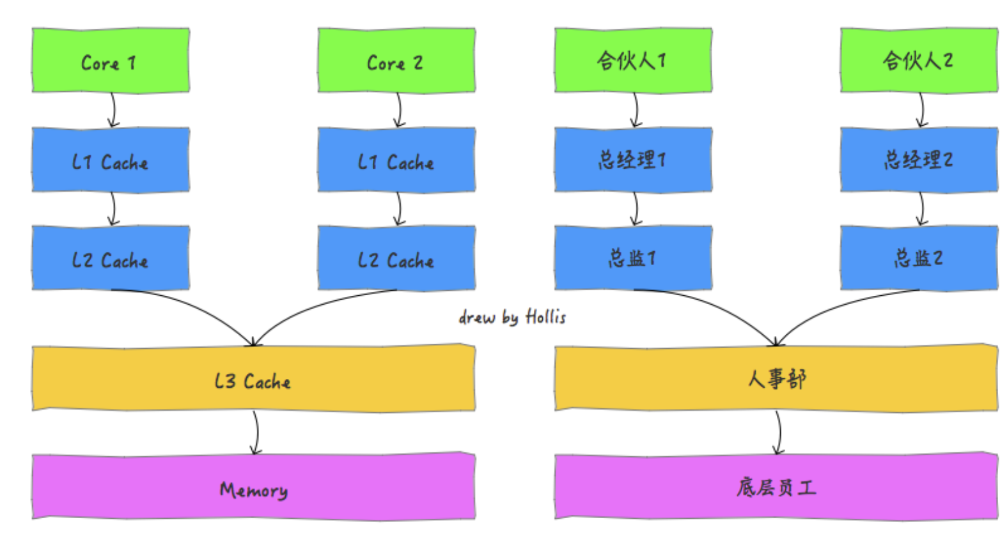
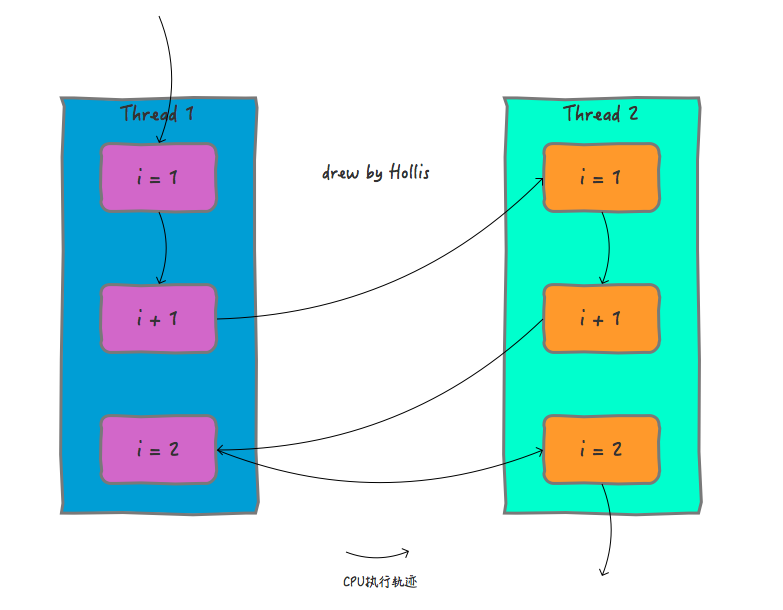
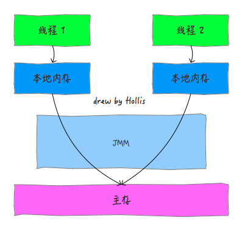

# 1. 计算机硬件升级带来的问题

## 1.1 多级缓存和一致性问题

我们应该都知道，计算机在执行程序的时候，每条指令都是在CPU中执行的，而执行的时候，又免不了要和数据打交道。而计算机上面的数据，是存放在主存当中的，也就是计算机的物理内存啦。

刚开始，还相安无事的，但是随着CPU技术的发展，CPU的执行速度越来越快。而由于内存的技术并没有太大的变化，所以从内存中读取和写入数据的过程和CPU的执行速度比起来差距就会越来越大,这就导致CPU每次操作内存都要耗费很多等待时间。

> 这就像一家创业公司，刚开始，创始人和员工之间工作关系其乐融融，但是随着创始人的能力和野心越来越大，逐渐和员工之间出现了差距，普通员工原来越跟不上CEO的脚步。老板的每一个命令，传到到基层员工之后，由于基层员工的理解能力、执行能力的欠缺，就会耗费很多时间。这也就无形中拖慢了整家公司的工作效率。

可是，不能因为内存的读写速度慢，就不发展CPU技术了吧，总不能让内存成为计算机处理的瓶颈吧。

所以，人们想出来了一个好的办法，就是在CPU和内存之间增加高速缓存。缓存的概念大家都知道，就是保存一份数据拷贝。他的特点是速度快，内存小，并且昂贵。

那么，程序的执行过程就变成了：

**当程序在运行过程中，会将运算需要的数据从主存复制一份到CPU的高速缓存当中，那么CPU进行计算时就可以直接从它的高速缓存读取数据和向其中写入数据，当运算结束之后，再将高速缓存中的数据刷新到主存当中。**

> 之后，这家公司开始设立中层管理人员，管理人员直接归CEO领导，领导有什么指示，直接告诉管理人员，然后就可以去做自己的事情了。管理人员负责去协调底层员工的工作。因为管理人员是了解手下的人员以及自己负责的事情的。所以，大多数时候，公司的各种决策，通知等，CEO只要和管理人员之间沟通就够了。

而随着CPU能力的不断提升，一层缓存就慢慢的无法满足要求了，就逐渐的衍生出多级缓存。

按照数据读取顺序和与CPU结合的紧密程度，CPU缓存可以分为一级缓存（L1），二级缓存（L3），部分高端CPU还具有三级缓存（L3），每一级缓存中所储存的全部数据都是下一级缓存的一部分。

这三种缓存的技术难度和制造成本是相对递减的，所以其容量也是相对递增的。

那么，在有了多级缓存之后，程序的执行就变成了：

**当CPU要读取一个数据时，首先从一级缓存中查找，如果没有找到再从二级缓存中查找，如果还是没有就从三级缓存或内存中查找。**

> 随着公司越来越大，老板要管的事情越来越多，公司的管理部门开始改革，开始出现高层，中层，底层等管理者。一级一级之间逐层管理。

单核CPU只含有一套L1，L2，L3缓存；如果CPU含有多个核心，即多核CPU，则每个核心都含有一套L1（甚至和L2）缓存，而共享L3（或者和L2）缓存。

> 公司也分很多种，有些公司只有一个大Boss，他一个人说了算。但是有些公司有比如联席总经理、合伙人等机制。
>
> 单核CPU就像一家公司只有一个老板，所有命令都来自于他，那么就只需要一套管理班底就够了。
>
> 多核CPU就像一家公司是由多个合伙人共同创办的，那么，就需要给每个合伙人都设立一套供自己直接领导的高层管理人员，多个合伙人共享使用的是公司的底层员工。
>
> 还有的公司，不断壮大，开始差分出各个子公司。各个子公司就是多个CPU了，互相之前没有共用的资源。互不影响。

下图为一个单CPU双核的缓存结构。



随着计算机能力不断提升，开始支持多线程。那么问题就来了。我们分别来分析下单线程、多线程在单核CPU、多核CPU中的影响。

**单线程。** cpu核心的缓存只被一个线程访问。缓存独占，不会出现访问冲突等问题。

**单核CPU，多线程。** 进程中的多个线程会同时访问进程中的共享数据，CPU将某块内存加载到缓存后，不同线程在访问相同的物理地址的时候，都会映射到相同的缓存位置，这样即使发生线程的切换，缓存仍然不会失效。但由于任何时刻只能有一个线程在执行，因此不会出现缓存访问冲突。

**多核CPU，多线程。** 每个核都至少有一个L1 缓存。多个线程访问进程中的某个共享内存，且这多个线程分别在不同的核心上执行，则每个核心都会在各自的caehe中保留一份共享内存的缓冲。由于多核是可以并行的，可能会出现多个线程同时写各自的缓存的情况，而各自的cache之间的数据就有可能不同。

在CPU和主存之间增加缓存，在多线程场景下就可能存在**缓存一致性问题**，也就是说，在多核CPU中，每个核的自己的缓存中，关于同一个数据的缓存内容可能不一致。

> 如果这家公司的命令都是串行下发的话，那么就没有任何问题。
>
> 如果这家公司的命令都是并行下发的话，并且这些命令都是由同一个CEO下发的，这种机制是也没有什么问题。因为他的命令执行者只有一套管理体系。
>
> 如果这家公司的命令都是并行下发的话，并且这些命令是由多个合伙人下发的，这就有问题了。因为每个合伙人只会把命令下达给自己直属的管理人员，而多个管理人员管理的底层员工可能是公用的。
>
> 比如，合伙人1要辞退员工a，合伙人2要给员工a升职，升职后的话他再被辞退需要多个合伙人开会决议。两个合伙人分别把命令下发给了自己的管理人员。合伙人1命令下达后，管理人员a在辞退了员工后，他就知道这个员工被开除了。而合伙人2的管理人员2这时候在没得到消息之前，还认为员工a是在职的，他就欣然的接收了合伙人给他的升职a的命令。


## 1.2 CPU时间片与原子性问题

很多人都知道，现在我们用到操作系统，无论是Windows、Linux还是MacOS等其实都是多用户多任务分时操作系统。使用这些操作系统的“用户”是可以“同时”干多件事的，这已经是日常习惯了，并没觉得有什么特别。

但是实际上，对于单CPU的计算机来说，在CPU中，同一时间是只能干一件事儿的。

为了看起来像是“同时干多件事”，分时操作系统是把CPU的时间划分成长短基本相同的时间区间,即”时间片”，通过操作系统的管理，把这些时间片依次轮流地分配给各个“用户”使用。

如果某个“用户”在时间片结束之前，整个任务还没有完成，“用户”就必须进入到就绪状态，放弃CPU，等待下一轮循环。此时CPU又分配给另一个“用户”去使用。

> CPU 就好像是一个电话亭，他可以开放给所有用户使用，但是他有规定，每个用户进入电话亭之后只能使用规定时长的时间。如果时间到了，用户还没打完电话，那就会被要求去重新排队。

不同的操作系统，在选择“用户”分配时间片的调度算法是不一样的，常用的有FCFS、轮转、SPN、SRT、HRRN、反馈等，由于不是本文重点，就不展开了。

> 这个电话亭可以允许哪个用户进入打电话是有不同的策略的，不同的电话亭规定不同，有的电话亭采用排队机制（FCFS）、有的优先分配给打电话时间最短的人（SPN）等

我们说原子性问题，其实指的是多线程场景中操作如果不能保证原子性，会导致处理结果和预期不一致。

前面我们提到过，线程是CPU调度的基本单位。CPU有时间片的概念，会根据不同的调度算法进行线程调度。所以在多线程场景下，就会发生原子性问题。因为线程在执行一个`读改写`操作时，在执行完`读改`之后，时间片耗完，就会被要求放弃CPU，并等待重新调度。这种情况下，`读改写`就不是一个原子操作。

> 就好像我们去电话亭打电话，一共有三个步骤，查找电话，拨号，交流。由于我们在电话亭中可以停留的时间有限，有可能刚刚找到电话号码，时间到了，就被赶出来了。

在单线程中，一个`读改写`就算不是原子操作也没关系，因为只要这个线程再次被调度，这个操作总是可以执行完的。但是在多线程场景中可能就有问题了。因为多个线程可能会对同一个共享资源进行操作。

比如经典的 `i++` 操作，对于一个简单的`i++`操作，一共有三个步骤：`load` , `add` ,`save` 。共享变量就会被多个线程同时进行操作，这样读改写操作就不是原子的，操作完之后共享变量的值会和期望的不一致，举个例子：如果i=1,我们进行两次`i++`操作，我们期望的结果是3，但是有可能结果是2。



## 1.3 指令重排与有序性问题

而且，我们知道，除了引入了时间片以外，由于处理器优化和指令重排等，CPU还可能对输入代码进行乱序执行，比如`load`->`add`->`save` 有可能被优化成`load`->`save`->`add` 。这就是有序性问题。

> 我们打电话的时候，除了可能被中途赶出来以外，本来正常步骤是要查找电话、拨号、交流的。但是电话亭非要给我们优化成查找电话、交流、拨号。这肯定不是我们想要的啊。

还是刚刚的`i++`操作，在满足了原子性的情况下，如果没有满足有序性，那么得到的结果可能也不是我们想要的。


## 1.4 总结

随着计算机硬件的不断升级，间接的会给软件系统带来一些问题或者难题。而其中比较重要的三个问题就是我们本文阐述的一致性问题、原子性问题和有序性问题。

至于一致性、原子性和有序性到底是什么，他们又和并发编程有什么关系？我们在后面的文章中会介绍。

关于本文，读者需要知道的是，很多问题并不是与生俱来的，随着CPU能力增强、增加缓存、处理器优化和指令重排等技术的推出，很多问题也都显现出来了。有问题，自然就要解决问题，这些问题，后面的章节中我们也会逐一解决。

在[上一篇](https://www.hollischuang.com/archives/3309)文章中，我们提到：随着计算机硬件的不断升级，间接的会给软件系统带来一些问题或者难题。而其中比较重要的三个问题就是我们一致性问题、原子性问题和有序性问题。

那么，我们这一篇回过头来再来看一下一致性、原子性和有序性到底是什么，这些问题出现之后该如何解决呢？

# 2. 到底什么是计算机内存模型？

## 2.1 缓存一致性

在多核CPU，多线程的场景中，每个核都至少有一个L1 缓存。多个线程访问进程中的某个共享内存，且这多个线程分别在不同的核心上执行，则每个核心都会在各自的caehe中保留一份共享内存的缓冲。由于多核是可以并行的，可能会出现多个线程同时写各自的缓存的情况，而各自的cache之间的数据就有可能不同。

在CPU和主存之间增加缓存，在多线程场景下就可能存在**缓存一致性问题**，也就是说，在多核CPU中，每个核的自己的缓存中，关于同一个数据的缓存内容可能不一致。

## 2.2 原子性

线程是CPU调度的基本单位。CPU有时间片的概念，会根据不同的调度算法进行线程调度。所以在多线程场景下，就会发生原子性问题。因为线程在执行一个读改写操作时，在执行完读改之后，时间片耗完，就会被要求放弃CPU，并等待重新调度。这种情况下，读改写就不是一个原子操作。即存在**原子性问题**。

## 2.3 有序性

除了引入了时间片以外，由于处理器优化和指令重排等，CPU还可能对输入代码进行乱序执行，比如load->add->save 有可能被优化成load->save->add 。这就是**有序性问题**。

## 2.4 内存模型

前面提到的，多CPU多级缓存导致的一致性问题、CPU时间片机制导致的原子性问题、以及处理器优化和指令重排导致的有序性问题等，都硬件的不断升级导致的。那么，有没有什么机制可以很好的解决上面的这些问题呢？

最简单直接的做法就是废除处理器和处理器的优化技术、废除CPU缓存，让CPU直接和主存交互。但是，这么做虽然可以保证多线程下的并发问题。但是，这就有点因噎废食了。

所以，为了保证并发编程中可以满足原子性、可见性及有序性。有一个重要的概念，那就是——**内存模型**。

为了保证共享内存的正确性（可见性、有序性、原子性），内存模型定义了共享内存系统中多线程程序读写操作行为的规范。通过这些规则来规范对内存的读写操作，从而保证指令执行的正确性。它与处理器有关、与缓存有关、与并发有关、与编译器也有关。他解决了CPU多级缓存、处理器优化、指令重排等导致的内存访问问题，保证了并发场景下的一致性、原子性和有序性。

内存模型解决并发问题主要采用两种方式：限制处理器优化和使用内存屏障。这部分内容会在后面分别进行讲解。

### 2.4.1 内存一致性和缓存一致性

内存模型（Memory Model）如果扩展开来说的话，通常指的是内存一致性模型（Memory Sequential Consistency Model）。

那么，本文中提到了两个很相近的概念：内存一致性和缓存一致性，这二者之间到底有什么关系呢？

缓存一致性（Cache Coherence），解决是多个缓存副本之间的数据的一致性问题。

内存一致性（Memory Consistency），保证的是多线程程序访问内存时可以读到什么值。

**内存一致性就是程序员（编程语言）、编译器、CPU间的一种协议。这个协议保证了程序访问内存时会得到什么值。如果没有Memory Consistency，程序员写的程序代码的输出结果是不确定的。**

简单点说，内存一致性，就是保证并发场景下的程序运行结果和程序员预期是一样的（当然，要通过加锁等方式），包括的就是并发编程中的原子性、有序性和可见性。而缓存一致性可以简单的类比成并发编程中的可见性。

在很多内存模型的实现中，关于缓存一致性的保证都是通过硬件层面缓存一致性协议来保证的。

### 2.4.2 缓存一致性和可见性

可见性是指当多个线程访问同一个变量时，一个线程修改了这个变量的值，其他线程能够立即看得到修改的值。

所以，我们可以认为，缓存一致性问题其实就是可见性问题。

但是，如果站在Java并发编程的角度来看的话，可见性问题和缓存一致性问题并不完全一样。

在Java中，所有的变量都存储在主内存中，每条线程还有自己的工作内存，线程的工作内存中保存了该线程中是用到的变量的主内存副本拷贝，线程对变量的所有操作都必须在工作内存中进行，而不能直接读写主内存。不同的线程之间也无法直接访问对方工作内存中的变量，线程间变量的传递均需要自己的工作内存和主存之间进行数据同步进行。


这里面提到的主内存和工作内存，并不是计算机主存和缓存。可以类比，但不完全是。

如果一定要勉强对应起来的话，从变量、主内存、工作内存的定义来看，主内存主要对应于Java堆中的对象实例数据部分。工作内存则对应于虚拟机栈中的部分区域。

所以，Java中的可见性问题，其实是各个线程的本地内存之间的数据互相不可见。即线程中本地内存的一致性问题。

即：

```
Java并发编程可见性问题 == 本地内存的一致性问题 ！= 缓存一致性问题
```

## 2.5 总结

本文介绍了计算机缓存一致性 、原子性以及有序性问题。并且简单介绍了计算机内存模型。

并且帮助读者区分了内存一致性、缓存一致性 、可见性等概念。那么，内存模型到底如何解决这些问题的呢？计算机内存模型和Java内存模型又有什么关系和区别呢？后面的文章会分别展开这些话题。

# 3. 什么是java内存模型

在上一篇文章中，我们介绍过了计算机内存模型，本文再来简单的回顾一下：

随着计算机硬件的不断升级，间接的会给软件系统带来一些问题或者难题。而其中比较重要的三个问题就是我们一致性问题、原子性问题和有序性问题。

所以，为了保证并发编程中可以满足原子性、可见性及有序性。有一个重要的概念，那就是——内存模型。

为了保证共享内存的正确性（可见性、有序性、原子性），内存模型定义了共享内存系统中多线程程序读写操作行为的规范。通过这些规则来规范对内存的读写操作，从而保证指令执行的正确性。它与处理器有关、与缓存有关、与并发有关、与编译器也有关。他解决了CPU多级缓存、处理器优化、指令重排等导致的内存访问问题，保证了并发场景下的一致性、原子性和有序性。

我们知道，Java程序是需要运行在Java虚拟机上面的，Java内存模型（Java Memory Model ,JMM）就是一种符合内存模型规范的，屏蔽了各种硬件和操作系统的访问差异的，保证了Java程序在各种平台下对内存的访问都能保证效果一致的机制及规范。

提到Java内存模型，一般指的是JDK 5 开始使用的新的内存模型，主要由JSR-133: JavaTM Memory Model and Thread Specification 描述。感兴趣的可以参看下这份PDF文档（http://www.cs.umd.edu/~pugh/java/memoryModel/jsr133.pdf）

Java内存模型规定了所有的变量都存储在主内存中，每条线程还有自己的工作内存，线程的工作内存中保存了该线程中是用到的变量的主内存副本拷贝，线程对变量的所有操作都必须在工作内存中进行，而不能直接读写主内存。不同的线程之间也无法直接访问对方工作内存中的变量，线程间变量的传递均需要自己的工作内存和主存之间进行数据同步进行。

而JMM就作用于工作内存和主存之间数据同步过程。他规定了如何做数据同步以及什么时候做数据同步。



这里面提到的主内存和工作内存，读者可以简单的类比成计算机内存模型中的主存和缓存的概念。特别需要注意的是，主内存和工作内存与JVM内存结构中的Java堆、栈、方法区等并不是同一个层次的内存划分，无法直接类比。《深入理解Java虚拟机》中认为，如果一定要勉强对应起来的话，从变量、主内存、工作内存的定义来看，主内存主要对应于Java堆中的对象实例数据部分。工作内存则对应于虚拟机栈中的部分区域。

所以，再来总结下，JMM是一种规范，目的是解决由于多线程通过共享内存进行通信时，存在的本地内存数据不一致、编译器会对代码指令重排序、处理器会对代码乱序执行等带来的问题。

后面的章节，我们开始展开Java内存模型，深入分析他的底层基础理论以及具体实现。

# 4. java内存模型的实现

在前面几篇文章中，我们介绍过了一些和Java内存模型有关的知识，我们再来简单回顾一下：

随着计算机硬件的不断升级，间接的会给软件系统带来一些问题或者难题。而其中比较重要的三个问题就是我们一致性问题、原子性问题和有序性问题。

所以，为了保证并发编程中可以满足原子性、可见性及有序性。有一个重要的概念，那就是——内存模型。

为了保证共享内存的正确性（可见性、有序性、原子性），内存模型定义了共享内存系统中多线程程序读写操作行为的规范。通过这些规则来规范对内存的读写操作，从而保证指令执行的正确性。

我们知道，Java程序是需要运行在Java虚拟机上面的，Java内存模型（Java Memory Model ,JMM）就是一种符合内存模型规范的，屏蔽了各种硬件和操作系统的访问差异的，保证了Java程序在各种平台下对内存的访问都能保证效果一致的机制及规范。

Java内存模型规定了所有的变量都存储在主内存中，每条线程还有自己的工作内存，线程的工作内存中保存了该线程中是用到的变量的主内存副本拷贝，线程对变量的所有操作都必须在工作内存中进行，而不能直接读写主内存。不同的线程之间也无法直接访问对方工作内存中的变量，线程间变量的传递均需要自己的工作内存和主存之间进行数据同步进行。

而JMM就作用于工作内存和主存之间数据同步过程。

所以，JMM是一种规范，目的是解决由于多线程通过共享内存进行通信时，存在的本地内存数据不一致、编译器会对代码指令重排序、处理器会对代码乱序执行等带来的问题。

那么，Java内存模型到底是通过什么样的方式来解决原子性、有序性以及可见性问题的呢？本文就来简单分析一下。

## 4.1 Java内存模型的实现原理

了解Java多线程的朋友都知道，在Java中提供了一系列和并发处理相关的关键字，比如volatile、synchronized、final、concurren包等。其实这些就是Java内存模型封装了底层的实现后提供给程序员使用的一些关键字。

在开发多线程的代码的时候，我们可以直接使用synchronized等关键字来控制并发，从来就不需要关心底层的编译器优化、缓存一致性等问题。所以，Java内存模型，除了定义了一套规范，还提供了一系列原语，封装了底层实现后，供开发者直接使用。

本文并不准备把所有的关键字逐一介绍其用法，各个关键字的用法及原理后续文章会逐一介绍。本文的一个重点是要介绍并发编程要解决原子性、有序性和一致性的问题，分别使用什么方式来保证的。

## 4.2 原子性

在Java中，为了保证原子性，提供了两个高级的字节码指令monitorenter和monitorexit。可以通过这两个指令来保证原子性。

在后续的文章中，我们即将介绍的synchronized其实底层就是使用monitorenter和monitorexit实现的，所以，在Java中可以使用synchronized来保证方法和代码块内的操作是原子性的。

我们后续文章中会介绍synchronized与原子性的关系，以及为什么volatile无法保证原子性。当然，这是后话。

## 4.3 可见性

Java内存模型是通过在变量修改后将新值同步回主内存，在变量读取前从主内存刷新变量值的这种依赖主内存作为传递媒介的方式来实现的。

Java中的volatile关键字提供了一个功能，那就是被其修饰的变量在被修改后可以立即同步到主内存，被其修饰的变量在每次是用之前都从主内存刷新。因此，可以使用volatile来保证多线程操作时变量的可见性。

除了volatile，Java中的synchronized和final两个关键字也可以实现可见性。只不过实现方式不同，后续再介绍到这两个关键字的时候会再次展开。

## 4.4 有序性

在Java中，可以使用synchronized和volatile来保证多线程之间操作的有序性。实现方式有所区别：

volatile关键字会禁止指令重排。synchronized关键字保证同一时刻只允许一条线程操作。

## 4.5 小结

好了，这里简单的介绍完了Java并发编程中解决原子性、可见性以及有序性可以使用的关键字。

但是，Java中提供了很多关键字和API可以帮助我们保证并发编程中的原子性、可见性以及有序性，不同的关键字和API有着不同的实现，并且也会有一些意想不到的坑，后续很多文章将主要围绕如何解决原子性、可见性以及有序性问题展开。

所以，在此，我们可以再来回顾下Java内存模型，其实他就是提供了一套API、关键字等，帮助我们解决Java并发场景中的原子性、可见性以及有序性问题。

在展开后续文章之前，读者们一定要再次仔细学习前面几篇的内容，做到真正的理解到底并发编程有什么问题，这些问题怎么来的，如何解决这些问题等。