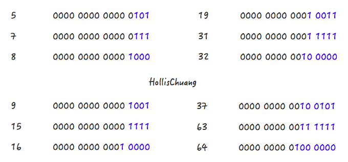

<!--ts-->
   * [前言](HashMap-initialize.md#前言)
   * [1.为什么要设置HashMap的初始化容量](HashMap-initialize.md#1为什么要设置hashmap的初始化容量)
   * [2. HashMap中容量的初始化](HashMap-initialize.md#2-hashmap中容量的初始化)
   * [3. HashMap中初始容量的合理值](HashMap-initialize.md#3-hashmap中初始容量的合理值)
   * [4. 总结](HashMap-initialize.md#4-总结)

<!-- Added by: anapodoton, at: Sun Feb 16 15:39:04 CST 2020 -->

<!--te-->

# 前言

在《[HashMap中傻傻分不清楚的那些概念](http://www.hollischuang.com/archives/2416)》文章中，我们介绍了HashMap中和容量相关的几个概念，简单介绍了一下HashMap的扩容机制。

文中我们提到，默认情况下HashMap的容量是16，但是，如果用户通过构造函数指定了一个数字作为容量，那么Hash会选择**大于该数字的第一个2的幂**作为容量。(3->4、7->8、9->16)

本文，延续上一篇文章，我们再来深入学习下，到底应不应该设置HashMap的默认容量？如果真的要设置HashMap的初始容量，我们应该设置多少？

# 1.为什么要设置HashMap的初始化容量

我们之前提到过，《阿里巴巴Java开发手册》中建议我们设置HashMap的初始化容量。


那么，为什么要这么建议？你有想过没有。

我们先来写一段代码在JDK 1.7 （jdk1.7.0_79）下面来分别测试下，在不指定初始化容量和指定初始化容量的情况下性能情况如何。（jdk 8 结果会有所不同，我会在后面的文章中分析）

```java
public static void main(String[] args) {
    int aHundredMillion = 10000000;

    Map<Integer, Integer> map = new HashMap<>();

    long s1 = System.currentTimeMillis();
    for (int i = 0; i < aHundredMillion; i++) {
        map.put(i, i);
    }
    long s2 = System.currentTimeMillis();

    System.out.println("未初始化容量，耗时 ： " + (s2 - s1));


    Map<Integer, Integer> map1 = new HashMap<>(aHundredMillion / 2);

    long s5 = System.currentTimeMillis();
    for (int i = 0; i < aHundredMillion; i++) {
        map1.put(i, i);
    }
    long s6 = System.currentTimeMillis();

    System.out.println("初始化容量5000000，耗时 ： " + (s6 - s5));


    Map<Integer, Integer> map2 = new HashMap<>(aHundredMillion);

    long s3 = System.currentTimeMillis();
    for (int i = 0; i < aHundredMillion; i++) {
        map2.put(i, i);
    }
    long s4 = System.currentTimeMillis();

    System.out.println("初始化容量为10000000，耗时 ： " + (s4 - s3));
}
```

以上代码不难理解，我们创建了3个HashMap，分别使用默认的容量（16）、使用元素个数的一半（5千万）作为初始容量、使用元素个数（一亿）作为初始容量进行初始化。然后分别向其中put一亿个KV。

输出结果：

```
未初始化容量，耗时 ： 14419
初始化容量5000000，耗时 ： 11916
初始化容量为10000000，耗时 ： 7984
```

**从结果中，我们可以知道，在已知HashMap中将要存放的KV个数的时候，设置一个合理的初始化容量可以有效的提高性能。**

当然，以上结论也是有理论支撑的。我们[上一篇](http://www.hollischuang.com/archives/2416)文章介绍过，HashMap有扩容机制，就是当达到扩容条件时会进行扩容。HashMap的扩容条件就是当HashMap中的元素个数（size）超过临界值（threshold）时就会自动扩容。在HashMap中，`threshold = loadFactor * capacity`。

所以，如果我们没有设置初始容量大小，随着元素的不断增加，HashMap会发生多次扩容，而HashMap中的扩容机制决定了每次扩容都需要重建hash表，是非常影响性能的。（关于resize，后面我会有文章单独介绍）

从上面的代码示例中，我们还发现，同样是设置初始化容量，设置的数值不同也会影响性能，那么当我们已知HashMap中即将存放的KV个数的时候，容量设置成多少为好呢？

# 2. HashMap中容量的初始化

在上一篇文章中，我们通过代码实例其实介绍过，默认情况下，当我们设置HashMap的初始化容量时，实际上HashMap会采用第一个大于该数值的2的幂作为初始化容量。

上一篇文章中有个例子

```java
Map<String, String> map = new HashMap<String, String>(1);
map.put("hahaha", "hollischuang");

Class<?> mapType = map.getClass();
Method capacity = mapType.getDeclaredMethod("capacity");
capacity.setAccessible(true);
System.out.println("capacity : " + capacity.invoke(map));
```

初始化容量设置成1的时候，输出结果是2。在jdk1.8中，如果我们传入的初始化容量为1，实际上设置的结果也为1，上面代码输出结果为2的原因是代码中map.put(“hahaha”, “hollischuang”);导致了扩容，容量从1扩容到2。

那么，话题再说回来，当我们通过HashMap(int initialCapacity)设置初始容量的时候，HashMap并不一定会直接采用我们传入的数值，而是经过计算，得到一个新值，目的是提高hash的效率。(1->1、3->4、7->8、9->16)

> 在Jdk 1.7和Jdk 1.8中，HashMap初始化这个容量的时机不同。jdk1.8中，在调用HashMap的构造函数定义HashMap的时候，就会进行容量的设定。而在Jdk 1.7中，要等到第一次put操作时才进行这一操作。

不管是Jdk 1.7还是Jdk 1.8，计算初始化容量的算法其实是如出一辙的，主要代码如下：

```java
    int n = cap - 1;
    n |= n >>> 1;
    n |= n >>> 2;
    n |= n >>> 4;
    n |= n >>> 8;
    n |= n >>> 16;
    return (n < 0) ? 1 : (n >= MAXIMUM_CAPACITY) ? MAXIMUM_CAPACITY : n + 1;
```

上面的代码挺有意思的，一个简单的容量初始化，Java的工程师也有很多考虑在里面。

上面的算法目的挺简单，就是：根据用户传入的容量值（代码中的cap），通过计算，得到第一个比他大的2的幂并返回。

聪明的读者们，如果让你设计这个算法你准备如何计算？如果你想到二进制的话，那就很简单了。举几个例子看一下：



请关注上面的几个例子中，蓝色字体部分的变化情况，或许你会发现些规律。5->8、9->16、19->32、37->64都是主要经过了两个阶段。

> Step 1，5->7
>
> Step 2，7->8
>
> Step 1，9->15
>
> Step 2，15->16
>
> Step 1，19->31
>
> Step 2，31->32

对应到以上代码中，Step1：

```
n |= n >>> 1;
n |= n >>> 2;
n |= n >>> 4;
n |= n >>> 8;
n |= n >>> 16;
```

对应到以上代码中，Step2：

```
return (n < 0) ? 1 : (n >= MAXIMUM_CAPACITY) ? MAXIMUM_CAPACITY : n + 1;
```

Step 2 比较简单，就是做一下极限值的判断，然后把Step 1得到的数值+1。

Step 1 怎么理解呢？**其实是对一个二进制数依次向右移位，然后与原值取或。**其目的对于一个数字的二进制，从第一个不为0的位开始，把后面的所有位都设置成1。

随便拿一个二进制数，套一遍上面的公式就发现其目的了：

```
1100 1100 1100 >>>1 = 0110 0110 0110
1100 1100 1100 | 0110 0110 0110 = 1110 1110 1110
1110 1110 1110 >>>2 = 0011 1011 1011
1110 1110 1110 | 0011 1011 1011 = 1111 1111 1111
1111 1111 1111 >>>4 = 1111 1111 1111
1111 1111 1111 | 1111 1111 1111 = 1111 1111 1111
```

通过几次`无符号右移`和`按位或`运算，我们把1100 1100 1100转换成了1111 1111 1111 ，再把1111 1111 1111加1，就得到了1 0000 0000 0000，这就是大于1100 1100 1100的第一个2的幂。

好了，我们现在解释清楚了Step 1和Step 2的代码。就是可以把一个数转化成第一个比他自身大的2的幂。（可以开始佩服Java的工程师们了，使用`无符号右移`和`按位或`运算大大提升了效率。）

但是还有一种特殊情况套用以上公式不行，这些数字就是2的幂自身。如果数字4 套用公式的话。得到的会是 8 ：

```
Step 1: 
0100 >>>1 = 0010
0100 | 0010 = 0110
0110 >>>1 = 0011
0110 | 0011 = 0111
Step 2:
0111 + 0001 = 1000
```

为了解决这个问题，JDK的工程师把所有用户传进来的数在进行计算之前先-1，就是源码中的第一行：

```
int n = cap - 1;
```

至此，再来回过头看看这个设置初始容量的代码，目的是不是一目了然了：

```
    int n = cap - 1;
    n |= n >>> 1;
    n |= n >>> 2;
    n |= n >>> 4;
    n |= n >>> 8;
    n |= n >>> 16;
    return (n < 0) ? 1 : (n >= MAXIMUM_CAPACITY) ? MAXIMUM_CAPACITY : n + 1;
```

# 3. HashMap中初始容量的合理值

当我们使用`HashMap(int initialCapacity)`来初始化容量的时候，jdk会默认帮我们计算一个相对合理的值当做初始容量。那么，是不是我们只需要把已知的HashMap中即将存放的元素个数直接传给initialCapacity就可以了呢？

关于这个值的设置，在《阿里巴巴Java开发手册》有以下建议：


这个值，并不是阿里巴巴的工程师原创的，在guava（21.0版本）中也使用的是这个值。

```java
public static <K, V> HashMap<K, V> newHashMapWithExpectedSize(int expectedSize) {
    return new HashMap<K, V>(capacity(expectedSize));
}

/**
* Returns a capacity that is sufficient to keep the map from being resized as long as it grows no
* larger than expectedSize and the load factor is ≥ its default (0.75).
*/
static int capacity(int expectedSize) {
    if (expectedSize < 3) {
      checkNonnegative(expectedSize, "expectedSize");
      return expectedSize + 1;
    }
    if (expectedSize < Ints.MAX_POWER_OF_TWO) {
      // This is the calculation used in JDK8 to resize when a putAll
      // happens; it seems to be the most conservative calculation we
      // can make.  0.75 is the default load factor.
      return (int) ((float) expectedSize / 0.75F + 1.0F);
    }
    return Integer.MAX_VALUE; // any large value
}
```

在`return (int) ((float) expectedSize / 0.75F + 1.0F);`上面有一行注释，说明了这个公式也不是guava原创，参考的是JDK8中putAll方法中的实现的。感兴趣的读者可以去看下putAll方法的实现，也是以上的这个公式。

虽然，当我们使用`HashMap(int initialCapacity)`来初始化容量的时候，jdk会默认帮我们计算一个相对合理的值当做初始容量。但是这个值并没有参考loadFactor的值。

也就是说，如果我们设置的默认值是7，经过Jdk处理之后，会被设置成8，但是，这个HashMap在元素个数达到 8*0.75 = 6的时候就会进行一次扩容，这明显是我们不希望见到的。

如果我们通过**expectedSize / 0.75F + 1.0F**计算，7/0.75 + 1 = 10 ,10经过Jdk处理之后，会被设置成16，这就大大的减少了扩容的几率。

当HashMap内部维护的哈希表的容量达到75%时（默认情况下），会触发rehash，而rehash的过程是比较耗费时间的。所以初始化容量要设置成expectedSize/0.75 + 1的话，可以有效的减少冲突也可以减小误差。

所以，我可以认为，当我们明确知道HashMap中元素的个数的时候，把默认容量设置成expectedSize / 0.75F + 1.0F 是一个在性能上相对好的选择，但是，同时也会牺牲些内存。

# 4. 总结

当我们想要在代码中创建一个HashMap的时候，如果我们已知这个Map中即将存放的元素个数，给HashMap设置初始容量可以在一定程度上提升效率。

但是，JDK并不会直接拿用户传进来的数字当做默认容量，而是会进行一番运算，最终得到一个2的幂。原因在（[全网把Map中的hash()分析的最透彻的文章，别无二家。](http://www.hollischuang.com/archives/2091)）介绍过，得到这个数字的算法其实是使用了使用无符号右移和按位或运算来提升效率。

但是，为了最大程度的避免扩容带来的性能消耗，我们建议可以把默认容量的数字设置成expectedSize / 0.75F + 1.0F 。在日常开发中，可以使用

```
Map<String, String> map = Maps.newHashMapWithExpectedSize(10);
```

来创建一个HashMap，计算的过程guava会帮我们完成。

但是，以上的操作是一种用内存换性能的做法，真正使用的时候，要考虑到内存的影响。

最后，留一个思考题：为什么JDK 8中，putAll方法采用了这个expectedSize / 0.75F + 1.0F公式，而put、构造函数等并没有默认使用这个公式呢？

**putAll中其实是已经有了expectedSize的值，所以可以使用该公式，但是put中，并没有该值。**
