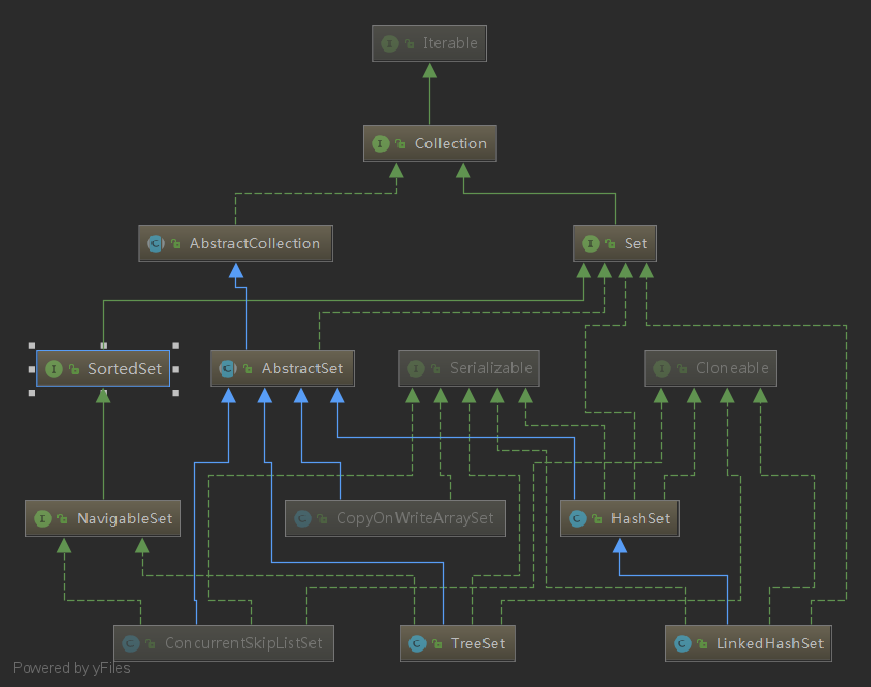

<!--ts-->
   * [前言](#前言)
   * [1. HashSet](#1-hashset)
      * [前言](#前言-1)
      * [1.1 定义](#11-定义)
      * [1.2 <strong>基本属性</strong>](#12-基本属性)
      * [1.3  <strong>构造函数</strong>](#13--构造函数)
      * [1.4 方法](#14-方法)
   * [2. TreeSet](#2-treeset)
      * [2.1 TreeSet定义](#21-treeset定义)
      * [2.2 TreeSet主要方法](#22-treeset主要方法)
      * [2.3 最后](#23-最后)
   * [3. 总结](#3-总结)
      * [3.1 TreeSet和LinkedHashSet都是有序的，那它们有何不同？](#31-treeset和linkedhashset都是有序的那它们有何不同)

<!-- Added by: anapodoton, at: Sun Mar  1 17:05:50 CST 2020 -->

<!--te-->

# 前言

java里面的Set对应于数学概念上的集合，里面的元素是不可重复的，通常使用Map或者List来实现。

[](https://gitee.com/alan-tang-tt/yuan/raw/master/死磕 java集合系列/resource/Set.png)

java中提供的Set的实现主要有HashSet、LinkedHashSet、TreeSet、CopyOnWriteArraySet、ConcurrentSkipSet。

# 1. HashSet

## 前言

在前篇博文中（[java提高篇（二三）—–HashMap](http://www.cnblogs.com/chenssy/p/3521565.html)）详细讲解了HashMap的实现过程，对于HashSet而言，它是基于HashMap来实现的，底层采用HashMap来保存元素。所以如果对HashMap比较熟悉，那么HashSet是so  easy!!

## 1.1 定义

```java
 public class HashSet<E>
    extends AbstractSet<E>
    implements Set<E>, Cloneable, java.io.Serializable
```

HashSet继承AbstractSet类，实现Set、Cloneable、Serializable接口。其中AbstractSet提供 Set 接口的骨干实现，从而最大限度地减少了实现此接口所需的工作。Set接口是一种不包括重复元素的Collection，它维持它自己的内部排序，所以随机访问没有任何意义。

## 1.2 **基本属性**

```java
//基于HashMap实现，底层使用HashMap保存所有元素
        private transient HashMap<E,Object> map;

        //定义一个Object对象作为HashMap的value
        private static final Object PRESENT = new Object();
```

## 1.3  **构造函数**

```java
        /**
         * 默认构造函数
         * 初始化一个空的HashMap，并使用默认初始容量为16和加载因子0.75。
         */
        public HashSet() {
            map = new HashMap<>();
        }

        /**
         * 构造一个包含指定 collection 中的元素的新 set。
         */
        public HashSet(Collection<? extends E> c) {
            map = new HashMap<>(Math.max((int) (c.size()/.75f) + 1, 16));
            addAll(c);
        }

        /**
         * 构造一个新的空 set，其底层 HashMap 实例具有指定的初始容量和指定的加载因子
         */
        public HashSet(int initialCapacity, float loadFactor) {
            map = new HashMap<>(initialCapacity, loadFactor);
        }

        /**
         * 构造一个新的空 set，其底层 HashMap 实例具有指定的初始容量和默认的加载因子（0.75）。
         */
        public HashSet(int initialCapacity) {
           map = new HashMap<>(initialCapacity);
        }

        /**
         * 在API中我没有看到这个构造函数，今天看源码才发现（原来访问权限为包权限，不对外公开的）
         * 以指定的initialCapacity和loadFactor构造一个新的空链接哈希集合。
         * dummy 为标识 该构造函数主要作用是对LinkedHashSet起到一个支持作用
         */
        HashSet(int initialCapacity, float loadFactor, boolean dummy) {
           map = new LinkedHashMap<>(initialCapacity, loadFactor);
        }
```

 从构造函数中可以看出HashSet所有的构造都是构造出一个新的HashMap，其中最后一个构造函数，为包访问权限是不对外公开，仅仅只在使用LinkedHashSet时才会发生作用。

## 1.4 方法

 既然HashSet是基于HashMap，那么对于HashSet而言，其方法的实现过程是非常简单的。

```java
 public Iterator<E> iterator() {
        return map.keySet().iterator();
    }
```

iterator()方法返回对此 set 中元素进行迭代的迭代器。返回元素的顺序并不是特定的。底层调用HashMap的keySet返回所有的key，这点反应了HashSet中的所有元素都是保存在HashMap的key中，value则是使用的PRESENT对象，该对象为static final。

```java
 public int size() {
        return map.size();
    }
```

size()返回此 set 中的元素的数量（set 的容量）。底层调用HashMap的size方法，返回HashMap容器的大小。

```java
 public boolean isEmpty() {
        return map.isEmpty();
    }
```

isEmpty()，判断HashSet()集合是否为空，为空返回 `true，否则返回false`。

```java
 public boolean contains(Object o) {
        return map.containsKey(o);
    }
```

contains()，判断某个元素是否存在于HashSet()中，存在返回true，否则返回false。更加确切的讲应该是要满足这种关系才能返回`true：(o==null ? e==null : o.equals(e))`。底层调用containsKey判断HashMap的key值是否为空。

```java
 public boolean add(E e) {
        return map.put(e, PRESENT)==null;
    }
```

add()如果此 set 中尚未包含指定元素，则添加指定元素。如果此Set没有包含满足`(e==null ? e2==null : e.equals(e2))` 的e2时，则将e2添加到Set中，否则不添加且返回false。由于底层使用HashMap的put方法将key = e，value=PRESENT构建成key-value键值对，当此e存在于HashMap的key中，则value将会覆盖原有value，但是key保持不变，所以如果将一个已经存在的e元素添加中HashSet中，新添加的元素是不会保存到HashMap中，所以这就满足了HashSet中元素不会重复的特性。

```java
 public boolean remove(Object o) {
        return map.remove(o)==PRESENT;
    }
```

remove如果指定元素存在于此 set 中，则将其移除。底层使用HashMap的remove方法删除指定的Entry。

```java
 public void clear() {
        map.clear();
    }
```

clear从此 set 中移除所有元素。底层调用HashMap的clear方法清除所有的Entry。

```java
public Object clone() {
        try {
            HashSet<E> newSet = (HashSet<E>) super.clone();
            newSet.map = (HashMap<E, Object>) map.clone();
            return newSet;
        } catch (CloneNotSupportedException e) {
            throw new InternalError();
        }
    }
```

clone返回此 `HashSet` 实例的浅表副本：并没有复制这些元素本身。

**后记：**

由于HashSet底层使用了HashMap实现，使其的实现过程变得非常简单，如果你对HashMap比较了解，那么HashSet简直是小菜一碟。有两个方法对HashMap和HashSet而言是非常重要的，下篇将详细讲解hashcode和equals。

# 2. TreeSet

与HashSet是基于HashMap实现一样，TreeSet同样是基于TreeMap实现的。在《Java提高篇（二七）—–TreeMap》中LZ详细讲解了TreeMap实现机制，如果客官详情看了这篇博文或者多TreeMap有比较详细的了解，那么TreeSet的实现对您是喝口水那么简单。

## 2.1 TreeSet定义

我们知道TreeMap是一个有序的二叉树，那么同理TreeSet同样也是一个有序的，它的作用是提供有序的Set集合。通过源码我们知道TreeSet基础AbstractSet，实现NavigableSet、Cloneable、Serializable接口。其中AbstractSet提供 `Set` 接口的骨干实现，从而最大限度地减少了实现此接口所需的工作。NavigableSet是扩展的 `SortedSet`，具有了为给定搜索目标报告最接近匹配项的导航方法，这就意味着它支持一系列的导航方法。比如查找与指定目标最匹配项。Cloneable支持克隆，Serializable支持序列化。

```
 public class TreeSet<E> extends AbstractSet<E>
    implements NavigableSet<E>, Cloneable, java.io.Serializable
```

同时在TreeSet中定义了如下几个变量。

```java
 private transient NavigableMap<E,Object> m;

//PRESENT会被当做Map的value与key构建成键值对
 private static final Object PRESENT = new Object();
```

其构造方法：

```java
//默认构造方法，根据其元素的自然顺序进行排序
    public TreeSet() {
        this(new TreeMap<E,Object>());
    }

    //构造一个包含指定 collection 元素的新 TreeSet，它按照其元素的自然顺序进行排序。
    public TreeSet(Comparator<? super E> comparator) {
            this(new TreeMap<>(comparator));
    }

    //构造一个新的空 TreeSet，它根据指定比较器进行排序。
    public TreeSet(Collection<? extends E> c) {
        this();
        addAll(c);
    }

    //构造一个与指定有序 set 具有相同映射关系和相同排序的新 TreeSet。
    public TreeSet(SortedSet<E> s) {
        this(s.comparator());
        addAll(s);
    }

    TreeSet(NavigableMap<E,Object> m) {
        this.m = m;
    }
```

## 2.2 TreeSet主要方法

1、add：将指定的元素添加到此 set（如果该元素尚未存在于 set 中）。

```
 public boolean add(E e) {
        return m.put(e, PRESENT)==null;
    }
```

2、addAll：将指定 collection 中的所有元素添加到此 set 中。

```java
public  boolean addAll(Collection<? extends E> c) {
        // Use linear-time version if applicable
        if (m.size()==0 && c.size() > 0 &&
            c instanceof SortedSet &&
            m instanceof TreeMap) {
            SortedSet<? extends E> set = (SortedSet<? extends E>) c;
            TreeMap<E,Object> map = (TreeMap<E, Object>) m;
            Comparator<? super E> cc = (Comparator<? super E>) set.comparator();
            Comparator<? super E> mc = map.comparator();
            if (cc==mc || (cc != null && cc.equals(mc))) {
                map.addAllForTreeSet(set, PRESENT);
                return true;
            }
        }
        return super.addAll(c);
    }
```

3、ceiling：返回此 set 中大于等于给定元素的最小元素；如果不存在这样的元素，则返回 null。

```java
 public E ceiling(E e) {
        return m.ceilingKey(e);
    }
```

4、clear：移除此 set 中的所有元素。

```java
 public void clear() {
        m.clear();
    }
```

5、clone：返回 TreeSet 实例的浅表副本。属于浅拷贝。

```java
public Object clone() {
        TreeSet<E> clone = null;
        try {
            clone = (TreeSet<E>) super.clone();
        } catch (CloneNotSupportedException e) {
            throw new InternalError();
        }

        clone.m = new TreeMap<>(m);
        return clone;
    }
```

6、comparator：返回对此 set 中的元素进行排序的比较器；如果此 set 使用其元素的[自然顺序](mk:@MSITStore:G:%5CmyYunFile%5C????????????%5Cjdk6.ZH_cn.chm::/j2se6/api/java/lang/Comparable.html)，则返回 null。

```java
 public Comparator<? super E> comparator() {
        return m.comparator();
    }
```

7、contains：如果此 set 包含指定的元素，则返回 true。

```java
 public boolean contains(Object o) {
        return m.containsKey(o);
    }
```

8、descendingIterator：返回在此 set 元素上按降序进行迭代的迭代器。

```java
 public Iterator<E> descendingIterator() {
        return m.descendingKeySet().iterator();
    }
```

9、descendingSet：返回此 set 中所包含元素的逆序视图。

```java
 public NavigableSet<E> descendingSet() {
        return new TreeSet<>(m.descendingMap());
    }
```

10、first：返回此 set 中当前第一个（最低）元素。

```java
 public E first() {
        return m.firstKey();
    }
```

11、floor：返回此 set 中小于等于给定元素的最大元素；如果不存在这样的元素，则返回 null。

```java
 public E floor(E e) {
        return m.floorKey(e);
    }
```

12、headSet：返回此 set 的部分视图，其元素严格小于 toElement。

```java
 public SortedSet<E> headSet(E toElement) {
        return headSet(toElement, false);
    }
```

13、higher：返回此 set 中严格大于给定元素的最小元素；如果不存在这样的元素，则返回 null。

```java
 public E higher(E e) {
        return m.higherKey(e);
    }
```

14、isEmpty：如果此 set 不包含任何元素，则返回 true。

```
 public boolean isEmpty() {
        return m.isEmpty();
    }
```

15、iterator：返回在此 set 中的元素上按升序进行迭代的迭代器

```
 public Iterator<E> iterator() {
        return m.navigableKeySet().iterator();
    }
```

16、last：返回此 set 中当前最后一个（最高）元素。

```
 public E last() {
        return m.lastKey();
    }
```

17、lower：返回此 set 中严格小于给定元素的最大元素；如果不存在这样的元素，则返回 null。

```
 public E lower(E e) {
        return m.lowerKey(e);
    }
```

18、pollFirst：获取并移除第一个（最低）元素；如果此 set 为空，则返回 null。

```
 public E pollFirst() {
        Map.Entry<E,?> e = m.pollFirstEntry();
        return (e == null) ? null : e.getKey();
    }
```

19、pollLast：获取并移除最后一个（最高）元素；如果此 set 为空，则返回 null。

```
 public E pollLast() {
        Map.Entry<E,?> e = m.pollLastEntry();
        return (e == null) ? null : e.getKey();
    }
```

20、remove：将指定的元素从 set 中移除（如果该元素存在于此 set 中）。

```
 public boolean remove(Object o) {
        return m.remove(o)==PRESENT;
    }
```

21、size：返回 set 中的元素数（set 的容量）。

```
 public int size() {
        return m.size();
    }
```

22、subSet：返回此 set 的部分视图

```
    /
     * 返回此 set 的部分视图，其元素范围从 fromElement 到 toElement。
     */
     public NavigableSet<E> subSet(E fromElement, boolean fromInclusive,
             E toElement,   boolean toInclusive) {
             return new TreeSet<>(m.subMap(fromElement, fromInclusive,
                  toElement,   toInclusive));
     }

     /
      * 返回此 set 的部分视图，其元素从 fromElement（包括）到 toElement（不包括）。
      */
     public SortedSet<E> subSet(E fromElement, E toElement) {
         return subSet(fromElement, true, toElement, false);
     }
```

23、tailSet：返回此 set 的部分视图

```java
    /
     * 返回此 set 的部分视图，其元素大于（或等于，如果 inclusive 为 true）fromElement。
     */
    public NavigableSet<E> tailSet(E fromElement, boolean inclusive) {
        return new TreeSet<>(m.tailMap(fromElement, inclusive));
    }

    /
     * 返回此 set 的部分视图，其元素大于等于 fromElement。
     */
    public SortedSet<E> tailSet(E fromElement) {
        return tailSet(fromElement, true);
    }
```

## 2.3 最后

由于TreeSet是基于TreeMap实现的，所以如果我们对treeMap有了一定的了解，对TreeSet那是小菜一碟，我们从TreeSet中的源码可以看出，其实现过程非常简单，几乎所有的方法实现全部都是基于TreeMap的。

# 3. 总结

1. HashSet怎么保证添加元素不重复？

   HashSet内部使用HashMap的key存储元素，以此来保证元素不重复；

2. HashSet是有序的吗？

   HashSet是无序的，因为HashMap的key是无序的；

3. HashSet是否允许null元素？

   HashSet中允许有一个null元素，因为HashMap允许key为null；

4. HashSet是非线程安全的；

5. HashSet是没有get()方法的；

6. LinkedHashSet的底层使用LinkedHashMap存储元素。

7. LinkedHashSet是有序的吗？怎么个有序法？

   LinkedHashSet是有序的，它是按照插入的顺序排序的。

8. TreeSet底层使用NavigableMap存储元素；

9. TreeSet是有序的；

10. TreeSet是非线程安全的；

11. TreeSet实现了NavigableSet接口，而NavigableSet继承自SortedSet接口；

12. TreeSet实现了SortedSet接口；

## 3.1 TreeSet和LinkedHashSet都是有序的，那它们有何不同？

LinkedHashSet并没有实现SortedSet接口，它的有序性主要依赖于LinkedHashMap的有序性，所以它的有序性是指按照插入顺序保证的有序性；

而TreeSet实现了SortedSet接口，它的有序性主要依赖于NavigableMap的有序性，而NavigableMap又继承自SortedMap，这个接口的有序性是指按照key的自然排序保证的有序性，而key的自然排序又有两种实现方式，一种是key实现Comparable接口，一种是构造方法传入Comparator比较器。
