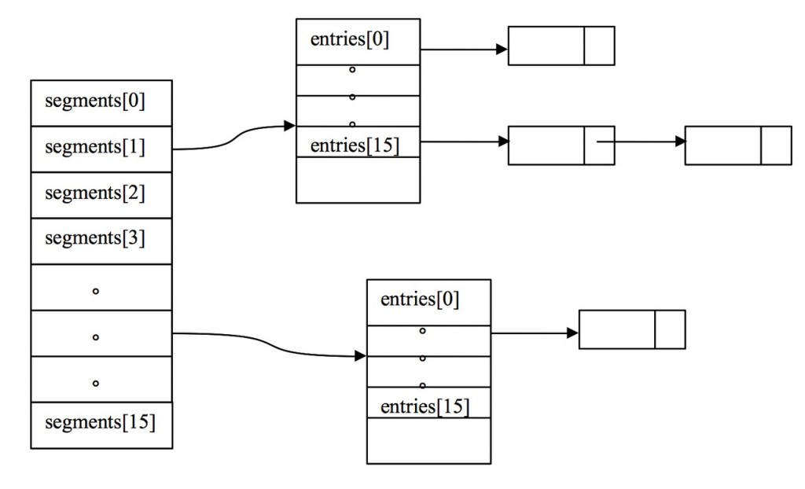

<!--ts-->
   * [前言](#前言)
   * [一个常犯的错误](#一个常犯的错误)
   * [hashcode()惹的祸](#hashcode惹的祸)
   * [总结](#总结)
   * [equals()](#equals)
   * [在equals()中使用getClass进行类型判断](#在equals中使用getclass进行类型判断)

<!-- Added by: anapodoton, at: Sat Feb 15 21:46:38 CST 2020 -->

<!--te-->

# 前言

所有Java类的父类——`java.lang.Object`中定义了两个重要的方法：

```java
public boolean equals(Object obj)
public int hashCode()
```

本文首先会给出一个错误使用这两个方法的例子，然后再解释equals和hashcode是如何协同工作的。

# 一个常犯的错误

先看以下代码：

```java
import java.util.HashMap;

public class Apple {
    private String color;

    public Apple(String color) {
        this.color = color;
    }

    public boolean equals(Object obj) {
        if(obj==null) return false;
        if (!(obj instanceof Apple))
            return false;   
        if (obj == this)
            return true;
        return this.color.equals(((Apple) obj).color);
    }

    public static void main(String[] args) {
        Apple a1 = new Apple("green");
        Apple a2 = new Apple("red");

        //hashMap stores apple type and its quantity
        HashMap<Apple, Integer> m = new HashMap<Apple, Integer>();
        m.put(a1, 10);
        m.put(a2, 20);
        System.out.println(m.get(new Apple("green")));
    }
}
```

上面的代码执行过程中，先是创建个两个Apple，一个green apple和一个red apple，然后将这来两个apple存储在map中，存储之后再试图通过map的get方法获取到其中green apple的实例。读者可以试着执行以上代码，数据结果为null。也就是说刚刚通过put方法放到map中的green apple并没有通过get方法获取到。你可能怀疑是不是green apple并没有被成功的保存到map中，但是，通过debug工具可以看到，它已经被保存成功了。

# hashcode()惹的祸

造成以上问题的原因其实比较简单，是因为代码中并没有重写`hashcode`方法。`hashcode`和`equals`的约定关系如下：

> 1、如果两个对象相等，那么他们一定有相同的哈希值（hash code）。
>
> 2、如果两个对象的哈希值相等，那么这两个对象有可能相等也有可能不相等。（需要再通过equals来判断）

如果你了解Map的工作原理，那么你一定知道，它是通过把key值进行hash来定位对象的，这样可以提供比线性存储更好的性能。实际上，Map的底层数据结构就是一个数组的数组（准确的说其实是一个链表+数组）。第一个数组的索引值是key的哈希码。通过这个索引可以定位到第二个数组，第二个数组通过使用equals方法进行线性搜索的方式来查找对象。([HashMap完全解读](http://www.hollischuang.com/archives/82))



其实，一个哈希码可以映射到一个桶（bucket）中，`hashcode`的作用就是先确定对象是属于哪个桶的。如果多个对象有相同的哈希值，那么他们可以放在同一个桶中。如果有不同的哈希值，则需要放在不同的桶中。至于同一个桶中的各个对象之前如何区分就需要使用`equals`方法了。

hashcode方法的默认实现会为每个对象返回一个不同的int类型的值。所以，上面的代码中，第二个apple被创建出来时他将具有不同的哈希值。可以通过重写hashCode方法来解决。

```java
public int hashCode(){
    return this.color.hashCode();   
}
```

# 总结

在判断两个对象是否相等时，不要只使用equals方法判断。还要考虑其哈希码是否相等。尤其是和hashMap等与hash相关的数据结构一起使用时。

# equals()    

超类Object中有这个equals()方法，该方法主要用于比较两个对象是否相等。该方法的源码如下：

```java
public boolean equals(Object obj) {
   return (this == obj);
}
```

我们知道所有的对象都拥有标识(内存地址)和状态(数据)，同时“==”比较两个对象的的内存地址，所以说使用Object的equals()方法是比较两个对象的内存地址是否相等，即若object1.equals(object2)为true，则表示equals1和equals2实际上是引用同一个对象。虽然有时候Object的equals()方法可以满足我们一些基本的要求，但是我们必须要清楚我们很大部分时间都是进行两个对象的比较，这个时候Object的equals()方法就不可以了，实际上JDK中，String、Math等封装类都对equals()方法进行了重写。下面是String的equals()方法：

```java
public boolean equals(Object anObject) {
   if (this == anObject) {
       return true;
   }
   if (anObject instanceof String) {
       String anotherString = (String)anObject;
       int n = count;
       if (n == anotherString.count) {
       char v1[] = value;
       char v2[] = anotherString.value;
       int i = offset;
       int j = anotherString.offset;
       while (n-- != 0) {
           if (v1[i++] != v2[j++])
           return false;
       }
       return true;
       }
   }
   return false;
   }
```

对于这个代码段:if (v1[i++] != v2[j++])return false;我们可以非常清晰的看到String的equals()方法是进行内容比较，而不是引用比较。至于其他的封装类都差不多。

在Java规范中，它对equals()方法的使用必须要遵循如下几个规则：

equals 方法在非空对象引用上实现相等关系：

- 1、自反性：对于任何非空引用值 x，x.equals(x) 都应返回 true。
- 2、对称性：对于任何非空引用值 x 和 y，当且仅当 y.equals(x) 返回 true 时，x.equals(y) 才应返回 true。
- 3、传递性：对于任何非空引用值 x、y 和 z，如果 x.equals(y) 返回 true，并且 y.equals(z) 返回 true，那么 x.equals(z) 应返回 true。
- 4、一致性：对于任何非空引用值 x 和 y，多次调用 x.equals(y) 始终返回 true 或始终返回 false，前提是对象上 equals 比较中所用的信息没有被修改。
- 5、对于任何非空引用值 x，x.equals(null) 都应返回 false。  

对于上面几个规则，我们在使用的过程中最好遵守，否则会出现意想不到的错误。

在java中进行比较，我们需要根据比较的类型来选择合适的比较方式：

- 1) 对象域，使用equals方法 。 
- 2) 类型安全的枚举，使用equals或== 。 
- 3) 可能为null的对象域 : 使用 == 和 equals 。 
- 4) 数组域 : 使用 Arrays.equals 。 
- 5) 除float和double外的原始数据类型 : 使用 == 。 
- 6) float类型: 使用Float.foatToIntBits转换成int类型，然后使用==。  
- 7) double类型: 使用Double.doubleToLongBit转换成long类型，然后使用==。

至于6）、7）为什么需要进行转换，我们可以参考他们相应封装类的equals()方法，下面的是Float类的：

```java
public boolean equals(Object obj) {
   return (obj instanceof Float)
          && (floatToIntBits(((Float)obj).value) == floatToIntBits(value));
}
```

原因嘛，里面提到了两点：

```java
However, there are two exceptions:
If f1 and f2 both represent
Float.NaN, then the equals method returns
true, even though Float.NaN==Float.NaN
has the value false.
If <code>f1 represents +0.0f while
f2 represents -0.0f, or vice
versa, the equal test has the value
false, even though 0.0f==-0.0f
has the value true.
```

# 在equals()中使用getClass进行类型判断

我们在覆写equals()方法时，一般都是推荐使用getClass来进行类型判断，不是使用instanceof。我们都清楚instanceof的作用是判断其左边对象是否为其右边类的实例，返回boolean类型的数据。可以用来判断继承中的子类的实例是否为父类的实现。注意后面这句话：可以用来判断继承中的子类的实例是否为父类的实现，正是这句话在作怪。我们先看如下实例(摘自《高质量代码 改善java程序的151个建议》)。

父类：Person

```java
public class Person {
   protected String name;

   public String getName() {
       return name;
   }

   public void setName(String name) {
       this.name = name;
   }

   public Person(String name){
       this.name = name;
   }

   public boolean equals(Object object){
       if(object instanceof Person){
           Person p = (Person) object;
           if(p.getName() == null || name == null){
               return false;
           }
           else{
               return name.equalsIgnoreCase(p.getName());
           }
       }
       return false;
   }
}
```

子类：Employee

```java
public class Employee extends Person{
   private int id;

   public int getId() {
       return id;
   }

   public void setId(int id) {
       this.id = id;
   }

   public Employee(String name,int id){
       super(name);
       this.id = id;
   }

   /**
    * 重写equals()方法
    */
   public boolean equals(Object object){
       if(object instanceof Employee){
           Employee e = (Employee) object;
           return super.equals(object) && e.getId() == id;
       }
       return false;
   }
}
```

上面父类Person和子类Employee都重写了equals(),不过Employee比父类多了一个id属性。测试程序如下：

```java
public class Test {
   public static void main(String[] args) {
       Employee e1 = new Employee("chenssy", 23);
       Employee e2 = new Employee("chenssy", 24);
       Person p1 = new Person("chenssy");

       System.out.println(p1.equals(e1));
       System.out.println(p1.equals(e2));
       System.out.println(e1.equals(e2));
   }
}
```

上面定义了两个员工和一个普通人，虽然他们同名，但是他们肯定不是同一人，所以按理来说输出结果应该全部都是false，但是事与愿违，结果是：true、true、false。

对于那e1!=e2我们非常容易理解，因为他们不仅需要比较name,还需要比较id。但是p1即等于e1也等于e2，这是非常奇怪的，因为e1、e2明明是两个不同的类，但为什么会出现这个情况？首先p1.equals(e1)，是调用p1的equals方法，该方法使用instanceof关键字来检查e1是否为Person类，这里我们再看看instanceof：判断其左边对象是否为其右边类的实例，也可以用来判断继承中的子类的实例是否为父类的实现。他们两者存在继承关系，肯定会返回true了，而两者name又相同，所以结果肯定是true。

所以出现上面的情况就是使用了关键字instanceof，这是非常容易“专空子”的。故在 **覆写equals时推荐使用getClass进行类型判断。而不是使用instanceof。**


