<!--ts-->
   * [前言](#前言)
   * [1. 为什么要有内存模型](#1-为什么要有内存模型)
      * [1.1 CPU和缓存一致性](#11-cpu和缓存一致性)
      * [1.2 处理器优化和指令重排](#12-处理器优化和指令重排)
   * [2.并发编程的问题](#2并发编程的问题)
   * [3. 什么是内存模型](#3-什么是内存模型)
   * [4.什么是Java内存模型](#4什么是java内存模型)
   * [5.Java内存模型的实现](#5java内存模型的实现)
      * [5.1原子性](#51原子性)
      * [5.2可见性](#52可见性)
      * [5.3有序性](#53有序性)
   * [6. 内存模型是怎么解决缓存一致性问题的？](#6-内存模型是怎么解决缓存一致性问题的)
      * [6.1 缓存一致性协议](#61-缓存一致性协议)
      * [6.2 内存模型](#62-内存模型)
      * [6.3 总结](#63-总结)
         * [思考](#思考)
   * [7.总结](#7总结)
   * [8. 深入理解 Java 内存模型系列教程](#8-深入理解-java-内存模型系列教程)
      * [8.1 深入理解 Java 内存模型（一）——基础](#81-深入理解-java-内存模型一基础)
         * [8.1.1 并发编程模型的分类](#811-并发编程模型的分类)
         * [8.1.2 Java 内存模型的抽象](#812-java-内存模型的抽象)
         * [8.1.3 重排序](#813-重排序)
         * [8.1.4 处理器重排序与内存屏障指令](#814-处理器重排序与内存屏障指令)
         * [8.1.5 happens-before](#815-happens-before)
      * [8.2 深入理解 Java 内存模型（二）——重排序](#82-深入理解-java-内存模型二重排序)
         * [8.2.1 数据依赖性](#821-数据依赖性)
         * [8.2.2 as-if-serial 语义](#822-as-if-serial-语义)
         * [8.2.3 程序顺序规则](#823-程序顺序规则)
         * [8.2.4 重排序对多线程的影响](#824-重排序对多线程的影响)
      * [8.3 深入理解 Java 内存模型（三）——顺序一致性](#83-深入理解-java-内存模型三顺序一致性)
         * [8.3.1 数据竞争与顺序一致性保证](#831-数据竞争与顺序一致性保证)
         * [8.3.2 顺序一致性内存模型](#832-顺序一致性内存模型)
         * [8.3.3 同步程序的顺序一致性效果](#833-同步程序的顺序一致性效果)
         * [8.3.4 未同步程序的执行特性](#834-未同步程序的执行特性)
      * [8.4 深入理解 Java 内存模型（四）——volatile](#84-深入理解-java-内存模型四volatile)
         * [8.4.1 volatile 的特性](#841-volatile-的特性)
         * [8.4.2 volatile 写 - 读建立的 happens before 关系](#842-volatile-写---读建立的-happens-before-关系)
         * [8.4.3 volatile 写 - 读的内存语义](#843-volatile-写---读的内存语义)
         * [8.4.4 volatile 内存语义的实现](#844-volatile-内存语义的实现)
         * [8.4.5 JSR-133 为什么要增强 volatile 的内存语义](#845-jsr-133-为什么要增强-volatile-的内存语义)
      * [8.5 深入理解 Java 内存模型（五）——锁](#85-深入理解-java-内存模型五锁)
         * [8.5.1 锁的释放 - 获取建立的 happens before 关系](#851-锁的释放---获取建立的-happens-before-关系)
         * [8.5.2 锁释放和获取的内存语义](#852-锁释放和获取的内存语义)
         * [8.5.3 锁内存语义的实现](#853-锁内存语义的实现)
         * [8.5.4 concurrent 包的实现](#854-concurrent-包的实现)
      * [8.6 深入理解 Java 内存模型（六）——final](#86-深入理解-java-内存模型六final)
         * [8.6.1 写 final 域的重排序规则](#861-写-final-域的重排序规则)
         * [8.6.2 读 final 域的重排序规则](#862-读-final-域的重排序规则)
         * [8.6.3 如果 final 域是引用类型](#863-如果-final-域是引用类型)
         * [8.6.4 为什么 final 引用不能从构造函数内“逸出”](#864-为什么-final-引用不能从构造函数内逸出)
         * [8.6.5 final 语义在处理器中的实现](#865-final-语义在处理器中的实现)
         * [8.6.6 JSR-133 为什么要增强 final 的语义](#866-jsr-133-为什么要增强-final-的语义)
      * [8.7 深入理解 Java 内存模型（七）——总结](#87-深入理解-java-内存模型七总结)
         * [8.7.1 处理器内存模型](#871-处理器内存模型)
      * [JMM，处理器内存模型与顺序一致性内存模型之间的关系](#jmm处理器内存模型与顺序一致性内存模型之间的关系)
      * [JMM 的设计](#jmm-的设计)
      * [JMM 的内存可见性保证](#jmm-的内存可见性保证)
      * [JSR-133 对旧内存模型的修补](#jsr-133-对旧内存模型的修补)
   * [扩展](#扩展)

<!-- Added by: anapodoton, at: Wed Feb 19 23:34:46 CST 2020 -->

<!--te-->

# 前言

回答下面这些问题：

内存可见性、重排序、顺序一致性、volatile、锁、final

**Java内存模型是什么，为什么要有Java内存模型，Java内存模型解决了什么问题？**

# 1. 为什么要有内存模型

> 在介绍Java内存模型之前，先来看一下到底什么是计算机内存模型，然后再来看Java内存模型在计算机内存模型的基础上做了哪些事情。要说计算机的内存模型，就要说一下一段古老的历史，看一下为什么要有内存模型。

**内存模型，英文名Memory Model，他是一个很老的老古董了。他是与计算机硬件有关的一个概念。那么我先给你介绍下他和硬件到底有啥关系。**

## 1.1 CPU和缓存一致性

我们应该都知道，计算机在执行程序的时候，每条指令都是在CPU中执行的，而执行的时候，又免不了要和数据打交道。而计算机上面的数据，是存放在主存当中的，也就是计算机的物理内存啦。

刚开始，还相安无事的，但是随着CPU技术的发展，CPU的执行速度越来越快。而由于内存的技术并没有太大的变化，所以从内存中读取和写入数据的过程和CPU的执行速度比起来差距就会越来越大,这就导致CPU每次操作内存都要耗费很多等待时间。

> 这就像一家创业公司，刚开始，创始人和员工之间工作关系其乐融融，但是随着创始人的能力和野心越来越大，逐渐和员工之间出现了差距，普通员工原来越跟不上CEO的脚步。老板的每一个命令，传到到基层员工之后，由于基层员工的理解能力、执行能力的欠缺，就会耗费很多时间。这也就无形中拖慢了整家公司的工作效率。

可是，不能因为内存的读写速度慢，就不发展CPU技术了吧，总不能让内存成为计算机处理的瓶颈吧。

所以，人们想出来了一个好的办法，就是在CPU和内存之间增加高速缓存。缓存的概念大家都知道，就是保存一份数据拷贝。他的特点是速度快，内存小，并且昂贵。

那么，程序的执行过程就变成了：

**当程序在运行过程中，会将运算需要的数据从主存复制一份到CPU的高速缓存当中，那么CPU进行计算时就可以直接从它的高速缓存读取数据和向其中写入数据，当运算结束之后，再将高速缓存中的数据刷新到主存当中。**

> 之后，这家公司开始设立中层管理人员，管理人员直接归CEO领导，领导有什么指示，直接告诉管理人员，然后就可以去做自己的事情了。管理人员负责去协调底层员工的工作。因为管理人员是了解手下的人员以及自己负责的事情的。所以，大多数时候，公司的各种决策，通知等，CEO只要和管理人员之间沟通就够了。

而随着CPU能力的不断提升，一层缓存就慢慢的无法满足要求了，就逐渐的衍生出多级缓存。

按照数据读取顺序和与CPU结合的紧密程度，CPU缓存可以分为一级缓存（L1），二级缓存（L3），部分高端CPU还具有三级缓存（L3），每一级缓存中所储存的全部数据都是下一级缓存的一部分。

这三种缓存的技术难度和制造成本是相对递减的，所以其容量也是相对递增的。

那么，在有了多级缓存之后，程序的执行就变成了：

**当CPU要读取一个数据时，首先从一级缓存中查找，如果没有找到再从二级缓存中查找，如果还是没有就从三级缓存或内存中查找。**

> 随着公司越来越大，老板要管的事情越来越多，公司的管理部门开始改革，开始出现高层，中层，底层等管理者。一级一级之间逐层管理。

单核CPU只含有一套L1，L2，L3缓存；如果CPU含有多个核心，即多核CPU，则每个核心都含有一套L1（甚至和L2）缓存，而共享L3（或者和L2）缓存。

> 公司也分很多种，有些公司只有一个大Boss，他一个人说了算。但是有些公司有比如联席总经理、合伙人等机制。
>
> 单核CPU就像一家公司只有一个老板，所有命令都来自于他，那么就只需要一套管理班底就够了。
>
> 多核CPU就像一家公司是由多个合伙人共同创办的，那么，就需要给每个合伙人都设立一套供自己直接领导的高层管理人员，多个合伙人共享使用的是公司的底层员工。
>
> 还有的公司，不断壮大，开始差分出各个子公司。各个子公司就是多个CPU了，互相之前没有共用的资源。互不影响。

下图为一个单CPU双核的缓存结构。


随着计算机能力不断提升，开始支持多线程。那么问题就来了。我们分别来分析下单线程、多线程在单核CPU、多核CPU中的影响。

**单线程。**cpu核心的缓存只被一个线程访问。缓存独占，不会出现访问冲突等问题。

**单核CPU，多线程。**进程中的多个线程会同时访问进程中的共享数据，CPU将某块内存加载到缓存后，不同线程在访问相同的物理地址的时候，都会映射到相同的缓存位置，这样即使发生线程的切换，缓存仍然不会失效。但由于任何时刻只能有一个线程在执行，因此不会出现缓存访问冲突。

**多核CPU，多线程。**每个核都至少有一个L1 缓存。多个线程访问进程中的某个共享内存，且这多个线程分别在不同的核心上执行，则每个核心都会在各自的caehe中保留一份共享内存的缓冲。由于多核是可以并行的，可能会出现多个线程同时写各自的缓存的情况，而各自的cache之间的数据就有可能不同。

在CPU和主存之间增加缓存，在多线程场景下就可能存在**缓存一致性问题**，也就是说，在多核CPU中，每个核的自己的缓存中，关于同一个数据的缓存内容可能不一致。

> 如果这家公司的命令都是串行下发的话，那么就没有任何问题。
>
> 如果这家公司的命令都是并行下发的话，并且这些命令都是由同一个CEO下发的，这种机制是也没有什么问题。因为他的命令执行者只有一套管理体系。
>
> 如果这家公司的命令都是并行下发的话，并且这些命令是由多个合伙人下发的，这就有问题了。因为每个合伙人只会把命令下达给自己直属的管理人员，而多个管理人员管理的底层员工可能是公用的。
>
> 比如，合伙人1要辞退员工a，合伙人2要给员工a升职，升职后的话他再被辞退需要多个合伙人开会决议。两个合伙人分别把命令下发给了自己的管理人员。合伙人1命令下达后，管理人员a在辞退了员工后，他就知道这个员工被开除了。而合伙人2的管理人员2这时候在没得到消息之前，还认为员工a是在职的，他就欣然的接收了合伙人给他的升职a的命令。


## 1.2 处理器优化和指令重排

上面提到在在CPU和主存之间增加缓存，在多线程（多核）场景下会存在**缓存一致性问题**。除了这种情况，还有一种硬件问题也比较重要。那就是为了使处理器内部的运算单元能够尽量的被充分利用，处理器可能会对输入代码进行乱序执行处理。这就是**处理器优化**。

除了现在很多流行的处理器会对代码进行优化乱序处理，很多编程语言的编译器也会有类似的优化，比如Java虚拟机的即时编译器（JIT）也会做**指令重排**。

可想而知，如果任由**处理器优化和编译器对指令重排**的话，就可能导致各种各样的问题。

> 关于员工组织调整的情况，如果允许人事部在接到多个命令后进行随意拆分乱序执行或者重排的话，那么对于这个员工以及这家公司的影响是非常大的。

# 2.并发编程的问题

前面说的和硬件有关的概念你可能听得有点蒙，还不知道他到底和软件有啥关系。但是关于并发编程的问题你应该有所了解，比如**原子性问题，可见性问题和有序性**问题。

**其实，原子性问题，可见性问题和有序性问题。是人们抽象定义出来的。而这个抽象的底层问题就是前面提到的缓存一致性问题、处理器优化问题和指令重排问题等。**

这里简单回顾下这三个问题，并不准备深入展开，感兴趣的读者可以自行学习。我们说，并发编程，为了保证数据的安全，需要满足以下三个特性：

**原子性**是指在一个操作中就是cpu不可以在中途暂停然后再调度，既不被中断操作，要不执行完成，要不就不执行。

**可见性**是指当多个线程访问同一个变量时，一个线程修改了这个变量的值，其他线程能够立即看得到修改的值。

**有序性**即程序执行的顺序按照代码的先后顺序执行。

有没有发现，**缓存一致性问题**其实就是**可见性问题**。而**处理器优化**是可以导致**原子性问题**的。**指令重排**即会导致**有序性问题**。所以，后文将不再提起硬件层面的那些概念，而是直接使用大家熟悉的原子性、可见性和有序性。

# 3. 什么是内存模型

前面提到的，缓存一致性问题、处理器器优化的指令重排问题是硬件的不断升级导致的。那么，有没有什么机制可以很好的解决上面的这些问题呢？

最简单直接的做法就是废除处理器和处理器的优化技术、废除CPU缓存，让CPU直接和主存交互。但是，这么做虽然可以保证多线程下的并发问题。但是，这就有点因噎废食了。

所以，为了保证并发编程中可以满足原子性、可见性及有序性。有一个重要的概念，那就是——内存模型。

**为了保证共享内存的正确性（可见性、有序性、原子性），内存模型定义了共享内存系统中多线程程序读写操作行为的规范。**通过这些规则来规范对内存的读写操作，从而保证指令执行的正确性。它与处理器有关、与缓存有关、与并发有关、与编译器也有关。他解决了CPU多级缓存、处理器优化、指令重排等导致的内存访问问题，保证了并发场景下的一致性、原子性和有序性。

内存模型解决并发问题主要采用两种方式：**限制处理器优化**和**使用内存屏障**。本文就不深入底层原理来展开介绍了，感兴趣的朋友可以自行学习。

# 4.什么是Java内存模型

前面介绍过了计算机内存模型，这是解决多线程场景下并发问题的一个重要规范。那么具体的实现是如何的呢，不同的编程语言，在实现上可能有所不同。

Java内存模型和操作系统内存模型的关系


我们知道，Java程序是需要运行在Java虚拟机上面的，**Java内存模型（Java Memory Model ,JMM）就是一种符合内存模型规范的，屏蔽了各种硬件和操作系统的访问差异的，保证了Java程序在各种平台下对内存的访问都能保证效果一致的机制及规范。**

Java内存模型规定了所有的变量都存储在主内存中，每条线程还有自己的工作内存，线程的工作内存中保存了该线程中是用到的变量的主内存副本拷贝，线程对变量的所有操作都必须在工作内存中进行，而不能直接读写主内存。不同的线程之间也无法直接访问对方工作内存中的变量，线程间变量的传递均需要自己的工作内存和主存之间进行数据同步进行。

而JMM就作用于工作内存和主存之间数据同步过程。他规定了如何做数据同步以及什么时候做数据同步。


这里面提到的主内存和工作内存，读者可以简单的类比成计算机内存模型中的主存和缓存的概念。特别需要注意的是，主内存和工作内存与JVM内存结构中的Java堆、栈、方法区等并不是同一个层次的内存划分，无法直接类比。《深入理解Java虚拟机》中认为，如果一定要勉强对应起来的话，从变量、主内存、工作内存的定义来看，主内存主要对应于Java堆中的对象实例数据部分。工作内存则对应于虚拟机栈中的部分区域。

**所以，再来总结下，JMM是一种规范，目的是解决由于多线程通过共享内存进行通信时，存在的本地内存数据不一致、编译器会对代码指令重排序、处理器会对代码乱序执行等带来的问题。**

# 5.Java内存模型的实现

了解Java多线程的朋友都知道，在Java中提供了一系列和并发处理相关的关键字，比如`volatile`、`synchronized`、`final`、`concurren`包等。其实这些就是Java内存模型封装了底层的实现后提供给程序员使用的一些关键字。

在开发多线程的代码的时候，我们可以直接使用`synchronized`等关键字来控制并发，从来就不需要关心底层的编译器优化、缓存一致性等问题。所以，**Java内存模型，除了定义了一套规范，还提供了一系列原语，封装了底层实现后，供开发者直接使用。**

本文并不准备把所有的关键字逐一介绍其用法，因为关于各个关键字的用法，网上有很多资料。读者可以自行学习。本文还有一个重点要介绍的就是，我们前面提到，并发编程要解决原子性、有序性和一致性的问题，我们就再来看下，在Java中，分别使用什么方式来保证。

## 5.1原子性

在Java中，为了保证原子性，提供了两个高级的字节码指令`monitorenter`和`monitorexit`。在[synchronized的实现原理](http://www.hollischuang.com/archives/1883)文章中，介绍过，这两个字节码，在Java中对应的关键字就是`synchronized`。

因此，在Java中可以使用`synchronized`来保证方法和代码块内的操作是原子性的。

## 5.2可见性

Java内存模型是通过在变量修改后将新值同步回主内存，在变量读取前从主内存刷新变量值的这种依赖主内存作为传递媒介的方式来实现的。

Java中的`volatile`关键字提供了一个功能，那就是被其修饰的变量在被修改后可以立即同步到主内存，被其修饰的变量在每次是用之前都从主内存刷新。因此，可以使用`volatile`来保证多线程操作时变量的可见性。

除了`volatile`，Java中的`synchronized`和`final`两个关键字也可以实现可见性。只不过实现方式不同，这里不再展开了。

## 5.3有序性

在Java中，可以使用`synchronized`和`volatile`来保证多线程之间操作的有序性。实现方式有所区别：

`volatile`关键字会禁止指令重排。`synchronized`关键字保证同一时刻只允许一条线程操作。

好了，这里简单的介绍完了Java并发编程中解决原子性、可见性以及有序性可以使用的关键字。读者可能发现了，好像`synchronized`关键字是万能的，他可以同时满足以上三种特性，这其实也是很多人滥用`synchronized`的原因。

但是`synchronized`是比较影响性能的，虽然编译器提供了很多锁优化技术，但是也不建议过度使用。

# 6. 内存模型是怎么解决缓存一致性问题的？

我们在文章中提到过，由于CPU和主存的处理速度上存在一定差别，为了匹配这种差距，提升计算机能力，人们在CPU和主存之间增加了多层高速缓存。每个CPU会有L1、L2甚至L3缓存，在多核计算机中会有多个CPU，那么就会存在多套缓存，那么这多套缓存之间的数据就可能出现不一致的现象。为了解决这个问题，有了内存模型。**内存模型定义了共享内存系统中多线程程序读写操作行为的规范**。通过这些规则来规范对内存的读写操作，从而保证指令执行的正确性。

不知道小伙伴们有没有想过这样的问题：**内存模型到底是怎么保证缓存一致性的呢？**

接下来我们试着回答这个问题。首先，缓存一致性是由于引入缓存而导致的问题，所以，这是很多CPU厂商必须解决的问题。为了解决前面提到的缓存数据不一致的问题，人们提出过很多方案，通常来说有以下2种方案：

> 1、通过在总线加`LOCK#`锁的方式。
>
> 2、通过缓存一致性协议（Cache Coherence Protocol）。

在早期的CPU当中，是通过在总线上加`LOCK#`锁的形式来解决缓存不一致的问题。因为CPU和其他部件进行通信都是通过总线来进行的，如果对总线加`LOCK#`锁的话，也就是说阻塞了其他CPU对其他部件访问（如内存），从而使得只能有一个CPU能使用这个变量的内存。在总线上发出了`LCOK#`锁的信号，那么只有等待这段代码完全执行完毕之后，其他CPU才能从其内存读取变量，然后进行相应的操作。这样就解决了缓存不一致的问题。

但是由于在锁住总线期间，其他CPU无法访问内存，会**导致效率低下**。因此出现了第二种解决方案，通过缓存一致性协议来解决缓存一致性问题。

## 6.1 缓存一致性协议

缓存一致性协议（Cache Coherence Protocol），最出名的就是Intel 的MESI协议，MESI协议保证了**每个缓存中使用的共享变量的副本是一致的。**

> MESI的核心的思想是：当CPU写数据时，如果发现操作的变量是共享变量，即在其他CPU中也存在该变量的副本，会发出信号通知其他CPU将该变量的缓存行置为无效状态，因此当其他CPU需要读取这个变量时，发现自己缓存中缓存该变量的缓存行是无效的，那么它就会从内存重新读取。

在MESI协议中，每个缓存可能有有4个状态，它们分别是：

> **M(Modified)**：这行数据有效，数据被修改了，和内存中的数据不一致，数据只存在于本Cache中。
>
> **E(Exclusive)**：这行数据有效，数据和内存中的数据一致，数据只存在于本Cache中。
>
> **S(Shared)**：这行数据有效，数据和内存中的数据一致，数据存在于很多Cache中。
>
> **I(Invalid)**：这行数据无效。

关于MESI的更多细节这里就不详细介绍了，读者只要知道，MESI是一种比较常用的缓存一致性协议，他可以用来解决缓存之间的数据一致性问题就可以了。

但是，值得注意的是，传统的MESI协议中有两个行为的执行成本比较大。

一个是将某个Cache Line标记为Invalid状态，另一个是当某Cache Line当前状态为Invalid时写入新的数据。所以CPU通过Store Buffer和Invalidate Queue组件来降低这类操作的延时。

如图：


当一个CPU进行写入时，首先会给其它CPU发送Invalid消息，然后把当前写入的数据写入到Store Buffer中。然后异步在**某个时刻**真正的写入到Cache中。

当前CPU核如果要读Cache中的数据，需要先扫描Store Buffer之后再读取Cache。

但是此时其它CPU核是看不到当前核的Store Buffer中的数据的，要等到Store Buffer中的数据被刷到了Cache之后才会触发失效操作。

而当一个CPU核收到Invalid消息时，会把消息写入自身的Invalidate Queue中，随后**异步**将其设为Invalid状态。

和Store Buffer不同的是，当前CPU核心使用Cache时并不扫描Invalidate Queue部分，所以可能会**有极短时间的脏读问题**。

所以，为了解决缓存的一致性问题，比较典型的方案是MESI缓存一致性协议。

**MESI协议，可以保证缓存的一致性，但是无法保证实时性。**

## 6.2 内存模型

前面介绍过了缓存一致性模型，接着我们再来看一下内存模型。我们说过内存模型定义一系列规范，来保证多线程访问共享变量时的可见性、有序性和原子性。（更多内容请参考[再有人问你Java内存模型是什么，就把这篇文章发给他](http://www.hollischuang.com/archives/2550)）

内存模型（Memory Model）如果扩展开来说的话，通常指的是内存一致性模型（Memory Sequential Consistency Model）

前面我们提到过缓存一致性，这里又要说内存一致性，不是故意要把读者搞蒙，而是希望通过对比让读者更加清楚。

**缓存一致性（Cache Coherence），解决是多个缓存副本之间的数据的一致性问题。**

**内存一致性（Memory Consistency），保证的是多线程程序访问内存时可以读到什么值。**

我们首先看以下程序：

```java
初始：x=0 y=0

Thread1：
S1：x=1
L1：r1=y

Thread2：
S2：y=2
L2：r2=x
```

其中，S1、S2、L1、L2是语句代号（S表示Store，L表示Load）；r1和r2是两个寄存器。x和y是两个不同的内存变量。两个线程执行完之后，r1和r2可能是什么值？

注意到线程是并发、交替执行的，下面是可能的执行顺序和相应结果：

```
S1 L1 S2 L2 那么r1=0 r2=2

S1 S2 L1 L2 那么r1=2 r2=1

S2 L2 S1 L1 那么r1=2 r2=0
```

这些都是意料之内、情理之中的。但是在x86体系结构下，很可能得到r1=0 r2=0这样的结果。

如果没有`Memory Consistency`，程序员写的程序代码的输出结果是不确定的。

因此，`Memory Consistency`就是程序员（编程语言）、编译器、CPU间的一种协议。这个协议保证了程序访问内存时会得到什么值。

**简单点说，内存一致性，就是保证并发场景下的程序运行结果和程序员预期是一样的（当然，要通过加锁等方式），包括的就是并发编程中的原子性、有序性和可见性。而缓存一致性说的就是并发编程中的可见性。**

**在很多内存模型的实现中，关于缓存一致性的保证都是通过硬件层面缓存一致性协议来保证的。**需要注意的是，这里提到的内存模型，是计算机内存模型，而非Java内存模型。

## 6.3 总结

**缓存一致性问题**。硬件层面的问题，指的是由于多核计算机中有多套缓存，各个缓存之间的数据不一致性问题。

PS：这里还需要再重复一遍，Java多线程中，每个线程都有自己的工作内存，需要和主存进行交互。这里的工作内存和计算机硬件的缓存并不是一回事儿，只是可以相互类比。所以，并发编程的可见性问题，是因为各个线程之间的本地内存数据不一致导致的，和计算机缓存并无关系。

**缓存一致性协议**。用来解决缓存一致性问题的，常用的是MESI协议。

**内存一致性模型**。屏蔽计算机硬件问题，主要来解决并发编程中的原子性、有序性和一致性问题。

**实现内存一致性模型的时候可能会用到缓存一致性模型。**

### 思考

最后，再给大家留一道思考题：

既然在硬件层面，已经有了缓存一致性协议，可以保证缓存的一致性即并发编程中的可见性，那么为什么在写多线程的代码的时候，程序员要自己使用volatile、synchronized等关键字来保证可见性？

# 7.总结

在读完本文之后，相信你应该了解了什么是Java内存模型、Java内存模型的作用以及Java中内存模型做了什么事情等。关于Java中这些和内存模型有关的关键字，希望读者还可以继续深入学习，并且自己写几个例子亲自体会一下。

------

下面是深入理解Java内存模型系列。

# 8. 深入理解 Java 内存模型系列教程

## 8.1 深入理解 Java 内存模型（一）——基础

### 8.1.1 并发编程模型的分类

在并发编程中，我们需要处理两个关键问题：**线程之间如何通信及线程之间如何同步**（这里的线程是指并发执行的活动实体）。**通信是指线程之间以何种机制来交换信息。在命令式编程中，线程之间的通信机制有两种：共享内存和消息传递。**

在共享内存的并发模型里，线程之间共享程序的公共状态，线程之间通过写 - 读内存中的公共状态来隐式进行通信。在消息传递的并发模型里，线程之间没有公共状态，线程之间必须通过明确的发送消息来显式进行通信。

什么是线程之间的同步？

**同步是指程序用于控制不同线程之间操作发生相对顺序的机制**。在共享内存并发模型里，同步是显式进行的。程序员必须显式指定某个方法或某段代码需要在线程之间互斥执行。在消息传递的并发模型里，由于消息的发送必须在消息的接收之前，因此同步是隐式进行的。

**Java 的并发采用的是共享内存模型**，Java 线程之间的通信总是隐式进行，整个通信过程对程序员完全透明。如果编写多线程程序的 Java 程序员不理解隐式进行的线程之间通信的工作机制，很可能会遇到各种奇怪的内存可见性问题。

### 8.1.2 Java 内存模型的抽象

在 java 中，所有实例域、静态域（静态数组和静态实例）和数组元素存储在堆内存中，堆内存在线程之间共享（本文使用“共享变量”这个术语代指实例域，静态域和数组元素）。局部变量（Local variables），方法定义参数（java 语言规范称之为 formal method parameters）和异常处理器参数（exception handler parameters）不会在线程之间共享，它们不会有内存可见性问题，也不受内存模型的影响。

Java 线程之间的通信由 Java 内存模型（本文简称为 JMM）控制，JMM 决定一个线程对共享变量的写入何时对另一个线程可见。

从抽象的角度来看，**JMM 定义了线程和主内存之间的抽象关系**：线程之间的共享变量存储在主内存（main memory）中。

每个线程都有一个私有的**本地内存（local memory）**，本地内存中存储了该线程以读 / 写共享变量的副本。本地内存是 JMM 的一个抽象概念，并不真实存在。它涵盖了缓存，写缓冲区，寄存器以及其他的硬件和编译器优化。

**因为在多核多线程模式下，一个线程无法直接读取另外一个线程的本地内存（即缓存，寄存器等），只能从内存中获取到值。因为在设计的时候，每个CPU都会有自己的缓存，只有内存是多个CPU共用的。**

Java 内存模型的抽象示意图如下：


从上图来看，线程 A 与线程 B 之间如要通信的话，必须要经历下面 2 个步骤：

1. 首先，线程 A 把本地内存 A 中更新过的共享变量刷新到主内存中去。
2. 然后，线程 B 到主内存中去读取线程 A 之前已更新过的共享变量。

下面通过示意图来说明这两个步骤：


如上图所示，本地内存 A 和 B 有主内存中共享变量 x 的副本。假设初始时，这三个内存中的 x 值都为 0。线程 A 在执行时，把更新后的 x 值（假设值为 1）临时存放在自己的本地内存 A 中。当线程 A 和线程 B 需要通信时，线程 A 首先会把自己本地内存中修改后的 x 值刷新到主内存中，此时主内存中的 x 值变为了 1。随后，线程 B 到主内存中去读取线程 A 更新后的 x 值，此时线程 B 的本地内存的 x 值也变为了 1。

从整体来看，这两个步骤实质上是线程 A 在向线程 B 发送消息，而且这个通信过程必须要经过主内存。**JMM 通过控制主内存与每个线程的本地内存之间的交互，来为 java 程序员提供内存可见性保证**。

### 8.1.3 重排序

在执行程序时为了提高性能，编译器和处理器常常会对指令做重排序。重排序分三种类型：

1. 编译器优化的重排序。编译器在不改变单线程程序语义的前提下，可以重新安排语句的执行顺序。
2. 指令级并行的重排序。现代处理器采用了指令级并行技术（Instruction-Level Parallelism， ILP）来将多条指令重叠执行。如果不存在数据依赖性，处理器可以改变语句对应机器指令的执行顺序。
3. 内存系统的重排序。由于处理器使用缓存和读 / 写缓冲区，这使得加载和存储操作看上去可能是在乱序执行。

从 java 源代码到最终实际执行的指令序列，会分别经历下面三种重排序：


上述的 1 属于编译器重排序，2 和 3 属于处理器重排序。这些重排序都可能会导致多线程程序出现内存可见性问题。对于编译器，JMM 的编译器重排序规则会禁止特定类型的编译器重排序（不是所有的编译器重排序都要禁止）。对于处理器重排序，JMM 的处理器重排序规则会要求 java 编译器在生成指令序列时，插入特定类型的内存屏障（memory barriers，intel 称之为 memory fence）指令，通过内存屏障指令来禁止特定类型的处理器重排序（不是所有的处理器重排序都要禁止）。

JMM 属于语言级的内存模型，它确保在不同的编译器和不同的处理器平台之上，通过禁止特定类型的编译器重排序和处理器重排序，为程序员提供一致的内存可见性保证。

### 8.1.4 处理器重排序与内存屏障指令

**现代的处理器使用写缓冲区来临时保存向内存写入的数据**。写缓冲区可以保证指令流水线持续运行，它可以避免由于处理器停顿下来等待向内存写入数据而产生的延迟。同时，通过以批处理的方式刷新写缓冲区，以及合并写缓冲区中对同一内存地址的多次写，可以减少对内存总线的占用。虽然写缓冲区有这么多好处，但每个处理器上的写缓冲区，仅仅对它所在的处理器可见。这个特性会对内存操作的执行顺序产生重要的影响：处理器对内存的读 / 写操作的执行顺序，不一定与内存实际发生的读 / 写操作顺序一致！为了具体说明，请看下面示例：

| Processor A                                                | Processor B                |
| ---------------------------------------------------------- | -------------------------- |
| a = 1; //A1    x = b; //A2                                 | b = 2; //B1    y = a; //B2 |
| 初始状态：a = b = 0    处理器允许执行后得到结果：x = y = 0 |                            |

假设处理器 A 和处理器 B 按程序的顺序并行执行内存访问，最终却可能得到 x = y = 0 的结果。具体的原因如下图所示：


这里处理器 A 和处理器 B 可以同时把共享变量写入自己的写缓冲区（A1，B1），然后从内存中读取另一个共享变量（A2，B2），最后才把自己写缓存区中保存的脏数据刷新到内存中（A3，B3）。当以这种时序执行时，程序就可以得到 x = y = 0 的结果。

从内存操作实际发生的顺序来看，直到处理器 A 执行 A3 来刷新自己的写缓存区，写操作 A1 才算真正执行了。虽然处理器 A 执行内存操作的顺序为：A1->A2，但内存操作实际发生的顺序却是：A2->A1。此时，处理器 A 的内存操作顺序被重排序了（处理器 B 的情况和处理器 A 一样，这里就不赘述了）。

这里的关键是，由于写缓冲区仅对自己的处理器可见，它会导致处理器执行内存操作的顺序可能会与内存实际的操作执行顺序不一致。由于现代的处理器都会使用写缓冲区，因此现代的处理器都会允许对写 - 读操做重排序。

下面是常见处理器允许的重排序类型的列表：

|           | Load-Load | Load-Store | Store-Store | Store-Load | 数据依赖 |
| --------- | --------- | ---------- | ----------- | ---------- | -------- |
| sparc-TSO | N         | N          | N           | Y          | N        |
| x86       | N         | N          | N           | Y          | N        |
| ia64      | Y         | Y          | Y           | Y          | N        |
| PowerPC   | Y         | Y          | Y           | Y          | N        |

上表单元格中的“N”表示处理器不允许两个操作重排序，“Y”表示允许重排序。

从上表我们可以看出：常见的处理器都允许 Store-Load 重排序；常见的处理器都不允许对存在数据依赖的操作做重排序。sparc-TSO 和 x86 拥有相对较强的处理器内存模型，它们仅允许对写 - 读操作做重排序（因为它们都使用了写缓冲区）。

※注 1：sparc-TSO 是指以 TSO(Total Store Order) 内存模型运行时，sparc 处理器的特性。

※注 2：上表中的 x86 包括 x64 及 AMD64。

※注 3：由于 ARM 处理器的内存模型与 PowerPC 处理器的内存模型非常类似，本文将忽略它。

※注 4：数据依赖性后文会专门说明。

为了保证内存可见性，java 编译器在生成指令序列的适当位置会插入内存屏障指令来禁止特定类型的处理器重排序。JMM 把内存屏障指令分为下列四类：

| 屏障类型            | 指令示例                   | 说明                                                         |
| ------------------- | -------------------------- | ------------------------------------------------------------ |
| LoadLoad Barriers   | Load1; LoadLoad; Load2     | 确保 Load1 数据的装载，之前于 Load2 及所有后续装载指令的装载。 |
| StoreStore Barriers | Store1; StoreStore; Store2 | 确保 Store1 数据对其他处理器可见（刷新到内存），之前于 Store2 及所有后续存储指令的存储。 |
| LoadStore Barriers  | Load1; LoadStore; Store2   | 确保 Load1 数据装载，之前于 Store2 及所有后续的存储指令刷新到内存。 |
| StoreLoad Barriers  | Store1; StoreLoad; Load2   | 确保 Store1 数据对其他处理器变得可见（指刷新到内存），之前于 Load2 及所有后续装载指令的装载。StoreLoad Barriers 会使该屏障之前的所有内存访问指令（存储和装载指令）完成之后，才执行该屏障之后的内存访问指令。 |

StoreLoad Barriers 是一个“全能型”的屏障，它同时具有其他三个屏障的效果。现代的多处理器大都支持该屏障（其他类型的屏障不一定被所有处理器支持）。执行该屏障开销会很昂贵，因为当前处理器通常要把写缓冲区中的数据全部刷新到内存中（buffer fully flush）。

### 8.1.5 happens-before

从 JDK5 开始，java 使用新的 JSR -133 内存模型（本文除非特别说明，针对的都是 JSR- 133 内存模型）。JSR-133 提出了 happens-before 的概念，通过这个概念来阐述操作之间的内存可见性。如果一个操作执行的结果需要对另一个操作可见，那么这两个操作之间必须存在 happens-before 关系。这里提到的两个操作既可以是在一个线程之内，也可以是在不同线程之间。 与程序员密切相关的 happens-before 规则如下：

- 程序顺序规则：一个线程中的每个操作，happens- before 于该线程中的任意后续操作。
- 监视器锁规则：对一个监视器锁的解锁，happens- before 于随后对这个监视器锁的加锁。
- volatile 变量规则：对一个 volatile 域的写，happens- before 于任意后续对这个 volatile 域的读。
- 传递性：如果 A happens- before B，且 B happens- before C，那么 A happens- before C。

注意，两个操作之间具有 happens-before 关系，并不意味着前一个操作必须要在后一个操作之前执行！happens-before 仅仅要求前一个操作（执行的结果）对后一个操作可见，且前一个操作按顺序排在第二个操作之前（the first is visible to and ordered before the second）。happens- before 的定义很微妙，后文会具体说明 happens-before 为什么要这么定义。

happens-before 与 JMM 的关系如下图所示：


如上图所示，一个 happens-before 规则通常对应于多个编译器重排序规则和处理器重排序规则。对于 java 程序员来说，happens-before 规则简单易懂，它避免程序员为了理解 JMM 提供的内存可见性保证而去学习复杂的重排序规则以及这些规则的具体实现。

## 8.2 深入理解 Java 内存模型（二）——重排序

### 8.2.1 数据依赖性

如果两个操作访问同一个变量，且这两个操作中有一个为写操作，此时这两个操作之间就存在数据依赖性。数据依赖分下列三种类型：

| 名称   | 代码示例     | 说明                           |
| ------ | ------------ | ------------------------------ |
| 写后读 | a = 1;b = a; | 写一个变量之后，再读这个位置。 |
| 写后写 | a = 1;a = 2; | 写一个变量之后，再写这个变量。 |
| 读后写 | a = b;b = 1; | 读一个变量之后，再写这个变量。 |

上面三种情况，只要重排序两个操作的执行顺序，程序的执行结果将会被改变。

前面提到过，编译器和处理器可能会对操作做重排序。编译器和处理器在重排序时，会遵守数据依赖性，编译器和处理器不会改变存在数据依赖关系的两个操作的执行顺序。

注意，这里所说的数据依赖性仅针对单个处理器中执行的指令序列和单个线程中执行的操作，不同处理器之间和不同线程之间的数据依赖性不被编译器和处理器考虑。

### 8.2.2 as-if-serial 语义

as-if-serial 语义的意思指：不管怎么重排序（编译器和处理器为了提高并行度），（单线程）程序的执行结果不能被改变。编译器，runtime 和处理器都必须遵守 as-if-serial 语义。

为了遵守 as-if-serial 语义，编译器和处理器不会对存在数据依赖关系的操作做重排序，因为这种重排序会改变执行结果。但是，如果操作之间不存在数据依赖关系，这些操作可能被编译器和处理器重排序。为了具体说明，请看下面计算圆面积的代码示例：

```
double pi  = 3.14;    //A
double r   = 1.0;     //B
double area = pi * r * r; //C
```

上面三个操作的数据依赖关系如下图所示：

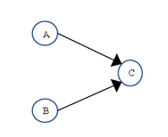

如上图所示，A 和 C 之间存在数据依赖关系，同时 B 和 C 之间也存在数据依赖关系。因此在最终执行的指令序列中，C 不能被重排序到 A 和 B 的前面（C 排到 A 和 B 的前面，程序的结果将会被改变）。但 A 和 B 之间没有数据依赖关系，编译器和处理器可以重排序 A 和 B 之间的执行顺序。下图是该程序的两种执行顺序：


as-if-serial 语义把单线程程序保护了起来，遵守 as-if-serial 语义的编译器，runtime 和处理器共同为编写单线程程序的程序员创建了一个幻觉：单线程程序是按程序的顺序来执行的。as-if-serial 语义使单线程程序员无需担心重排序会干扰他们，也无需担心内存可见性问题。

### 8.2.3 程序顺序规则

根据 happens- before 的程序顺序规则，上面计算圆的面积的示例代码存在三个 happens- before 关系：

1. A happens- before B；
2. B happens- before C；
3. A happens- before C；

这里的第 3 个 happens- before 关系，是根据 happens- before 的传递性推导出来的。

这里 A happens- before B，但实际执行时 B 却可以排在 A 之前执行（看上面的重排序后的执行顺序）。在第一章提到过，如果 A happens- before B，JMM 并不要求 A 一定要在 B 之前执行。JMM 仅仅要求前一个操作（执行的结果）对后一个操作可见，且前一个操作按顺序排在第二个操作之前。这里操作 A 的执行结果不需要对操作 B 可见；而且重排序操作 A 和操作 B 后的执行结果，与操作 A 和操作 B 按 happens- before 顺序执行的结果一致。在这种情况下，JMM 会认为这种重排序并不非法（not illegal），JMM 允许这种重排序。

在计算机中，软件技术和硬件技术有一个共同的目标：在不改变程序执行结果的前提下，尽可能的开发并行度。编译器和处理器遵从这一目标，从 happens- before 的定义我们可以看出，JMM 同样遵从这一目标。

### 8.2.4 重排序对多线程的影响

现在让我们来看看，重排序是否会改变多线程程序的执行结果。请看下面的示例代码：

```java
class ReorderExample {
int a = 0;
boolean flag = false;

public void writer() {
    a = 1;                   //1
    flag = true;             //2
}

Public void reader() {
    if (flag) {                //3
        int i =  a * a;        //4
        ……
    }
}
}
```

flag 变量是个标记，用来标识变量 a 是否已被写入。这里假设有两个线程 A 和 B，A 首先执行 writer() 方法，随后 B 线程接着执行 reader() 方法。线程 B 在执行操作 4 时，能否看到线程 A 在操作 1 对共享变量 a 的写入？

答案是：不一定能看到。

由于操作 1 和操作 2 没有数据依赖关系，编译器和处理器可以对这两个操作重排序；同样，操作 3 和操作 4 没有数据依赖关系，编译器和处理器也可以对这两个操作重排序。让我们先来看看，当操作 1 和操作 2 重排序时，可能会产生什么效果？请看下面的程序执行时序图：


如上图所示，操作 1 和操作 2 做了重排序。程序执行时，线程 A 首先写标记变量 flag，随后线程 B 读这个变量。由于条件判断为真，线程 B 将读取变量 a。此时，变量 a 还根本没有被线程 A 写入，在这里多线程程序的语义被重排序破坏了！

※注：本文统一用红色的虚箭线表示错误的读操作，用绿色的虚箭线表示正确的读操作。

下面再让我们看看，当操作 3 和操作 4 重排序时会产生什么效果（借助这个重排序，可以顺便说明控制依赖性）。下面是操作 3 和操作 4 重排序后，程序的执行时序图：


在程序中，操作 3 和操作 4 存在控制依赖关系。当代码中存在控制依赖性时，会影响指令序列执行的并行度。为此，编译器和处理器会采用猜测（Speculation）执行来克服控制相关性对并行度的影响。以处理器的猜测执行为例，执行线程 B 的处理器可以提前读取并计算 a*a，然后把计算结果临时保存到一个名为重排序缓冲（reorder buffer ROB）的硬件缓存中。当接下来操作 3 的条件判断为真时，就把该计算结果写入变量 i 中。

从图中我们可以看出，猜测执行实质上对操作 3 和 4 做了重排序。重排序在这里破坏了多线程程序的语义！

在单线程程序中，对存在控制依赖的操作重排序，不会改变执行结果（这也是 as-if-serial 语义允许对存在控制依赖的操作做重排序的原因）；但在多线程程序中，对存在控制依赖的操作重排序，可能会改变程序的执行结果。

## 8.3 深入理解 Java 内存模型（三）——顺序一致性

### 8.3.1 数据竞争与顺序一致性保证

当程序未正确同步时，就会存在数据竞争。java 内存模型规范对数据竞争的定义如下：

- 在一个线程中写一个变量，
- 在另一个线程读同一个变量，
- 而且写和读没有通过同步来排序。

当代码中包含数据竞争时，程序的执行往往产生违反直觉的结果（前一章的示例正是如此）。如果一个多线程程序能正确同步，这个程序将是一个没有数据竞争的程序。

JMM 对正确同步的多线程程序的内存一致性做了如下保证：

- 如果程序是正确同步的，程序的执行将具有顺序一致性（sequentially consistent）-- 即程序的执行结果与该程序在顺序一致性内存模型中的执行结果相同（马上我们将会看到，这对于程序员来说是一个极强的保证）。这里的同步是指广义上的同步，包括对常用同步原语（lock，volatile 和 final）的正确使用。

### 8.3.2 顺序一致性内存模型

顺序一致性内存模型是一个被计算机科学家理想化了的理论参考模型，它为程序员提供了极强的内存可见性保证。顺序一致性内存模型有两大特性：

- 一个线程中的所有操作必须按照程序的顺序来执行。
- （不管程序是否同步）所有线程都只能看到一个单一的操作执行顺序。在顺序一致性内存模型中，每个操作都必须原子执行且立刻对所有线程可见。

顺序一致性内存模型为程序员提供的视图如下：


在概念上，顺序一致性模型有一个单一的全局内存，这个内存通过一个左右摆动的开关可以连接到任意一个线程。同时，每一个线程必须按程序的顺序来执行内存读 / 写操作。从上图我们可以看出，在任意时间点最多只能有一个线程可以连接到内存。当多个线程并发执行时，图中的开关装置能把所有线程的所有内存读 / 写操作串行化。

为了更好的理解，下面我们通过两个示意图来对顺序一致性模型的特性做进一步的说明。

假设有两个线程 A 和 B 并发执行。其中 A 线程有三个操作，它们在程序中的顺序是：A1->A2->A3。B 线程也有三个操作，它们在程序中的顺序是：B1->B2->B3。

假设这两个线程使用监视器来正确同步：A 线程的三个操作执行后释放监视器，随后 B 线程获取同一个监视器。那么程序在顺序一致性模型中的执行效果将如下图所示：


现在我们再假设这两个线程没有做同步，下面是这个未同步程序在顺序一致性模型中的执行示意图：


未同步程序在顺序一致性模型中虽然整体执行顺序是无序的，但所有线程都只能看到一个一致的整体执行顺序。以上图为例，线程 A 和 B 看到的执行顺序都是：B1->A1->A2->B2->A3->B3。之所以能得到这个保证是因为顺序一致性内存模型中的每个操作必须立即对任意线程可见。

但是，在 JMM 中就没有这个保证。未同步程序在 JMM 中不但整体的执行顺序是无序的，而且所有线程看到的操作执行顺序也可能不一致。比如，在当前线程把写过的数据缓存在本地内存中，且还没有刷新到主内存之前，这个写操作仅对当前线程可见；从其他线程的角度来观察，会认为这个写操作根本还没有被当前线程执行。只有当前线程把本地内存中写过的数据刷新到主内存之后，这个写操作才能对其他线程可见。在这种情况下，当前线程和其它线程看到的操作执行顺序将不一致。

### 8.3.3 同步程序的顺序一致性效果

下面我们对前面的示例程序 ReorderExample 用监视器来同步，看看正确同步的程序如何具有顺序一致性。

请看下面的示例代码：

```java
class SynchronizedExample {
int a = 0;
boolean flag = false;

public synchronized void writer() {
    a = 1;
    flag = true;
}

public synchronized void reader() {
    if (flag) {
        int i = a;
        ……
    }
}
}
```

上面示例代码中，假设 A 线程执行 writer() 方法后，B 线程执行 reader() 方法。这是一个正确同步的多线程程序。根据 JMM 规范，该程序的执行结果将与该程序在顺序一致性模型中的执行结果相同。下面是该程序在两个内存模型中的执行时序对比图：

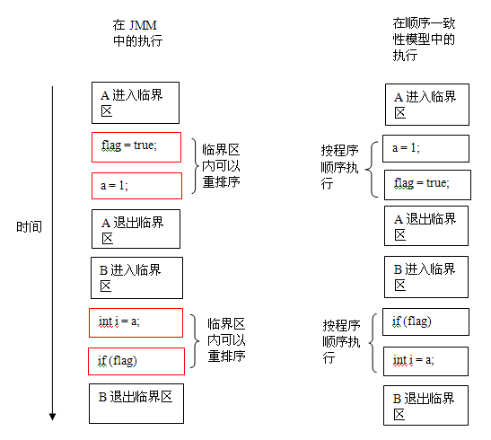

在顺序一致性模型中，所有操作完全按程序的顺序串行执行。而在 JMM 中，临界区内的代码可以重排序（但 JMM 不允许临界区内的代码“逸出”到临界区之外，那样会破坏监视器的语义）。JMM 会在退出监视器和进入监视器这两个关键时间点做一些特别处理，使得线程在这两个时间点具有与顺序一致性模型相同的内存视图（具体细节后文会说明）。虽然线程 A 在临界区内做了重排序，但由于监视器的互斥执行的特性，这里的线程 B 根本无法“观察”到线程 A 在临界区内的重排序。这种重排序既提高了执行效率，又没有改变程序的执行结果。

从这里我们可以看到 JMM 在具体实现上的基本方针：在不改变（正确同步的）程序执行结果的前提下，尽可能的为编译器和处理器的优化打开方便之门。

### 8.3.4 未同步程序的执行特性

对于未同步或未正确同步的多线程程序，JMM 只提供最小安全性：线程执行时读取到的值，要么是之前某个线程写入的值，要么是默认值（0，null，false），JMM 保证线程读操作读取到的值不会无中生有（out of thin air）的冒出来。为了实现最小安全性，JVM 在堆上分配对象时，首先会清零内存空间，然后才会在上面分配对象（JVM 内部会同步这两个操作）。因此，在以清零的内存空间（pre-zeroed memory）分配对象时，域的默认初始化已经完成了。

JMM 不保证未同步程序的执行结果与该程序在顺序一致性模型中的执行结果一致。因为未同步程序在顺序一致性模型中执行时，整体上是无序的，其执行结果无法预知。保证未同步程序在两个模型中的执行结果一致毫无意义。

和顺序一致性模型一样，未同步程序在 JMM 中的执行时，整体上也是无序的，其执行结果也无法预知。同时，未同步程序在这两个模型中的执行特性有下面几个差异：

1. 顺序一致性模型保证单线程内的操作会按程序的顺序执行，而 JMM 不保证单线程内的操作会按程序的顺序执行（比如上面正确同步的多线程程序在临界区内的重排序）。这一点前面已经讲过了，这里就不再赘述。
2. 顺序一致性模型保证所有线程只能看到一致的操作执行顺序，而 JMM 不保证所有线程能看到一致的操作执行顺序。这一点前面也已经讲过，这里就不再赘述。
3. JMM 不保证对 64 位的 long 型和 double 型变量的读 / 写操作具有原子性，而顺序一致性模型保证对所有的内存读 / 写操作都具有原子性。

第 3 个差异与处理器总线的工作机制密切相关。在计算机中，数据通过总线在处理器和内存之间传递。每次处理器和内存之间的数据传递都是通过一系列步骤来完成的，这一系列步骤称之为总线事务（bus transaction）。总线事务包括读事务（read transaction）和写事务（write transaction）。读事务从内存传送数据到处理器，写事务从处理器传送数据到内存，每个事务会读 / 写内存中一个或多个物理上连续的字。这里的关键是，总线会同步试图并发使用总线的事务。在一个处理器执行总线事务期间，总线会禁止其它所有的处理器和 I/O 设备执行内存的读 / 写。下面让我们通过一个示意图来说明总线的工作机制：


如上图所示，假设处理器 A，B 和 C 同时向总线发起总线事务，这时总线仲裁（bus arbitration）会对竞争作出裁决，这里我们假设总线在仲裁后判定处理器 A 在竞争中获胜（总线仲裁会确保所有处理器都能公平的访问内存）。此时处理器 A 继续它的总线事务，而其它两个处理器则要等待处理器 A 的总线事务完成后才能开始再次执行内存访问。假设在处理器 A 执行总线事务期间（不管这个总线事务是读事务还是写事务），处理器 D 向总线发起了总线事务，此时处理器 D 的这个请求会被总线禁止。

总线的这些工作机制可以把所有处理器对内存的访问以串行化的方式来执行；在任意时间点，最多只能有一个处理器能访问内存。这个特性确保了单个总线事务之中的内存读 / 写操作具有原子性。

在一些 32 位的处理器上，如果要求对 64 位数据的读 / 写操作具有原子性，会有比较大的开销。为了照顾这种处理器，java 语言规范鼓励但不强求 JVM 对 64 位的 long 型变量和 double 型变量的读 / 写具有原子性。当 JVM 在这种处理器上运行时，会把一个 64 位 long/ double 型变量的读 / 写操作拆分为两个 32 位的读 / 写操作来执行。这两个 32 位的读 / 写操作可能会被分配到不同的总线事务中执行，此时对这个 64 位变量的读 / 写将不具有原子性。

当单个内存操作不具有原子性，将可能会产生意想不到后果。请看下面示意图：

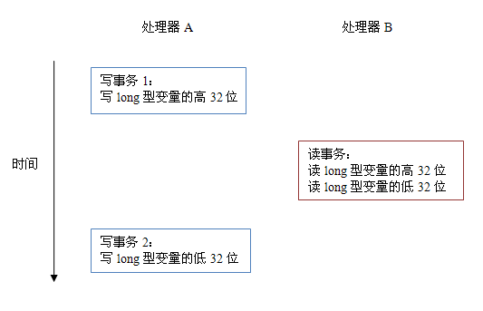

如上图所示，假设处理器 A 写一个 long 型变量，同时处理器 B 要读这个 long 型变量。处理器 A 中 64 位的写操作被拆分为两个 32 位的写操作，且这两个 32 位的写操作被分配到不同的写事务中执行。同时处理器 B 中 64 位的读操作被拆分为两个 32 位的读操作，且这两个 32 位的读操作被分配到同一个的读事务中执行。当处理器 A 和 B 按上图的时序来执行时，处理器 B 将看到仅仅被处理器 A“写了一半“的无效值。

## 8.4 深入理解 Java 内存模型（四）——volatile

### 8.4.1 volatile 的特性

当我们声明共享变量为 volatile 后，对这个变量的读 / 写将会很特别。理解 volatile 特性的一个好方法是：把对 volatile 变量的单个读 / 写，看成是使用同一个监视器锁对这些单个读 / 写操作做了同步。下面我们通过具体的示例来说明，请看下面的示例代码：

```java
class VolatileFeaturesExample {
    volatile long vl = 0L;  // 使用 volatile 声明 64 位的 long 型变量 

    public void set(long l) {
        vl = l;   // 单个 volatile 变量的写 
    }

    public void getAndIncrement () {
        vl++;    // 复合（多个）volatile 变量的读 / 写 
    }


    public long get() {
        return vl;   // 单个 volatile 变量的读 
    }
}
```

假设有多个线程分别调用上面程序的三个方法，这个程序在语意上和下面程序等价：

```java
class VolatileFeaturesExample {
    long vl = 0L;               // 64 位的 long 型普通变量 

    public synchronized void set(long l) {     // 对单个的普通 变量的写用同一个监视器同步 
        vl = l;
    }

    public void getAndIncrement () { // 普通方法调用 
        long temp = get();           // 调用已同步的读方法 
        temp += 1L;                  // 普通写操作 
        set(temp);                   // 调用已同步的写方法 
    }
    public synchronized long get() { 
    // 对单个的普通变量的读用同一个监视器同步 
        return vl;
    }
}
```

如上面示例程序所示，对一个 volatile 变量的单个读 / 写操作，与对一个普通变量的读 / 写操作使用同一个监视器锁来同步，它们之间的执行效果相同。

监视器锁的 happens-before 规则保证释放监视器和获取监视器的两个线程之间的内存可见性，这意味着对一个 volatile 变量的读，总是能看到（任意线程）对这个 volatile 变量最后的写入。

监视器锁的语义决定了临界区代码的执行具有原子性。这意味着即使是 64 位的 long 型和 double 型变量，只要它是 volatile 变量，对该变量的读写就将具有原子性。如果是多个 volatile 操作或类似于 volatile++ 这种复合操作，这些操作整体上不具有原子性。

简而言之，volatile 变量自身具有下列特性：

- 可见性。对一个 volatile 变量的读，总是能看到（任意线程）对这个 volatile 变量最后的写入。
- 原子性：对任意单个 volatile 变量的读 / 写具有原子性，但类似于 volatile++ 这种复合操作不具有原子性。

### 8.4.2 volatile 写 - 读建立的 happens before 关系

上面讲的是 volatile 变量自身的特性，对程序员来说，volatile 对线程的内存可见性的影响比 volatile 自身的特性更为重要，也更需要我们去关注。

从 JSR-133 开始，**volatile 变量的写 - 读可以实现线程之间的通信**。

从内存语义的角度来说，**volatile 与监视器锁有相同的效果：volatile 写和监视器的释放有相同的内存语义；volatile 读与监视器的获取有相同的内存语义**。

请看下面使用 volatile 变量的示例代码：

```java
class VolatileExample {
    int a = 0;
    volatile boolean flag = false;

    public void writer() {
        a = 1;                   //1
        flag = true;               //2
    }

    public void reader() {
        if (flag) {                //3
            int i =  a;           //4
            ……
        }
    }
}
```

假设线程 A 执行 writer() 方法之后，线程 B 执行 reader() 方法。根据 happens before 规则，这个过程建立的 happens before 关系可以分为两类：

1. 根据程序次序规则，1 happens before 2; 3 happens before 4。
2. 根据 volatile 规则，2 happens before 3。
3. 根据 happens before 的传递性规则，1 happens before 4。

上述 happens before 关系的图形化表现形式如下：

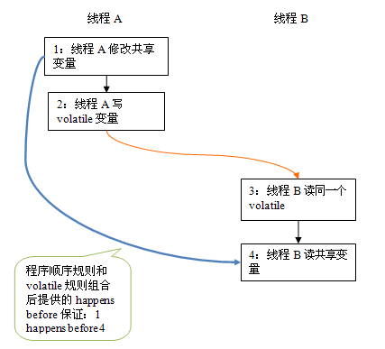

在上图中，每一个箭头链接的两个节点，代表了一个 happens before 关系。黑色箭头表示程序顺序规则；橙色箭头表示 volatile 规则；蓝色箭头表示组合这些规则后提供的 happens before 保证。

这里 A 线程写一个 volatile 变量后，B 线程读同一个 volatile 变量。A 线程在写 volatile 变量之前所有可见的共享变量，在 B 线程读同一个 volatile 变量后，将立即变得对 B 线程可见。

### 8.4.3 volatile 写 - 读的内存语义

volatile 写的内存语义如下：

- 当写一个 volatile 变量时，JMM 会把该线程对应的本地内存中的共享变量刷新到主内存。

以上面示例程序 VolatileExample 为例，假设线程 A 首先执行 writer() 方法，随后线程 B 执行 reader() 方法，初始时两个线程的本地内存中的 flag 和 a 都是初始状态。下图是线程 A 执行 volatile 写后，共享变量的状态示意图：

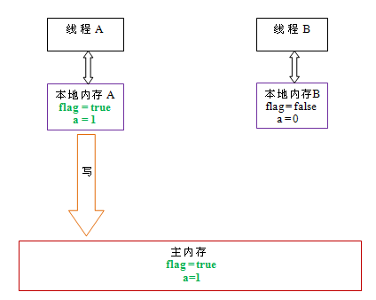

如上图所示，线程 A 在写 flag 变量后，本地内存 A 中被线程 A 更新过的两个共享变量的值被刷新到主内存中。此时，本地内存 A 和主内存中的共享变量的值是一致的。

volatile 读的内存语义如下：

- 当读一个 volatile 变量时，JMM 会把该线程对应的本地内存置为无效。线程接下来将从主内存中读取共享变量。

下面是线程 B 读同一个 volatile 变量后，共享变量的状态示意图：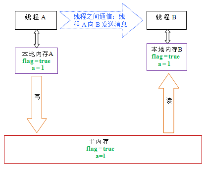如果我们把 volatile 写和 volatile 读这两个步骤综合起来看的话，在读线程 B 读一个 volatile 变量后，写线程 A 在写这个 volatile 变量之前所有可见的共享变量的值都将立即变得对读线程 B 可见。

下面对 volatile 写和 volatile 读的内存语义做个总结：

- 线程 A 写一个 volatile 变量，实质上是线程 A 向接下来将要读这个 volatile 变量的某个线程发出了（其对共享变量所在修改的）消息。
- 线程 B 读一个 volatile 变量，实质上是线程 B 接收了之前某个线程发出的（在写这个 volatile 变量之前对共享变量所做修改的）消息。
- 线程 A 写一个 volatile 变量，随后线程 B 读这个 volatile 变量，这个过程实质上是线程 A 通过主内存向线程 B 发送消息。

### 8.4.4 volatile 内存语义的实现

下面，让我们来看看 JMM 如何实现 volatile 写 / 读的内存语义。

前文我们提到过重排序分为编译器重排序和处理器重排序。为了实现 volatile 内存语义，JMM 会分别限制这两种类型的重排序类型。下面是 JMM 针对编译器制定的 volatile 重排序规则表：

| 是否能重排序 | 第二个操作  |             |             |
| ------------ | :---------- | ----------- | ----------- |
| 第一个操作   | 普通读 / 写 | volatile 读 | volatile 写 |
| 普通读 / 写  |             |             | NO          |
| volatile 读  | NO          | NO          | NO          |
| volatile 写  |             | NO          | NO          |

举例来说，第三行最后一个单元格的意思是：在程序顺序中，当第一个操作为普通变量的读或写时，如果第二个操作为 volatile 写，则编译器不能重排序这两个操作。

从上表我们可以看出：

- 当第二个操作是 volatile 写时，不管第一个操作是什么，都不能重排序。这个规则确保 volatile 写之前的操作不会被编译器重排序到 volatile 写之后。
- 当第一个操作是 volatile 读时，不管第二个操作是什么，都不能重排序。这个规则确保 volatile 读之后的操作不会被编译器重排序到 volatile 读之前。
- 当第一个操作是 volatile 写，第二个操作是 volatile 读时，不能重排序。

为了实现 volatile 的内存语义，编译器在生成字节码时，会在指令序列中插入内存屏障来禁止特定类型的处理器重排序。对于编译器来说，发现一个最优布置来最小化插入屏障的总数几乎不可能，为此，JMM 采取保守策略。下面是基于保守策略的 JMM 内存屏障插入策略：

- 在每个 volatile 写操作的前面插入一个 StoreStore 屏障。
- 在每个 volatile 写操作的后面插入一个 StoreLoad 屏障。
- 在每个 volatile 读操作的后面插入一个 LoadLoad 屏障。
- 在每个 volatile 读操作的后面插入一个 LoadStore 屏障。

上述内存屏障插入策略非常保守，但它可以保证在任意处理器平台，任意的程序中都能得到正确的 volatile 内存语义。

下面是保守策略下，volatile 写插入内存屏障后生成的指令序列示意图：

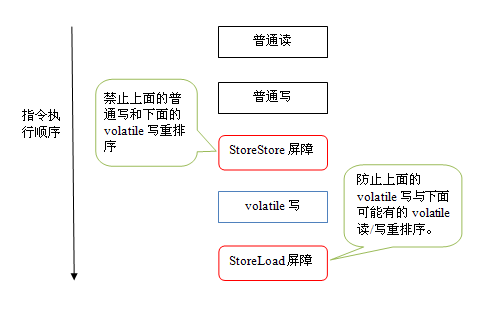

上图中的 StoreStore 屏障可以保证在 volatile 写之前，其前面的所有普通写操作已经对任意处理器可见了。这是因为 StoreStore 屏障将保障上面所有的普通写在 volatile 写之前刷新到主内存。

这里比较有意思的是 volatile 写后面的 StoreLoad 屏障。这个屏障的作用是避免 volatile 写与后面可能有的 volatile 读 / 写操作重排序。因为编译器常常无法准确判断在一个 volatile 写的后面，是否需要插入一个 StoreLoad 屏障（比如，一个 volatile 写之后方法立即 return）。为了保证能正确实现 volatile 的内存语义，JMM 在这里采取了保守策略：在每个 volatile 写的后面或在每个 volatile 读的前面插入一个 StoreLoad 屏障。从整体执行效率的角度考虑，JMM 选择了在每个 volatile 写的后面插入一个 StoreLoad 屏障。因为 volatile 写 - 读内存语义的常见使用模式是：一个写线程写 volatile 变量，多个读线程读同一个 volatile 变量。当读线程的数量大大超过写线程时，选择在 volatile 写之后插入 StoreLoad 屏障将带来可观的执行效率的提升。从这里我们可以看到 JMM 在实现上的一个特点：首先确保正确性，然后再去追求执行效率。

下面是在保守策略下，volatile 读插入内存屏障后生成的指令序列示意图：


上图中的 LoadLoad 屏障用来禁止处理器把上面的 volatile 读与下面的普通读重排序。LoadStore 屏障用来禁止处理器把上面的 volatile 读与下面的普通写重排序。

上述 volatile 写和 volatile 读的内存屏障插入策略非常保守。在实际执行时，只要不改变 volatile 写 - 读的内存语义，编译器可以根据具体情况省略不必要的屏障。下面我们通过具体的示例代码来说明：

```java
class VolatileBarrierExample {
    int a;
    volatile int v1 = 1;
    volatile int v2 = 2;

    void readAndWrite() {
        int i = v1;           // 第一个 volatile 读 
        int j = v2;           // 第二个 volatile 读 
        a = i + j;            // 普通写 
        v1 = i + 1;          // 第一个 volatile 写 
        v2 = j * 2;          // 第二个 volatile 写 
    }

    …                    // 其他方法 
}
```

针对 readAndWrite() 方法，编译器在生成字节码时可以做如下的优化：

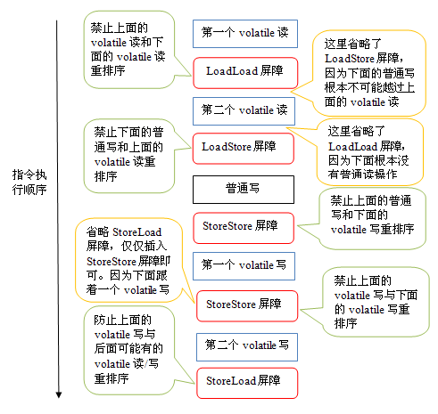

注意，最后的 StoreLoad 屏障不能省略。因为第二个 volatile 写之后，方法立即 return。此时编译器可能无法准确断定后面是否会有 volatile 读或写，为了安全起见，编译器常常会在这里插入一个 StoreLoad 屏障。

上面的优化是针对任意处理器平台，由于不同的处理器有不同“松紧度”的处理器内存模型，内存屏障的插入还可以根据具体的处理器内存模型继续优化。以 x86 处理器为例，上图中除最后的 StoreLoad 屏障外，其它的屏障都会被省略。

前面保守策略下的 volatile 读和写，在 x86 处理器平台可以优化成：


前文提到过，x86 处理器仅会对写 - 读操作做重排序。X86 不会对读 - 读，读 - 写和写 - 写操作做重排序，因此在 x86 处理器中会省略掉这三种操作类型对应的内存屏障。在 x86 中，JMM 仅需在 volatile 写后面插入一个 StoreLoad 屏障即可正确实现 volatile 写 - 读的内存语义。这意味着在 x86 处理器中，volatile 写的开销比 volatile 读的开销会大很多（因为执行 StoreLoad 屏障开销会比较大）。

### 8.4.5 JSR-133 为什么要增强 volatile 的内存语义

在 JSR-133 之前的旧 Java 内存模型中，虽然不允许 volatile 变量之间重排序，但旧的 Java 内存模型允许 volatile 变量与普通变量之间重排序。在旧的内存模型中，VolatileExample 示例程序可能被重排序成下列时序来执行：

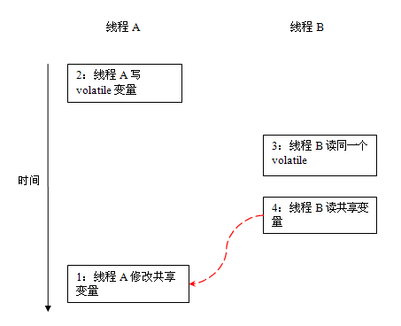

在旧的内存模型中，当 1 和 2 之间没有数据依赖关系时，1 和 2 之间就可能被重排序（3 和 4 类似）。其结果就是：读线程 B 执行 4 时，不一定能看到写线程 A 在执行 1 时对共享变量的修改。

因此在旧的内存模型中 ，volatile 的写 - 读没有监视器的释放 - 获所具有的内存语义。为了提供一种比监视器锁更轻量级的线程之间通信的机制，JSR-133 专家组决定增强 volatile 的内存语义：**严格限制编译器和处理器对 volatile 变量与普通变量的重排序，确保 volatile 的写 - 读和监视器的释放 - 获取一样，具有相同的内存语义**。从编译器重排序规则和处理器内存屏障插入策略来看，只要 volatile 变量与普通变量之间的重排序可能会破坏 volatile 的内存语意，这种重排序就会被编译器重排序规则和处理器内存屏障插入策略禁止。

由于 volatile 仅仅保证对单个 volatile 变量的读 / 写具有原子性，而监视器锁的互斥执行的特性可以确保对整个临界区代码的执行具有原子性。**在功能上，监视器锁比 volatile 更强大；在可伸缩性和执行性能上，volatile 更有优势。**如果读者想在程序中用 volatile 代替监视器锁，请一定谨慎。

## 8.5 深入理解 Java 内存模型（五）——锁

### 8.5.1 锁的释放 - 获取建立的 happens before 关系

锁是 java 并发编程中最重要的同步机制。锁除了让临界区互斥执行外，还可以让释放锁的线程向获取同一个锁的线程发送消息。

下面是锁释放 - 获取的示例代码：

```java
class MonitorExample {
    int a = 0;

    public synchronized void writer() {  //1
        a++;                             //2
    }                                    //3

    public synchronized void reader() {  //4
        int i = a;                       //5
        ……
    }                                    //6
}
```

假设线程 A 执行 writer() 方法，随后线程 B 执行 reader() 方法。根据 happens before 规则，这个过程包含的 happens before 关系可以分为两类：

1. 根据程序次序规则，1 happens before 2, 2 happens before 3; 4 happens before 5, 5 happens before 6。
2. 根据监视器锁规则，3 happens before 4。
3. 根据 happens before 的传递性，2 happens before 5。

上述 happens before 关系的图形化表现形式如下：

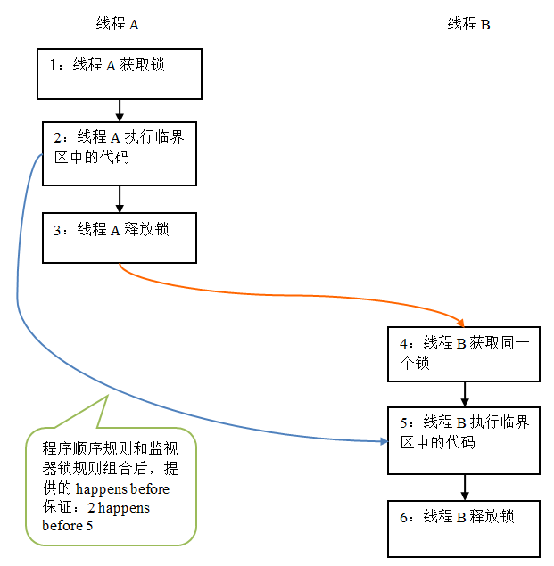

在上图中，每一个箭头链接的两个节点，代表了一个 happens before 关系。黑色箭头表示程序顺序规则；橙色箭头表示监视器锁规则；蓝色箭头表示组合这些规则后提供的 happens before 保证。

上图表示在线程 A 释放了锁之后，随后线程 B 获取同一个锁。在上图中，2 happens before 5。因此，线程 A 在释放锁之前所有可见的共享变量，在线程 B 获取同一个锁之后，将立刻变得对 B 线程可见。

### 8.5.2 锁释放和获取的内存语义

当线程释放锁时，JMM 会把该线程对应的本地内存中的共享变量刷新到主内存中。以上面的 MonitorExample 程序为例，A 线程释放锁后，共享数据的状态示意图如下：

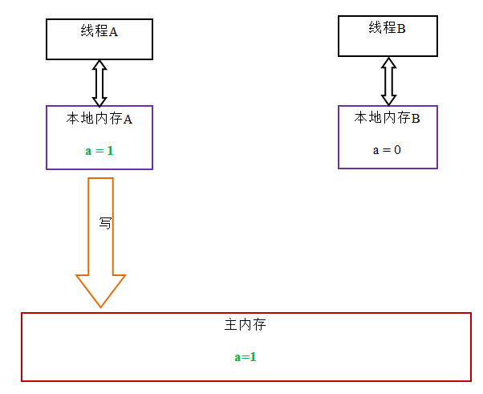

当线程获取锁时，JMM 会把该线程对应的本地内存置为无效。从而使得被监视器保护的临界区代码必须要从主内存中去读取共享变量。下面是锁获取的状态示意图：

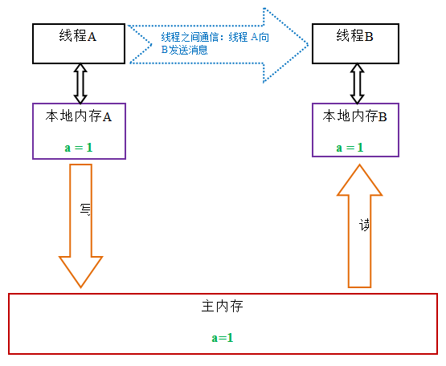

对比锁释放 - 获取的内存语义与 volatile 写 - 读的内存语义，可以看出：锁释放与 volatile 写有相同的内存语义；锁获取与 volatile 读有相同的内存语义。

下面对锁释放和锁获取的内存语义做个总结：

- 线程 A 释放一个锁，实质上是线程 A 向接下来将要获取这个锁的某个线程发出了（线程 A 对共享变量所做修改的）消息。
- 线程 B 获取一个锁，实质上是线程 B 接收了之前某个线程发出的（在释放这个锁之前对共享变量所做修改的）消息。
- 线程 A 释放锁，随后线程 B 获取这个锁，这个过程实质上是线程 A 通过主内存向线程 B 发送消息。

### 8.5.3 锁内存语义的实现

本文将借助 ReentrantLock 的源代码，来分析锁内存语义的具体实现机制。

请看下面的示例代码：

```java
class ReentrantLockExample {
int a = 0;
ReentrantLock lock = new ReentrantLock();

public void writer() {
    lock.lock();         // 获取锁 
    try {
        a++;
    } finally {
        lock.unlock();  // 释放锁 
    }
}

public void reader () {
    lock.lock();        // 获取锁 
    try {
        int i = a;
        ……
    } finally {
        lock.unlock();  // 释放锁 
    }
}
}
```

在 ReentrantLock 中，调用 lock() 方法获取锁；调用 unlock() 方法释放锁。

ReentrantLock 的实现依赖于 java 同步器框架 AbstractQueuedSynchronizer（本文简称之为 AQS）。AQS 使用一个整型的 volatile 变量（命名为 state）来维护同步状态，马上我们会看到，这个 volatile 变量是 ReentrantLock 内存语义实现的关键。 下面是 ReentrantLock 的类图（仅画出与本文相关的部分）：

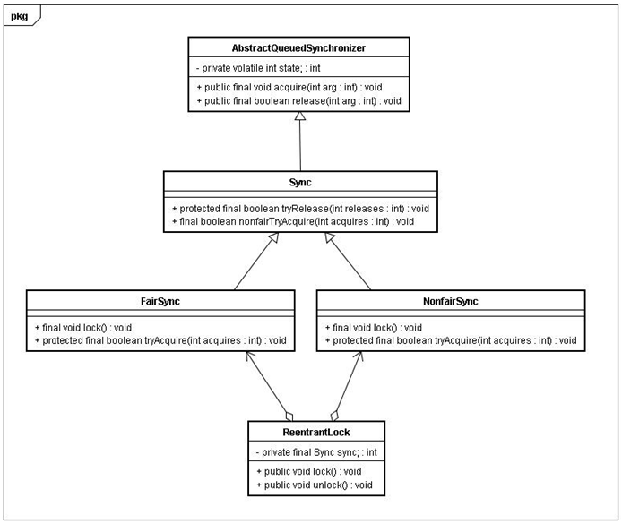

ReentrantLock 分为公平锁和非公平锁，我们首先分析公平锁。

使用公平锁时，加锁方法 lock() 的方法调用轨迹如下：

1. ReentrantLock : lock()
2. FairSync : lock()
3. AbstractQueuedSynchronizer : acquire(int arg)
4. ReentrantLock : tryAcquire(int acquires)

在第 4 步真正开始加锁，下面是该方法的源代码：

```java 
protected final boolean tryAcquire(int acquires) {
    final Thread current = Thread.currentThread();
    int c = getState();   // 获取锁的开始，首先读 volatile 变量 state
    if (c == 0) {
        if (isFirst(current) &&
            compareAndSetState(0, acquires)) {
            setExclusiveOwnerThread(current);
            return true;
        }
    }
    else if (current == getExclusiveOwnerThread()) {
        int nextc = c + acquires;
        if (nextc < 0)  
            throw new Error("Maximum lock count exceeded");
        setState(nextc);
        return true;
    }
    return false;
}
```

从上面源代码中我们可以看出，加锁方法首先读 volatile 变量 state。

在使用公平锁时，解锁方法 unlock() 的方法调用轨迹如下：

1. ReentrantLock : unlock()
2. AbstractQueuedSynchronizer : release(int arg)
3. Sync : tryRelease(int releases)

在第 3 步真正开始释放锁，下面是该方法的源代码：

```java
protected final boolean tryRelease(int releases) {
    int c = getState() - releases;
    if (Thread.currentThread() != getExclusiveOwnerThread())
        throw new IllegalMonitorStateException();
    boolean free = false;
    if (c == 0) {
        free = true;
        setExclusiveOwnerThread(null);
    }
    setState(c);           // 释放锁的最后，写 volatile 变量 state
    return free;
}
```

从上面的源代码我们可以看出，在释放锁的最后写 volatile 变量 state。

公平锁在释放锁的最后写 volatile 变量 state；在获取锁时首先读这个 volatile 变量。根据 volatile 的 happens-before 规则，释放锁的线程在写 volatile 变量之前可见的共享变量，在获取锁的线程读取同一个 volatile 变量后将立即变的对获取锁的线程可见。

现在我们分析非公平锁的内存语义的实现。

非公平锁的释放和公平锁完全一样，所以这里仅仅分析非公平锁的获取。

使用公平锁时，加锁方法 lock() 的方法调用轨迹如下：

1. ReentrantLock : lock()
2. NonfairSync : lock()
3. AbstractQueuedSynchronizer : compareAndSetState(int expect, int update)

在第 3 步真正开始加锁，下面是该方法的源代码：

```
protected final boolean compareAndSetState(int expect, int update) {
    return unsafe.compareAndSwapInt(this, stateOffset, expect, update);
}
```

该方法以原子操作的方式更新 state 变量，本文把 java 的 compareAndSet() 方法调用简称为 CAS。JDK 文档对该方法的说明如下：如果当前状态值等于预期值，则以原子方式将同步状态设置为给定的更新值。此操作具有 volatile 读和写的内存语义。

这里我们分别从编译器和处理器的角度来分析,CAS 如何同时具有 volatile 读和 volatile 写的内存语义。

前文我们提到过，编译器不会对 volatile 读与 volatile 读后面的任意内存操作重排序；编译器不会对 volatile 写与 volatile 写前面的任意内存操作重排序。组合这两个条件，意味着为了同时实现 volatile 读和 volatile 写的内存语义，编译器不能对 CAS 与 CAS 前面和后面的任意内存操作重排序。

下面我们来分析在常见的 intel x86 处理器中，CAS 是如何同时具有 volatile 读和 volatile 写的内存语义的。

下面是 sun.misc.Unsafe 类的 compareAndSwapInt() 方法的源代码：

```java
public final native boolean compareAndSwapInt(Object o, long offset,
                                              int expected,
                                              int x);
```

可以看到这是个本地方法调用。这个本地方法在 openjdk 中依次调用的 c++ 代码为：unsafe.cpp，atomic.cpp 和 atomic*windows*x86.inline.hpp。这个本地方法的最终实现在 openjdk 的如下位置：openjdk-7-fcs-src-b147-27*jun*2011\openjdk\hotspot\src\os*cpu\windows*x86\vm\ atomic*windows*x86.inline.hpp（对应于 windows 操作系统，X86 处理器）。下面是对应于 intel x86 处理器的源代码的片段：

```java
// Adding a lock prefix to an instruction on MP machine
// VC++ doesn't like the lock prefix to be on a single line
// so we can't insert a label after the lock prefix.
// By emitting a lock prefix, we can define a label after it.
#define LOCK_IF_MP(mp) __asm cmp mp, 0  \
                       __asm je L0      \
                       __asm _emit 0xF0 \
                       __asm L0:

inline jint     Atomic::cmpxchg    (jint     exchange_value, volatile jint*     dest, jint     compare_value) {
  // alternative for InterlockedCompareExchange
  int mp = os::is_MP();
  __asm {
    mov edx, dest
    mov ecx, exchange_value
    mov eax, compare_value
    LOCK_IF_MP(mp)
    cmpxchg dword ptr [edx], ecx
  }
}
```

如上面源代码所示，程序会根据当前处理器的类型来决定是否为 cmpxchg 指令添加 lock 前缀。如果程序是在多处理器上运行，就为 cmpxchg 指令加上 lock 前缀（lock cmpxchg）。反之，如果程序是在单处理器上运行，就省略 lock 前缀（单处理器自身会维护单处理器内的顺序一致性，不需要 lock 前缀提供的内存屏障效果）。

intel 的手册对 lock 前缀的说明如下：

1. 确保对内存的读 - 改 - 写操作原子执行。在 Pentium 及 Pentium 之前的处理器中，带有 lock 前缀的指令在执行期间会锁住总线，使得其他处理器暂时无法通过总线访问内存。很显然，这会带来昂贵的开销。从 Pentium 4，Intel Xeon 及 P6 处理器开始，intel 在原有总线锁的基础上做了一个很有意义的优化：如果要访问的内存区域（area of memory）在 lock 前缀指令执行期间已经在处理器内部的缓存中被锁定（即包含该内存区域的缓存行当前处于独占或以修改状态），并且该内存区域被完全包含在单个缓存行（cache line）中，那么处理器将直接执行该指令。由于在指令执行期间该缓存行会一直被锁定，其它处理器无法读 / 写该指令要访问的内存区域，因此能保证指令执行的原子性。这个操作过程叫做缓存锁定（cache locking），缓存锁定将大大降低 lock 前缀指令的执行开销，但是当多处理器之间的竞争程度很高或者指令访问的内存地址未对齐时，仍然会锁住总线。
2. 禁止该指令与之前和之后的读和写指令重排序。
3. 把写缓冲区中的所有数据刷新到内存中。

上面的第 2 点和第 3 点所具有的内存屏障效果，足以同时实现 volatile 读和 volatile 写的内存语义。

经过上面的这些分析，现在我们终于能明白为什么 JDK 文档说 CAS 同时具有 volatile 读和 volatile 写的内存语义了。

现在对公平锁和非公平锁的内存语义做个总结：

- 公平锁和非公平锁释放时，最后都要写一个 volatile 变量 state。
- 公平锁获取时，首先会去读这个 volatile 变量。
- 非公平锁获取时，首先会用 CAS 更新这个 volatile 变量, 这个操作同时具有 volatile 读和 volatile 写的内存语义。

从本文对 ReentrantLock 的分析可以看出，锁释放 - 获取的内存语义的实现至少有下面两种方式：

1. 利用 volatile 变量的写 - 读所具有的内存语义。
2. 利用 CAS 所附带的 volatile 读和 volatile 写的内存语义。

### 8.5.4 concurrent 包的实现

由于 java 的 CAS 同时具有 volatile 读和 volatile 写的内存语义，因此 Java 线程之间的通信现在有了下面四种方式：

1. A 线程写 volatile 变量，随后 B 线程读这个 volatile 变量。
2. A 线程写 volatile 变量，随后 B 线程用 CAS 更新这个 volatile 变量。
3. A 线程用 CAS 更新一个 volatile 变量，随后 B 线程用 CAS 更新这个 volatile 变量。
4. A 线程用 CAS 更新一个 volatile 变量，随后 B 线程读这个 volatile 变量。

Java 的 CAS 会使用现代处理器上提供的高效机器级别原子指令，这些原子指令以原子方式对内存执行读 - 改 - 写操作，这是在多处理器中实现同步的关键（从本质上来说，能够支持原子性读 - 改 - 写指令的计算机器，是顺序计算图灵机的异步等价机器，因此任何现代的多处理器都会去支持某种能对内存执行原子性读 - 改 - 写操作的原子指令）。同时，volatile 变量的读 / 写和 CAS 可以实现线程之间的通信。把这些特性整合在一起，就形成了整个 concurrent 包得以实现的基石。如果我们仔细分析 concurrent 包的源代码实现，会发现一个通用化的实现模式：

1. 首先，声明共享变量为 volatile；
2. 然后，使用 CAS 的原子条件更新来实现线程之间的同步；
3. 同时，配合以 volatile 的读 / 写和 CAS 所具有的 volatile 读和写的内存语义来实现线程之间的通信。

AQS，非阻塞数据结构和原子变量类（java.util.concurrent.atomic 包中的类），这些 concurrent 包中的基础类都是使用这种模式来实现的，而 concurrent 包中的高层类又是依赖于这些基础类来实现的。从整体来看，concurrent 包的实现示意图如下：

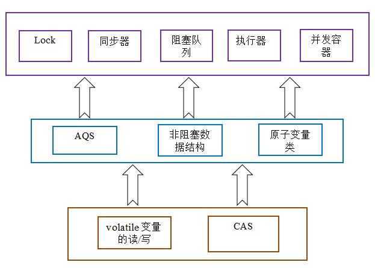

## 8.6 深入理解 Java 内存模型（六）——final

与前面介绍的锁和 volatile 相比较，对 final 域的读和写更像是普通的变量访问。对于 final 域，编译器和处理器要遵守两个重排序规则：

1. 在构造函数内对一个 final 域的写入，与随后把这个被构造对象的引用赋值给一个引用变量，这两个操作之间不能重排序。
2. 初次读一个包含 final 域的对象的引用，与随后初次读这个 final 域，这两个操作之间不能重排序。

下面，我们通过一些示例性的代码来分别说明这两个规则：

```java
public class FinalExample {
    int i;                            // 普通变量 
    final int j;                      //final 变量 
    static FinalExample obj;

    public void FinalExample () {     // 构造函数 
        i = 1;                        // 写普通域 
        j = 2;                        // 写 final 域 
    }

    public static void writer () {    // 写线程 A 执行 
        obj = new FinalExample ();
    }

    public static void reader () {       // 读线程 B 执行 
        FinalExample object = obj;       // 读对象引用 
        int a = object.i;                // 读普通域 
        int b = object.j;                // 读 final 域 
    }
}
```

这里假设一个线程 A 执行 writer () 方法，随后另一个线程 B 执行 reader () 方法。下面我们通过这两个线程的交互来说明这两个规则。

### 8.6.1 写 final 域的重排序规则

写 final 域的重排序规则禁止把 final 域的写重排序到构造函数之外。这个规则的实现包含下面 2 个方面：

- JMM 禁止编译器把 final 域的写重排序到构造函数之外。
- 编译器会在 final 域的写之后，构造函数 return 之前，插入一个 StoreStore 屏障。这个屏障禁止处理器把 final 域的写重排序到构造函数之外。

现在让我们分析 writer () 方法。writer () 方法只包含一行代码：finalExample = new FinalExample ()。这行代码包含两个步骤：

1. 构造一个 FinalExample 类型的对象；
2. 把这个对象的引用赋值给引用变量 obj。

假设线程 B 读对象引用与读对象的成员域之间没有重排序（马上会说明为什么需要这个假设），下图是一种可能的执行时序：


在上图中，写普通域的操作被编译器重排序到了构造函数之外，读线程 B 错误的读取了普通变量 i 初始化之前的值。而写 final 域的操作，被写 final 域的重排序规则“限定”在了构造函数之内，读线程 B 正确的读取了 final 变量初始化之后的值。

写 final 域的重排序规则可以确保：在对象引用为任意线程可见之前，对象的 final 域已经被正确初始化过了，而普通域不具有这个保障。以上图为例，在读线程 B“看到”对象引用 obj 时，很可能 obj 对象还没有构造完成（对普通域 i 的写操作被重排序到构造函数外，此时初始值 2 还没有写入普通域 i）。

### 8.6.2 读 final 域的重排序规则

读 final 域的重排序规则如下：

- 在一个线程中，初次读对象引用与初次读该对象包含的 final 域，JMM 禁止处理器重排序这两个操作（注意，这个规则仅仅针对处理器）。编译器会在读 final 域操作的前面插入一个 LoadLoad 屏障。

初次读对象引用与初次读该对象包含的 final 域，这两个操作之间存在间接依赖关系。由于编译器遵守间接依赖关系，因此编译器不会重排序这两个操作。大多数处理器也会遵守间接依赖，大多数处理器也不会重排序这两个操作。但有少数处理器允许对存在间接依赖关系的操作做重排序（比如 alpha 处理器），这个规则就是专门用来针对这种处理器。

reader() 方法包含三个操作：

1. 初次读引用变量 obj;
2. 初次读引用变量 obj 指向对象的普通域 i。
3. 初次读引用变量 obj 指向对象的 final 域 j。

现在我们假设写线程 A 没有发生任何重排序，同时程序在不遵守间接依赖的处理器上执行，下面是一种可能的执行时序：


在上图中，读对象的普通域的操作被处理器重排序到读对象引用之前。读普通域时，该域还没有被写线程 A 写入，这是一个错误的读取操作。而读 final 域的重排序规则会把读对象 final 域的操作“限定”在读对象引用之后，此时该 final 域已经被 A 线程初始化过了，这是一个正确的读取操作。

读 final 域的重排序规则可以确保：在读一个对象的 final 域之前，一定会先读包含这个 final 域的对象的引用。在这个示例程序中，如果该引用不为 null，那么引用对象的 final 域一定已经被 A 线程初始化过了。

### 8.6.3 如果 final 域是引用类型

上面我们看到的 final 域是基础数据类型，下面让我们看看如果 final 域是引用类型，将会有什么效果？

请看下列示例代码：

```java
public class FinalReferenceExample {
final int[] intArray;                     //final 是引用类型 
static FinalReferenceExample obj;

public FinalReferenceExample () {        // 构造函数 
    intArray = new int[1];              //1
    intArray[0] = 1;                   //2
}

public static void writerOne () {          // 写线程 A 执行 
    obj = new FinalReferenceExample ();  //3
}

public static void writerTwo () {          // 写线程 B 执行 
    obj.intArray[0] = 2;                 //4
}

public static void reader () {              // 读线程 C 执行 
    if (obj != null) {                    //5
        int temp1 = obj.intArray[0];       //6
    }
}
}
```

这里 final 域为一个引用类型，它引用一个 int 型的数组对象。对于引用类型，写 final 域的重排序规则对编译器和处理器增加了如下约束：

1. 在构造函数内对一个 final 引用的对象的成员域的写入，与随后在构造函数外把这个被构造对象的引用赋值给一个引用变量，这两个操作之间不能重排序。

对上面的示例程序，我们假设首先线程 A 执行 writerOne() 方法，执行完后线程 B 执行 writerTwo() 方法，执行完后线程 C 执行 reader () 方法。下面是一种可能的线程执行时序：


在上图中，1 是对 final 域的写入，2 是对这个 final 域引用的对象的成员域的写入，3 是把被构造的对象的引用赋值给某个引用变量。这里除了前面提到的 1 不能和 3 重排序外，2 和 3 也不能重排序。

JMM 可以确保读线程 C 至少能看到写线程 A 在构造函数中对 final 引用对象的成员域的写入。即 C 至少能看到数组下标 0 的值为 1。而写线程 B 对数组元素的写入，读线程 C 可能看的到，也可能看不到。JMM 不保证线程 B 的写入对读线程 C 可见，因为写线程 B 和读线程 C 之间存在数据竞争，此时的执行结果不可预知。

如果想要确保读线程 C 看到写线程 B 对数组元素的写入，写线程 B 和读线程 C 之间需要使用同步原语（lock 或 volatile）来确保内存可见性。

### 8.6.4 为什么 final 引用不能从构造函数内“逸出”

前面我们提到过，写 final 域的重排序规则可以确保：在引用变量为任意线程可见之前，该引用变量指向的对象的 final 域已经在构造函数中被正确初始化过了。其实要得到这个效果，还需要一个保证：在构造函数内部，不能让这个被构造对象的引用为其他线程可见，也就是对象引用不能在构造函数中“逸出”。为了说明问题，让我们来看下面示例代码：

```java
public class FinalReferenceEscapeExample {
final int i;
static FinalReferenceEscapeExample obj;

public FinalReferenceEscapeExample () {
    i = 1;                              //1 写 final 域 
    obj = this;                          //2 this 引用在此“逸出”
}

public static void writer() {
    new FinalReferenceEscapeExample ();
}

public static void reader {
    if (obj != null) {                     //3
        int temp = obj.i;                 //4
    }
}
}
```

假设一个线程 A 执行 writer() 方法，另一个线程 B 执行 reader() 方法。这里的操作 2 使得对象还未完成构造前就为线程 B 可见。即使这里的操作 2 是构造函数的最后一步，且即使在程序中操作 2 排在操作 1 后面，执行 read() 方法的线程仍然可能无法看到 final 域被初始化后的值，因为这里的操作 1 和操作 2 之间可能被重排序。实际的执行时序可能如下图所示：


从上图我们可以看出：在构造函数返回前，被构造对象的引用不能为其他线程可见，因为此时的 final 域可能还没有被初始化。在构造函数返回后，任意线程都将保证能看到 final 域正确初始化之后的值。

### 8.6.5 final 语义在处理器中的实现

现在我们以 x86 处理器为例，说明 final 语义在处理器中的具体实现。

上面我们提到，写 final 域的重排序规则会要求译编器在 final 域的写之后，构造函数 return 之前，插入一个 StoreStore 障屏。读 final 域的重排序规则要求编译器在读 final 域的操作前面插入一个 LoadLoad 屏障。

由于 x86 处理器不会对写 - 写操作做重排序，所以在 x86 处理器中，写 final 域需要的 StoreStore 障屏会被省略掉。同样，由于 x86 处理器不会对存在间接依赖关系的操作做重排序，所以在 x86 处理器中，读 final 域需要的 LoadLoad 屏障也会被省略掉。也就是说在 x86 处理器中，final 域的读 / 写不会插入任何内存屏障！

### 8.6.6 JSR-133 为什么要增强 final 的语义

在旧的 Java 内存模型中 ，最严重的一个缺陷就是线程可能看到 final 域的值会改变。比如，一个线程当前看到一个整形 final 域的值为 0（还未初始化之前的默认值），过一段时间之后这个线程再去读这个 final 域的值时，却发现值变为了 1（被某个线程初始化之后的值）。最常见的例子就是在旧的 Java 内存模型中，String 的值可能会改变（参考文献 2 中有一个具体的例子，感兴趣的读者可以自行参考，这里就不赘述了）。

为了修补这个漏洞，JSR-133 专家组增强了 final 的语义。通过为 final 域增加写和读重排序规则，可以为 java 程序员提供初始化安全保证：只要对象是正确构造的（被构造对象的引用在构造函数中没有“逸出”），那么不需要使用同步（指 lock 和 volatile 的使用），就可以保证任意线程都能看到这个 final 域在构造函数中被初始化之后的值。

## 8.7 深入理解 Java 内存模型（七）——总结

### 8.7.1 处理器内存模型

顺序一致性内存模型是一个理论参考模型，JMM 和处理器内存模型在设计时通常会把顺序一致性内存模型作为参照。JMM 和处理器内存模型在设计时会对顺序一致性模型做一些放松，因为如果完全按照顺序一致性模型来实现处理器和 JMM，那么很多的处理器和编译器优化都要被禁止，这对执行性能将会有很大的影响。

根据对不同类型读 / 写操作组合的执行顺序的放松，可以把常见处理器的内存模型划分为下面几种类型：

1. 放松程序中写 - 读操作的顺序，由此产生了 total store ordering 内存模型（简称为 TSO）。
2. 在前面 1 的基础上，继续放松程序中写 - 写操作的顺序，由此产生了 partial store order 内存模型（简称为 PSO）。
3. 在前面 1 和 2 的基础上，继续放松程序中读 - 写和读 - 读操作的顺序，由此产生了 relaxed memory order 内存模型（简称为 RMO）和 PowerPC 内存模型。

注意，这里处理器对读 / 写操作的放松，是以两个操作之间不存在数据依赖性为前提的（因为处理器要遵守 as-if-serial 语义，处理器不会对存在数据依赖性的两个内存操作做重排序）。

下面的表格展示了常见处理器内存模型的细节特征：

| 内存模型名称 | 对应的处理器 | Store-Load 重排序 | Store-Store 重排序 | Load-Load 和 Load-Store 重排序 | 可以更早读取到其它处理器的写 | 可以更早读取到当前处理器的写 |
| ------------ | ------------ | ----------------- | ------------------ | ------------------------------ | ---------------------------- | ---------------------------- |
| TSO          | sparc-TSOX64 | Y                 |                    |                                |                              | Y                            |
| PSO          | sparc-PSO    | Y                 | Y                  |                                |                              | Y                            |
| RMO          | ia64         | Y                 | Y                  | Y                              |                              | Y                            |
| PowerPC      | PowerPC      | Y                 | Y                  | Y                              | Y                            | Y                            |

在这个表格中，我们可以看到所有处理器内存模型都允许写 - 读重排序，原因在第一章以说明过：它们都使用了写缓存区，写缓存区可能导致写 - 读操作重排序。同时，我们可以看到这些处理器内存模型都允许更早读到当前处理器的写，原因同样是因为写缓存区：由于写缓存区仅对当前处理器可见，这个特性导致当前处理器可以比其他处理器先看到临时保存在自己的写缓存区中的写。

上面表格中的各种处理器内存模型，从上到下，模型由强变弱。越是追求性能的处理器，内存模型设计的会越弱。因为这些处理器希望内存模型对它们的束缚越少越好，这样它们就可以做尽可能多的优化来提高性能。

由于常见的处理器内存模型比 JMM 要弱，java 编译器在生成字节码时，会在执行指令序列的适当位置插入内存屏障来限制处理器的重排序。同时，由于各种处理器内存模型的强弱并不相同，为了在不同的处理器平台向程序员展示一个一致的内存模型，JMM 在不同的处理器中需要插入的内存屏障的数量和种类也不相同。下图展示了 JMM 在不同处理器内存模型中需要插入的内存屏障的示意图：


如上图所示，JMM 屏蔽了不同处理器内存模型的差异，它在不同的处理器平台之上为 java 程序员呈现了一个一致的内存模型。

## JMM，处理器内存模型与顺序一致性内存模型之间的关系

JMM 是一个语言级的内存模型，处理器内存模型是硬件级的内存模型，顺序一致性内存模型是一个理论参考模型。下面是语言内存模型，处理器内存模型和顺序一致性内存模型的强弱对比示意图：

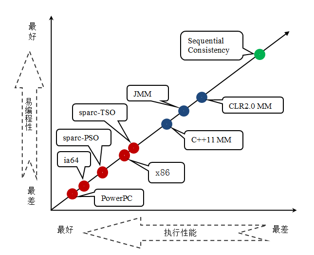

从上图我们可以看出：常见的 4 种处理器内存模型比常用的 3 中语言内存模型要弱，处理器内存模型和语言内存模型都比顺序一致性内存模型要弱。同处理器内存模型一样，越是追求执行性能的语言，内存模型设计的会越弱。

## JMM 的设计

从 JMM 设计者的角度来说，在设计 JMM 时，需要考虑两个关键因素：

- 程序员对内存模型的使用。程序员希望内存模型易于理解，易于编程。程序员希望基于一个强内存模型来编写代码。
- 编译器和处理器对内存模型的实现。编译器和处理器希望内存模型对它们的束缚越少越好，这样它们就可以做尽可能多的优化来提高性能。编译器和处理器希望实现一个弱内存模型。

由于这两个因素互相矛盾，所以 JSR-133 专家组在设计 JMM 时的核心目标就是找到一个好的平衡点：一方面要为程序员提供足够强的内存可见性保证；另一方面，对编译器和处理器的限制要尽可能的放松。下面让我们看看 JSR-133 是如何实现这一目标的。

为了具体说明，请看前面提到过的计算圆面积的示例代码：

```
double pi  = 3.14;    //A
double r   = 1.0;     //B
double area = pi * r * r; //C
```

上面计算圆的面积的示例代码存在三个 happens- before 关系：

1. A happens- before B；
2. B happens- before C；
3. A happens- before C；

由于 A happens- before B，happens- before 的定义会要求：A 操作执行的结果要对 B 可见，且 A 操作的执行顺序排在 B 操作之前。 但是从程序语义的角度来说，对 A 和 B 做重排序即不会改变程序的执行结果，也还能提高程序的执行性能（允许这种重排序减少了对编译器和处理器优化的束缚）。也就是说，上面这 3 个 happens- before 关系中，虽然 2 和 3 是必需要的，但 1 是不必要的。因此，JMM 把 happens- before 要求禁止的重排序分为了下面两类：

- 会改变程序执行结果的重排序。
- 不会改变程序执行结果的重排序。

JMM 对这两种不同性质的重排序，采取了不同的策略：

- 对于会改变程序执行结果的重排序，JMM 要求编译器和处理器必须禁止这种重排序。
- 对于不会改变程序执行结果的重排序，JMM 对编译器和处理器不作要求（JMM 允许这种重排序）。

下面是 JMM 的设计示意图：


从上图可以看出两点：

- JMM 向程序员提供的 happens- before 规则能满足程序员的需求。JMM 的 happens- before 规则不但简单易懂，而且也向程序员提供了足够强的内存可见性保证（有些内存可见性保证其实并不一定真实存在，比如上面的 A happens- before B）。
- JMM 对编译器和处理器的束缚已经尽可能的少。从上面的分析我们可以看出，JMM 其实是在遵循一个基本原则：只要不改变程序的执行结果（指的是单线程程序和正确同步的多线程程序），编译器和处理器怎么优化都行。比如，如果编译器经过细致的分析后，认定一个锁只会被单个线程访问，那么这个锁可以被消除。再比如，如果编译器经过细致的分析后，认定一个 volatile 变量仅仅只会被单个线程访问，那么编译器可以把这个 volatile 变量当作一个普通变量来对待。这些优化既不会改变程序的执行结果，又能提高程序的执行效率。

## JMM 的内存可见性保证

Java 程序的内存可见性保证按程序类型可以分为下列三类：

1. 单线程程序。单线程程序不会出现内存可见性问题。编译器，runtime 和处理器会共同确保单线程程序的执行结果与该程序在顺序一致性模型中的执行结果相同。
2. 正确同步的多线程程序。正确同步的多线程程序的执行将具有顺序一致性（程序的执行结果与该程序在顺序一致性内存模型中的执行结果相同）。这是 JMM 关注的重点，JMM 通过限制编译器和处理器的重排序来为程序员提供内存可见性保证。
3. 未同步 / 未正确同步的多线程程序。JMM 为它们提供了最小安全性保障：线程执行时读取到的值，要么是之前某个线程写入的值，要么是默认值（0，null，false）。

下图展示了这三类程序在 JMM 中与在顺序一致性内存模型中的执行结果的异同：

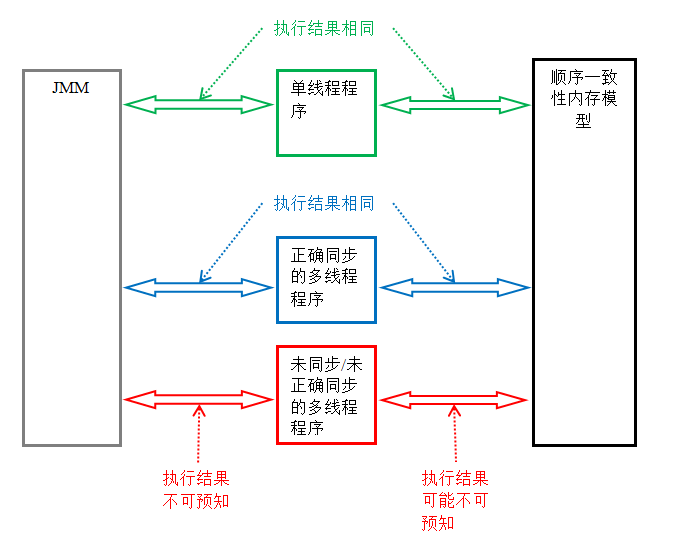

只要多线程程序是正确同步的，JMM 保证该程序在任意的处理器平台上的执行结果，与该程序在顺序一致性内存模型中的执行结果一致。

## JSR-133 对旧内存模型的修补

JSR-133 对 JDK5 之前的旧内存模型的修补主要有两个：

- 增强 volatile 的内存语义。旧内存模型允许 volatile 变量与普通变量重排序。JSR-133 严格限制 volatile 变量与普通变量的重排序，使 volatile 的写 - 读和锁的释放 - 获取具有相同的内存语义。
- 增强 final 的内存语义。在旧内存模型中，多次读取同一个 final 变量的值可能会不相同。为此，JSR-133 为 final 增加了两个重排序规则。现在，final 具有了初始化安全性。

# 扩展

[JVM内存结构 VS Java内存模型 VS Java对象模型](http://www.hollischuang.com/archives/2509)(Hollis原创)

[再有人问你Java内存模型是什么，就把这篇文章发给他。](http://www.hollischuang.com/archives/2550)(Hollis原创)

[内存模型是怎么解决缓存一致性问题的？](http://www.hollischuang.com/archives/2662)(Hollis原创)

[细说Java多线程之内存可见性](http://www.imooc.com/learn/352)（视频）（`推荐`）（如果嫌视频讲的慢，建议使用1.5倍速度观看）

[JSR 133: JavaTM Memory Model and Thread Specification Revision](https://www.jcp.org/en/jsr/detail?id=133)（JMM英文官方文档）

[Java内存模型FAQ](http://ifeve.com/jmm-faq/)

[深入理解Java内存模型（一）——基础](http://www.infoq.com/cn/articles/java-memory-model-1)

[深入理解Java内存模型（二）——重排序](http://www.infoq.com/cn/articles/java-memory-model-2)

[深入理解Java内存模型（三）——顺序一致性](http://www.infoq.com/cn/articles/java-memory-model-3)

[深入理解Java内存模型（四）——volatile](http://www.infoq.com/cn/articles/java-memory-model-4)

[深入理解Java内存模型（五）——锁](http://www.infoq.com/cn/articles/java-memory-model-5)

[深入理解Java内存模型（六）——final](http://www.infoq.com/cn/articles/java-memory-model-6)

[深入理解Java内存模型（七）——总结](http://www.infoq.com/cn/articles/java-memory-model-7)

[Java 理论与实践: 修复 Java 内存模型，第 2 部分](https://www.ibm.com/developerworks/cn/java/j-jtp03304/)（拓展阅读）


