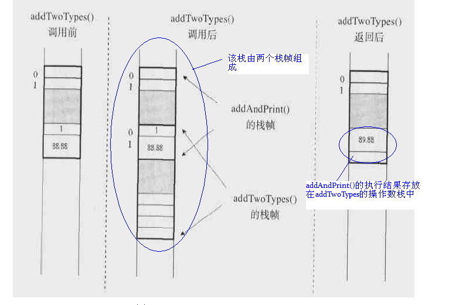

<!--ts-->
   * [前言](#前言)
   * [堆和栈的区别](#堆和栈的区别)
   * [深入理解栈 —— 栈的组成](#深入理解栈--栈的组成)
   * [常见误区](#常见误区)
      * [一、Java中的基本数据类型一定存储在栈中吗？](#一java中的基本数据类型一定存储在栈中吗)
      * [二、栈的速度比堆快吗？](#二栈的速度比堆快吗)
   * [结论](#结论)
   * [参考资料](#参考资料)

<!-- Added by: anapodoton, at: Wed Feb 19 23:33:45 CST 2020 -->

<!--te-->

# 前言

我们为什么要把内存分割为堆，栈，方法区呢？

其中，在c语言的世界里，是没有方法区的概念的，是java引入的，所以大胆猜测，方法区的引入和2个因素有关系：

1. java是解释性的语言，字节码在被jvm加载后，必须要有个地方来存储。存放在堆和栈里又不合适。
2. 为了支持面向对象的特性:在面向过程中，都是函数，所以用栈和堆足够了。

所以我们把类的信息，以及一些实例无关的信息(即编译器被确定的值)放到了方法区。

在来看堆与栈，栈是用来存储局部变量和计算的过程，堆用来存储实例。

这些的区分一定是为了效率。需要考虑变量的生命周期，访问的速度，空间大小，使用过程中是否保持有序，私有和共享。


堆和栈的概念可以说是Java开发底层的一大问题了。今天和一个复旦的哥们在讨论基本数据类型在堆栈中的存储问题，以及明白了这个问题对于用户（程序员）来说有何意义。

顺便总结一下堆栈相关的知识。google了很多，学习了很多，学习Java堆栈知识，看这篇就够了！

[Java虚拟机的堆、栈、堆栈如何去理解？ - 知乎](https://www.zhihu.com/question/29833675)

------

# 堆和栈的区别

- 功能不同

  - 栈内存用来存储局部变量和方法调用。

- 而堆内存用来存储Java中的对象。无论是成员变量，局部变量，还是类变量，它们指向的对象都存储在堆内存中。

- 共享性不同

  - 栈内存是线程私有的。
  - 堆内存是所有线程共有的。

- 异常错误不同

  如果栈内存或者堆内存不足都会抛出异常。

  - 栈空间不足：java.lang.StackOverFlowError。
  - 堆空间不足：java.lang.OutOfMemoryError。

- 空间大小

  栈的空间大小远远小于堆的。

------

# 深入理解栈 —— 栈的组成

栈帧由三部分组成：**局部变量区、操作数栈、帧数据区**。局部变量区和操作数栈的大小要视对应的方法而定，他们是按字长计算的。但调用一个方法时，它从类型信息中得到此方法局部变量区和操作数栈大小，并据此分配栈内存，然后压入Java栈。

- **局部变量区**

  局部变量区被组织为以一个字长为单位、从0开始计数的数组，类型为short、byte和char的值在存入数组前要被转换成int值，**而long和double在数组中占据连续的两项**，在访问局部变量中的long或double时，只需取出连续两项的第一项的索引值即可,如某个long值在局部变量区中占据的索引时3、4项，取值时，指令只需取索引为3的long值即可。

  如下代码以及图所示：

  ```java
  public static int runClassMethod(int i,long l,float f,double d,Object o,byte b) { 
     return 0;   
  }
  
  public int runInstanceMethod(char c,double d,short s,boolean b) { 
         return 0;   
  }
  ```

  

  

- **操作数栈** 

  和局部变量区一样，操作数栈也被组织成一个以字长为单位的数组。但和前者不同的是，它不是通过索引来访问的，而是通过入栈和出栈来访问的。可把操作数栈理解为存储计算时，临时数据的存储区域。下面我们通过一段简短的程序片段外加一幅图片来了解下操作数栈的作用。

```
	int a = 1;
	int b = 98;
	int c = a+b;	
```


从图中可以得出：操作数栈其实就是个临时数据存储区域，它是通过入栈和出栈来进行操作的。

- **帧数据区**  

  除了局部变量区和操作数栈外，java栈帧还需要一些数据来支持常量池解析、正常方法返回以及异常派发机制。这些数据都保存在java栈帧的帧数据区中。

  当JVM执行到需要常量池数据的指令时，它都会通过帧数据区中指向常量池的指针来访问它。

   除了处理常量池解析外，帧里的数据还要处理java方法的正常结束和异常终止。如果是通过return正常结束，则当前栈帧从Java栈中弹出，恢复发起调用的方法的栈。如果方法又返回值，JVM会把返回值压入到发起调用方法的操作数栈。

  为了处理java方法中的异常情况，帧数据区还必须保存一个对此方法异常引用表的引用。当异常抛出时，JVM给catch块中的代码。如果没发现，方法立即终止，然后JVM用帧区数据的信息恢复发起调用的方法的帧。然后再发起调用方法的上下文重新抛出同样的异常。

- **栈的整个结构**

  在前面就描述过：栈是由栈帧组成，每当线程调用一个java方法时，JVM就会在该线程对应的栈中压入一个帧，而帧是由局部变量区、操作数栈和帧数据区组成。那在一个代码块中，栈到底是什么形式呢？下面是我从《深入JVM》中摘抄的一个例子，大家可以看看：

  ```java
  public class Main{    
  	public static void addAndPrint(){      
      	double result = addTwoTypes(1,88.88);    
          System.out.println(result);    
      }   
           
      public static double addTwoTypes(int i,double d){  
      	return i + d;  
      }
  }
  ```

  执行过程中的三个快照：

  

  

  

  

   上面所给的图，只想说明两件事情：

  1. 只有在调用一个方法时，才为当前栈分配一个帧，然后将该帧压入栈
  2. 帧中存储了对应方法的局部数据，方法执行完，对应的帧则从栈中弹出，并把返回结果存储在**调用 方法的帧的操作数栈中**

------

# 常见误区

## 一、Java中的基本数据类型一定存储在栈中吗？

不一定。栈内存用来存储局部变量和方法调用。

如果该局部变量是基本数据类型例如

```
int a = 1;
```

那么直接将该值存储在栈中。

如果该局部变量是一个对象如

```
int[] array=new int[]{1,2};
```

那么将引用存在栈中而对象({1,2})存储在堆内。

## 二、栈的速度比堆快吗？

参考《Pro .NET Performance》可知：

> Contrary to popular belief, there isn’t that much of a difference between stacks and heaps in a .NET process. Stacks and heaps are nothing more than ranges of addresses in virtual memory, and there is no inherent advantage in the range of addresses reserved to the stack of a particular thread compared to the range of addresses reserved for the managed heap. Accessing a memory location on the heap is neither faster nor slower than accessing a memory location on the stack. There are several considerations that might, in certain cases, support the claim that memory access to stack locations is faster, overall, than memory access to heap locations. Among them:
>
> - On the stack, temporal allocation locality (allocations made close together in time) implies spatial locality (storage that is close together in space). In turn, when temporal allocation locality implies temporal access locality (objects allocated together are accessed together), the sequential stack storage tends to perform better with respect to CPU caches and operating system paging systems.
> - Memory density on the stack tends to be higher than on the heap because of the reference type overhead (discussed later in this chapter). Higher memory density often leads to better performance, e.g., because more objects fit in the CPU cache.
> - Thread stacks tend to be fairly small – the default maximum stack size on Windows is 1MB, and most threads tend to actually use only a few stack pages. On modern systems, the stacks of all application threads can fit into the CPU cache, making typical stack object access extremely fast. (Entire heaps, on the other hand, rarely fit into CPU caches.)
>
> With that said, you should not be moving all your allocations to the stack! Thread stacks on Windows are limited, and it is easy to exhaust the stack by applying injudicious recursion and large stack allocations.

即一定情况下栈的速度是比堆快的，但是快的并不明显。毕竟都是RAM。所以这算不上堆和栈的一大区别。

# 结论

回到最初，我和复旦哥们的讨论。基本类型数据如果是局部变量并且非对象那么JVM中是把值直接存入栈中的而不是存储一个引用对象然后借由这个对象来找到值。这其实算的上是实际运行时JVM提供的性能优化。因此基本数据类型和引用类型在栈中的存储情况就是不一样的了。

但是这些不一样，对于用户（程序员）来说是透明的。所以如果仅仅从语义的角度把基本类型看成引用类型，虽然不够严谨，但是对于使用者（程序员）来说有利于理解和学习。

# 参考资料

1. [Difference between Stack and Heap memory in Java Read more](http://javarevisited.blogspot.com/2013/01/difference-between-stack-and-heap-java.html#ixzz4E72HyQCP)
2. [深入JVM——栈和局部变量](http://xtu-tja-163-com.iteye.com/blog/775987)
