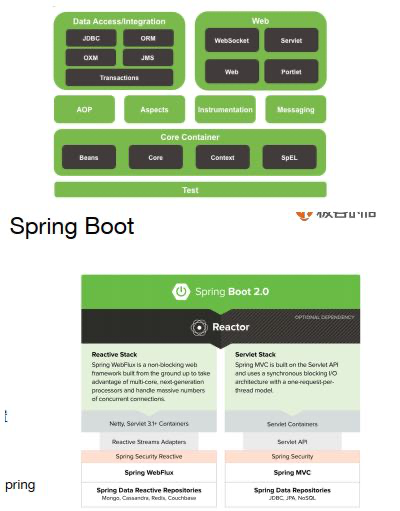

# 发展历程

Spring的核心。

[常见maven插件](https://www.cnblogs.com/april-chen/p/10414857.html)

Java常见注解

Java Config 相关注解
• @Configuration
• @ImportResource
• @ComponentScan
• @Bean
• @ConfigurationProperties  

定义相关注解
• @Component / @Repository / @Service
• @Controller / @RestController
• @RequestMapping
注⼊入相关注解
• @Autowired / @Qualifier / @Resource
• @Value  

# ORM

JPA（Java Persistence API） 为对象关系映射提供了一种基于 POJO 的持久化模型。简化数据持久化代码的开发⼯工作；为 Java 社区屏蔽不不同持久化 API 的差异。

常用JPA注解：

- 实体
  - @Entity、 @MappedSuperclass
  - @Table(name)
- 主键
  -  @Id
  -  @GeneratedValue(strategy, generator)
  -  @SequenceGenerator(name, sequenceName)  

- 映射
  -  @Column(name, nullable, length, insertable, updatable)
  -  @JoinTable(name)、 @JoinColumn(name)
- 关系
  - @OneToOne、 @OneToMany、 @ManyToOne、 @ManyToMany
  - @OrderBy  

- Hibernate:一款开源的对象关系映射（Object / Relational Mapping）框架。
- Mybatis & MyBatis Generator

# Spring MVC

- DispatcherServlet
  - Controller
    - @RestController
  - xxxResolver
    - ViewResolver
    - HandlerExceptionResolver
    - MultipartResolver
  - HandlerMapping
    - @RequestMapping
      - @GetMapping / @PostMapping
      - @PutMapping / @DeleteMapping
    - @RequestBody / @ResponseBody / @ResponseStatus

**关于上下⽂文常⽤用的接⼝**

- BeanFactory
  - DefaultListableBeanFactory
-  ApplicationContext
  - ClassPathXmlApplicationContext 
  - FileSystemXmlApplicationContext
  -  AnnotationConfigApplicationContext
- WebApplicationContext

一个请求的⼤大致处理理流程：

- 绑定⼀一些 **Attribute**

WebApplicationContext / LocaleResolver / ThemeResolver

- 处理理 **Multipart**

如果是，则将请求转为 MultipartHttpServletRequest 

- **Handler** 处理

如果找到对应 Handler，执⾏行行 Controller 及前后置处理理器器逻辑 

- 处理理返回的**Model** ，呈现视图

1. 定义映射关系

**@Controller**

**@RequestMapping**

- path / method 指定映射路路径与⽅方法
- params / headers 限定映射范围
- consumes / produces 限定请求与响应格式

⼀一些快捷⽅方式：

@RestController

@GetMapping / @PostMapping / @PutMapping / @DeleteMapping / @PatchMapping

2. 定义处理理⽅方法

- @RequestBody / @ResponseBody / @ResponseStatus
- @PathVariable / @RequestParam / @RequestHeader
- HttpEntity / ResponseEntity

3. 定义类型转换

⾃己实现 WebMvcConfigurer

- Spring Boot 在 WebMvcAutoConfiguration 中实现了了⼀个

- 添加⾃自定义的 Converter
-  添加⾃自定义的 Formatter

4. 定义校验

- 通过 Validator 对绑定结果进⾏行行校验
  - Hibernate Validator
- @Valid 注解
- BindingResult

5. 视图解析的实现基础

**ViewResolver** 与 **View** 接口

- AbstractCachingViewResolver
- UrlBasedViewResolver
- FreeMarkerViewResolver
- ContentNegotiatingViewResolver
- InternalResourceViewResolver

6. DispatcherServlet 中的视图解析逻辑

- initStrategies()，initViewResolvers() 初始化了了对应 ViewResolver 
- doDispatch()
  - processDispatchResult()
    - 没有返回视图的话，尝试 RequestToViewNameTranslator
    - resolveViewName() 解析 View 对象

使⽤用 **@**ResponseBody 的情况

在 HandlerAdapter.handle() 的中完成了了 Response 输出

- RequestMappingHandlerAdapter.invokeHandlerMethod()
  - HandlerMethodReturnValueHandlerComposite.handleReturnValue()
    - RequestResponseBodyMethodProcessor.handleReturnValue()