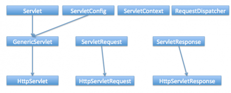
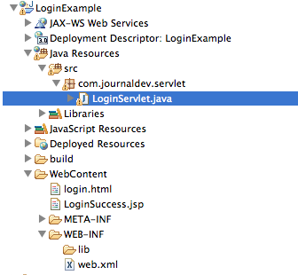
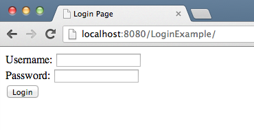
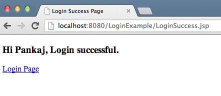
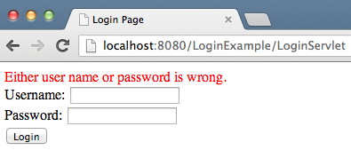

# tomcat结构

- bin:启动和关闭tomcat的bat文件
- conf:配置文件
  - server.xml 该文件用于配置server相关的信息，比如tomcat启动的端口号，配置主机 (Host)
  - web.xml 文件配置与web应用
- webapps:放置我们的web应用
- work工作目录:该目录用于存放**jsp**被访问后生成对应的**server**文件和**.class**文件


WEB-INF是一个安全目录，无法通过url直接访问，必须通过我们的映射来访问。


## Servlet概述

Server Applet。

Servlet是在Java中创建web应用程序的J2ee 服务端技术。`javax.servlet` 和 `javax.servlet.http`包中提供了编写servlet的接口和类。

所有的servlet都要实现`javax.servlet.Servlet`接口。该接口中定义了一个Servlet生命周期中的所有方法。如果要实现一个通用的Servlet，可以通过继承Java Servlet API中提供的`GenericServlet`类。`HttpServlet`类中提供了用于处理http请求的`doGet()` 和 `doPost()`等方法。

多数情况下，web应用程序都使用http协议，所以，我们多数时候都通过继承`HttpServlet`类来实现自己的Servlet。

## 通用网关接口（CGI）

在Servlet API产生之前，CGI技术用于创建动态web应用程序。CGI技术有许多缺点，如为每个请求创建单独的进程、依赖于平台代码(C、C++)、内存消耗大和性能低等。

## CGI 和 Servlet 对比

Servlet技术的诞生克服了很多CGI技术的缺点：

- Servlet在处理时间、内存利用率等方面表现更好。因为servlet使用多线程技术，为每个请求创建一个新线程。这自然就比为每个请求创建新进程的CGI技术要快很多，并且节省内存资源。
- Servlet是平台无关的，使用Servlet开发的web应用程序可以运行在任何标准的web容器中，如Tomcat、JBoss、Glassfish服务器。同样可以在任何操作系统中，如Windows、Linux、Unix、Solaris、Mac等。
- Servlet是健壮的，因为servlet容器负责管理servlet的生命周期，我们不需要担心内存泄漏、安全、垃圾收集等问题。
- Servlet易维护的，并且学习曲线小。因为在使用Servlet的时候我们只需要关注业务逻辑就可以了。

## Servlet API的层次结构

`javax.servlet.Servlet`是Servlet Api的最上层接口。还有一些其他的接口和类是我们在使用servlet的时候需要关注的。在Servlet 3.0规范中，建议使用的注解我们也需要了解。

在本节中，我们将学习重要Servlet API接口，类和注释。下面的图显示了servlet API层次结构。



### Servlet 接口

`javax.servlet.Servlet` 是Servlet Api的最上层接口，Servlet接口定义了一系列servlet的生命周期方法（init、service、destory等）。所有的Servlet类都需要继承这个接口。该接口中定义了以下方法：

**public abstract void init(ServletConfig paramServletConfig) throws ServletException** – 该方法由servlet容器调用，用于初始化servlet以及servlet配置参数。在init()方法执行之前，servlet是无法处理用户请求的。在servlet生命周期中该方法只会被调用一次，他会使servlet类不同区别于普通的java对象。我们可以扩展该方法来初始化资源，如数据库连接、socket连接等。

**public abstract ServletConfig getServletConfig()** – 该方法返回一个servlet配置对象，其中包含servlet中所有初始化参数和启动配置。我们可以用这个方法来获取servlet的初始化参数，这些参数一般被定义在web.xml或servlet 3的注解中。后面会介绍`ServletConfig`接口。

**public abstract void service(ServletRequest req, ServletResponse res) throws ServletException, IOException** – 该方法负责处理客户端请求。当servlet容器收到客户端请求时，它会创建一个新线程并执行service()方法，并把request 和 response作为参数传递给该方法。servlet通常运行在多线程环境中，所以开发人员应该使用同步来保证访问共享资源的线程安全性问题。

**public abstract String getServletInfo()** – 这个方法返回包含servlet信息的字符串，比如它的作者、版本和版权。返回的字符串应该是纯文本，不能有标记符号。

**public abstract void destroy()** – 这个方法在整个servlet生命周期中只会被调用一次来关闭所有资源。有点像Java中的finalize方法。

### ServletConfig 接口

`javax.servlet.ServletConfig`用于给servlet传递配置信息（译者注：描述Servlet本身的相关配置信息）。每个servlet都有属于它自己的ServletConfig对象，该对象由servlet容器负责实例化。可以在web.xml中提供初始化参数，当然在servlet3.0中可以使用注解。我们可以使用`getServletConfig()`方法来获取ServletConfig的对象。

ServletConfig接口中主要方法：

**public abstract ServletContext getServletContext()** – 该方法返回servlet的ServletContext对象。在下一节中我们将介绍ServletContext接口。

**public abstract Enumeration getInitParameterNames()** – 该方法返回servlet中所有初始化参数的名字的枚举。如果没有初始化参数定义，该方法将返回空枚举。

**public abstract String getInitParameter(String paramString)** – 这种方法可以通过名字来获取特定的初始化参数值。如果参数的名称不存在，则返回null。

### ServletContext 接口

`javax.servlet.ServletContext`接口用于描述应用程序的相关信息。ServletContext是一个独立的对象，可用于web应用程序中所有的servlet。当我们想要一些初始化的参数可用于web应用程序中多个或全部servlet时，我们可以使用ServletContext对象并且在web.xml中使用`<context-param>`标签定义参数。我们可以通过ServletConfig 中的 `getServletContext()`方法得到ServletContext对象。

ServletContext接口中的主要方法：

**public abstract ServletContext getContext(String uripath)** – 这个方法返回指定的uripath的ServletContext对象，如果uripath不可用或不可见则返回null。

**public abstract URL getResource(String path) throws MalformedURLException** – 返回的一个代表某个资源的URL对象。资源可以是本地文件系统、远程文件系统、数据库，甚至是不知道如何获取资源的具体细节的远程网络站点。

**public abstract InputStream getResourceAsStream(String path)** – 这个方法返回给定的资源路径的一个输入流对象。如果没有找到返回null。

**public abstract RequestDispatcher getRequestDispatcher(String urlpath)** – 这个方法一般被用于获得对于另外一个servlet的引用。获取到RequestDispatcher对象之后，就可以通过他把一个请求转发出去(forward或者include)。

**public abstract void log(String msg)** – 该方法用于把指定的消息字符串写入servlet日志文件中。

**public abstract Object getAttribute(String name)** – 按照指定的name返回对象属性。可以使用`public abstract Enumeration getAttributeNames()`活的所有对象属性的枚举。

**public abstract void setAttribute(String paramString, Object paramObject)** – 该方法用于在应用的范围内设置属性。该属性可以被可以访问当前ServletContext的所有servle获取到。可以使用`public abstract void removeAttribute(String paramString)`删除一个属性。

**String getInitParameter(String name)** – 该方法用于返回在web.xml中定义的初始化参数的值。如果指定的name在web.xml中并没有匹配到，则返回null。可以使用`Enumeration getInitParameterNames()`得到所有初始化参数的名称的枚举。

**boolean setInitParameter(String paramString1, String paramString2)** – 可以使用该方法设置应用中的初始化参数。

### ServletRequest 接口

ServletRequest接口是用来向servlet提供客户端请求信息。每一个客户端请求到达Servlet容器的时候，他都会创建一个ServletRequest对象，并将其传递对应的servlet的service()方法。

ServletRequest接口中的主要方法：

**Object getAttribute(String name)** – 返回指定的参数名对应的属性值。如果对应的参数不存在则返回null。我们可以使用`getAttributeNames()`方法来获取请求中的所有属性名称的枚举。接口中同样提供了设置值和删除值的方法。

**String getParameter(String name)** – 以字符串的形式返回请求参数值。我们可以使用getParameterNames()方法来获取请求参数名称的枚举。

**String getServerName()** – 返回服务器的主机名

**int getServerPort()** – 返回服务器监听的端口号。

ServletRequest的子接口HttpServletRequest中还包含了一些和session、cookies等相关的方法。

> 译者注：该接口中提供了getAttribute和getParameter两个方法，都是用于获取参数（属性）值的，那么这两个方法有什么区别呢？或者说Attribute和Parameter的区别是什么呢？
>
> 答：
>
> 来源不同
>
> > 参数（parameter）是从客户端（浏览器）中由用户提供的，若是GET方法是从URL中 提供的，若是POST方法是从请求体（request body）中提供的；
> >
> > 属性（attribute）是服务器端的组件（JSP或者Servlet）利用requst.setAttribute（）设置的.
>
> 操作不同
>
> > 参数（parameter）的值只能读取不能修改，读取可以使用request.getParameter()读取；
> >
> > 属性（attribute）的值既可以读取亦可以修改，读取可以使用request.setAttribute(),设置可使用request.getAttribute()
>
> 数据类型不同
>
> > 参数（parameter）不管前台传来的值语义是什么，在服务器获取时都以String类型看待，并且客户端的参数值只能是简单类型的值，不能是复杂类型，比如一个对象。
> >
> > 属性（attribute）的值可以是任意一个Object类型。

### ServletResponse 接口

servlet使用ServletResponse向客户端发送响应。和每ServletRequest类似，一个客户端请求到达Servlet容器的时候，他都会创建一个ServletResponse对象，并将其传递对应的servlet的service()方法。最终，该response对象用于给客户端生成html响应。

ServletResponse接口中的主要方法：

**void addCookie(Cookie cookie)** – 向响应中添加cookie

**void addHeader(String name, String value)** – 设置响应头

**String encodeURL(java.lang.String url)** – 通过重写Url的方式支持session，在Url中增加sessionId，如果不需要重写，直接返回该url

**String getHeader(String name)** – 返回指定的头信息。

**void sendRedirect(String location)**–重定向到指定的地址

**void setStatus(int sc)** – 设置响应的状态码

### RequestDispatcher 接口

RequestDispatcher 接口用于把一个请求转发给同一个servlet上下文中的其他的资源（Html、jsp、servlet）来处理。也可以用它来把另一个资源的内容包含到响应中。此接口用于同一个servlet上下文中的servlet相互沟通。

RequestDispatcher 接口的主要方法： **void forward(ServletRequest request, ServletResponse response)**– 把一个servlet的请求转发到服务器上的其他资源中（Html、jsp、servlet）。

**void include(ServletRequest request, ServletResponse response)** – 把另一个资源的内容包含到当前响应中。

> 译者注：forward和include的区别：
>
> 如果使用forward跳转，forward语句后面的response输出则不会执行，会跳转到forward指定的servlet中去执行。
>
> 用include来跳转，则include的servlet执行完后，再返回到原来的servlet执行forward语句后面的response的输出。

在servlet中可以使用`getRequestDispatcher(String path)`来获取一个RequestDispatcher。路径必须以`/`开头，并且是针对于当前context的根路径的相对地址。

### GenericServlet 类

GenericServlet是一个实现类Servlet, ServletConfig 和 Serializable 的抽象类。他提供了Servlet生命周期中的主要方法以及ServletConfig中的方法的默认实现。当我们定义自己的servlet的时候，只要继承了该方法，我们只需要重写我们关注的方法就可以了，其他的不关注的方法都可以使用其默认实现。该类中定义的大部分方法都是让用户更放方便的使用Servlet和ServletConfig接口中定义的常用方法。

GenericServlet 类中有一个重要的方法——无参数的init方法。如果我们必须在处理请求之前初始化一些资源，那么可以重写该方法。

### HTTPServlet 类

HTTPServlet 类是GenericServlet类的子类，主要为基于HTTP创建的web应用程序提供了一些支持。其中定义了一些可重写HTTP方法。

`doGet()`, 用于处理get请求 `doPost()`, 用于处理post请求 `doPut()`, 用于处理put请求 `doDelete()`, 用于处理delete请求

## Servlets属性（Attributes）

Servlet属性用于servlet之间的沟通，可以在web应用程序中设置、获取甚至删除属性值。servlet属性有三种范围：request、session、application

ServletRequest， HttpSession 和 ServletContext接口为request、session和application范围提供了get/set/remove的方法。

## Servlet 3中的注解

在servlet 3之前，所以的servlet映射和初始化参数都是定义在web.xml文件中的，随着应用中的servlet数量增多，这种方式就很难维护。

servlet 3中使用支持使用java注解来定义servlet、filter、listener以及初始化参数。

servlet 3 中主要的注解：

**WebServlet** – 可以在servlet类中使用该注解来定义初始化参数、loadOnStartup的值、description信息和url匹配模式(pattern)等。该注解的属性中 vlaue 或者 urlPatterns 通常是必需的，且二者不能共存。该注释声明的类**必须**继承HttpServlet。

**WebInitParam** – 该注解用于给servlet 或者 filter定义初始化参数（包括name,value和description）。可以在 WebFilter 或者 WebServlet中使用该注解。

**WebFilter** – 该注解用于声明一个servlet过滤器。使用该注解声明的类**必须**实现`javax.servlet.Filter`接口。

**WebListener** – 该注解用于声明一个事件监听器。

> 后续文章会更多的介绍servlet 监听器和过滤器。在本文中,我们的学习重点是Servlet API的接口和类。

## 使用Servlet实现登录的例子

现在我们准备创建一个有登录功能的servlet实例，在这个例子中，我会使用简单的HTML、jsp和servlet来进行用户的权限校验。我们将用到ServletContext的初始化参数、属性，ServletConfig的初始化参数、RequestDispatcher的include()方法和response的sendRedirect()等方法。

这个Web项目的代码结构应该如下图所示。这里使用Eclipse+Tomcat进行开发及运行。创建项目的过程参见[Java Web应用程序初级知识](http://www.hollischuang.com/archives/339)



这是登录页面的代码。我们会把它配置在web.xml 的中`<welcome-file-list>`标签下。这样，我们一访问这个应用就能跳转到该页面。

login.html

```
<!DOCTYPE html>
<html>
<head>
<meta charset="US-ASCII">
<title>Login Page</title>
</head>
<body>

<form action="LoginServlet" method="post">

Username: <input type="text" name="user">
<br>
Password: <input type="password" name="pwd">
<br>
<input type="submit" value="Login">
</form>
</body>
</html>
```

如果用户登录成功，用户将会在一个新的jsp页面中看到登录成功的提示信息。该jsp页面的代码如下：

LoginSuccess.jsp

```
<%@ page language="java" contentType="text/html; charset=US-ASCII"
    pageEncoding="US-ASCII"%>
<!DOCTYPE html PUBLIC "-//W3C//DTD HTML 4.01 Transitional//EN" "http://www.w3.org/TR/html4/loose.dtd">
<html>
<head>
<meta http-equiv="Content-Type" content="text/html; charset=US-ASCII">
<title>Login Success Page</title>
</head>
<body>
<h3>Hi Pankaj, Login successful.</h3>
<a href="login.html">Login Page</a>
</body>
</html>
```

下面是web.xml文件的配置，其中包含了servlet的初始化、参数、以及欢迎页的配置。

web.xml

```
<?xml version="1.0" encoding="UTF-8"?>
<web-app xmlns:xsi="http://www.w3.org/2001/XMLSchema-instance" xmlns="http://java.sun.com/xml/ns/javaee" xsi:schemaLocation="http://java.sun.com/xml/ns/javaee http://java.sun.com/xml/ns/javaee/web-app_3_0.xsd" id="WebApp_ID" version="3.0">
  <display-name>LoginExample</display-name>
  <welcome-file-list>
    <welcome-file>login.html</welcome-file>
  </welcome-file-list>

  <context-param>
  <param-name>dbURL</param-name>
  <param-value>jdbc:mysql://localhost/mysql_db</param-value>
  </context-param>
  <context-param>
  <param-name>dbUser</param-name>
  <param-value>mysql_user</param-value>
  </context-param>
  <context-param>
  <param-name>dbUserPwd</param-name>
  <param-value>mysql_pwd</param-value>
  </context-param>
</web-app>
```

下面则是Servlet类，他的主要功能就是做用户登录校验。主要关注其中关于Servlet以及ServletConfig的注解的使用。

LoginServlet.java

```
package com.journaldev.servlet;

import java.io.IOException;
import java.io.PrintWriter;

import javax.servlet.RequestDispatcher;
import javax.servlet.ServletException;
import javax.servlet.annotation.WebInitParam;
import javax.servlet.annotation.WebServlet;
import javax.servlet.http.HttpServlet;
import javax.servlet.http.HttpServletRequest;
import javax.servlet.http.HttpServletResponse;

/**
 * Servlet implementation class LoginServlet
 */
@WebServlet(
        description = "Login Servlet", 
        urlPatterns = { "/LoginServlet" }, 
        initParams = { 
                @WebInitParam(name = "user", value = "Pankaj"), 
                @WebInitParam(name = "password", value = "journaldev")
        })
public class LoginServlet extends HttpServlet {
    private static final long serialVersionUID = 1L;


    public void init() throws ServletException {
        //we can create DB connection resource here and set it to Servlet context
        if(getServletContext().getInitParameter("dbURL").equals("jdbc:mysql://localhost/mysql_db") &&
                getServletContext().getInitParameter("dbUser").equals("mysql_user") &&
                getServletContext().getInitParameter("dbUserPwd").equals("mysql_pwd"))
        getServletContext().setAttribute("DB_Success", "True");
        else throw new ServletException("DB Connection error");
    }


    protected void doPost(HttpServletRequest request, HttpServletResponse response) throws ServletException, IOException {

        //get request parameters for userID and password
        String user = request.getParameter("user");
        String pwd = request.getParameter("pwd");

        //get servlet config init params
        String userID = getServletConfig().getInitParameter("user");
        String password = getServletConfig().getInitParameter("password");
        //logging example
        log("User="+user+"::password="+pwd);

        if(userID.equals(user) && password.equals(pwd)){
            response.sendRedirect("LoginSuccess.jsp");
        }else{
            RequestDispatcher rd = getServletContext().getRequestDispatcher("/login.html");
            PrintWriter out= response.getWriter();
            out.println("<font color=red>Either user name or password is wrong.</font>");
            rd.include(request, response);

        }

    }

}
```

下面是页面展示，包括登录成功及失败两种情况。

## 过滤器

**过滤器就是 Servlet 的高级特性之一，**就是一个具有**拦截/过滤**功能的一个东西，在生活中过滤器可以是香烟滤嘴，滤纸，净水器，空气净化器等，在 Web 中仅仅是一个**实现了 Filter 接口的 Java 类**而已。过滤器可以对**所有的请求或者响应做拦截操作**。


**1.可以在请求资源之前设置请求的编码**
**2.可以进行登录校验**
**3.可以进行请求参数的内容的过滤**
**4.数据压缩 / 数据加密 / 数据格式的转换**
5.可以设置浏览器相关的数据


当需要限制用户访问某些资源时、在处理请求时提前处理某些资源、服务器响应的内容对其进行处理再返回、我们就是用过滤器来完成的。比如：过滤一些敏感的字符串【规定不能出现敏感字符串】、避免中文乱码【规定**Web**资源都使用**UTF-8**编码】、权限验证【规定只有带**Session**或**Cookie**的浏览器，才能访问 **web**资源】。

**1**、可以在**filter**中根据条件决定是否调用**chain.doFilter(request, response)**方法，即是否让目标资源执行

 **2**、在让目标资源执行之前，可以对**request\response**作预处理，再让目标资源执行

 **3**、在目标资源执行之后，可以捕获目标资源的执行结果，从而实现一些特殊的功能

##  监听器

