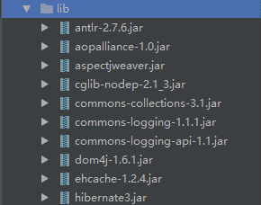
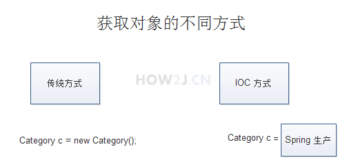

[TOC]

## 认识 Spring 框架

Spring 框架是 Java 应用最广的框架，它的**成功来源于理念，而不是技术本身**，它的理念包括 **IoC (Inversion of Control，控制反转)** 和 **AOP(Aspect Oriented Programming，面向切面编程)**。

[Spring框架的发展历史](https://mp.weixin.qq.com/s/wW6Xpq2X5OB0SWg5bU_tug)

### 什么是 Spring：

1. Spring 是一个**轻量级的 DI / IoC 和 AOP 容器的开源框架**，来源于 Rod Johnson 在其著作**《Expert one on one J2EE design and development》**中阐述的部分理念和原型衍生而来。
2. Spring 提倡以**“最少侵入”**的方式来管理应用中的代码，这意味着我们可以随时安装或者卸载 Spring

- **适用范围：任何 Java 应用**
- **Spring 的根本使命：简化 Java 开发**

> 尽管 J2EE 能够赶上 Spring 的步伐，**但 Spring 并没有停止前进，** Spring 继续在其他领域发展，而 J2EE 则刚刚开始涉及这些领域，或者还没有完全开始在这些领域的创新。**移动开发、社交 API 集成、NoSQL 数据库、云计算以及大数据**都是 Spring 正在涉足和创新的领域。Spring 的前景依然会很美好。

### Spring 中常用术语：

- **框架：**是能**完成一定功能**的**半成品**。
  框架能够帮助我们完成的是：**项目的整体框架、一些基础功能、规定了类和对象如何创建，如何协作等**，当我们开发一个项目时，框架帮助我们完成了一部分功能，我们自己再完成一部分，那这个项目就完成了。
- **非侵入式设计：**
  从框架的角度可以理解为：**无需继承框架提供的任何类**
  这样我们在更换框架时，之前写过的代码几乎可以继续使用。
- **轻量级和重量级：**
  轻量级是相对于重量级而言的，**轻量级一般就是非入侵性的、所依赖的东西非常少、资源占用非常少、部署简单等等**，其实就是**比较容易使用**，而**重量级正好相反**。
- **JavaBean：**
  即**符合 JavaBean 规范**的 Java 类
- **POJO：**即 **Plain Old Java Objects，简单老式 Java 对象**
  它可以包含业务逻辑或持久化逻辑，但**不担当任何特殊角色**且**不继承或不实现任何其它Java框架的类或接口。**

*注意：bean 的各种名称——虽然 Spring 用 bean 或者 JavaBean 来表示应用组件，但并不意味着 Spring 组件必须遵循 JavaBean 规范，一个 Spring 组件可以是任意形式的 POJO。*

- **容器：**
  在日常生活中容器就是一种盛放东西的器具，从程序设计角度看就是**装对象的的对象**，因为存在**放入、拿出等**操作，所以容器还要**管理对象的生命周期**。

### Spring 的优势

- **低侵入 / 低耦合** （降低组件之间的耦合度，实现软件各层之间的解耦）
- **声明式事务管理**（基于切面和惯例）
- **方便集成其他框架**（如MyBatis、Hibernate）
- **降低 Java 开发难度**
- Spring 框架中包括了 J2EE 三层的每一层的解决方案（一站式）

### Spring 能帮我们做什么

**①.Spring** 能帮我们根据配置文件**创建及组装对象之间的依赖关系**。
**②.Spring 面向切面编程**能帮助我们**无耦合的实现日志记录，性能统计，安全控制。**
**③.Spring** 能**非常简单的帮我们管理数据库事务**。
**④.Spring** 还**提供了与第三方数据访问框架（如Hibernate、JPA）无缝集成**，而且自己也提供了一套**JDBC访问模板**来方便数据库访问。
**⑤.Spring** 还提供与**第三方Web（如Struts1/2、JSF）框架无缝集成**，而且自己也提供了一套**Spring MVC**框架，来方便web层搭建。
**⑥.Spring** 能**方便的与Java EE（如Java Mail、任务调度）整合**，与**更多技术整合（比如缓存框架）**。

### Spring 的框架结构


- **Data Access/Integration层**包含有JDBC、ORM、OXM、JMS和Transaction模块。
- **Web层**包含了Web、Web-Servlet、WebSocket、Web-Porlet模块。
- **AOP模块**提供了一个符合AOP联盟标准的面向切面编程的实现。
- **Core Container(核心容器)：**包含有Beans、Core、Context和SpEL模块。
- **Test模块**支持使用JUnit和TestNG对Spring组件进行测试。

------

## Spring IoC 和 DI 简介

### IoC：Inverse of Control（控制反转）

- 读作**“反转控制”**，更好理解，不是什么技术，而是一种**设计思想**，就是**将原本在程序中手动创建对象的控制权，交由Spring框架来管理。**
- **正控：**若要使用某个对象，需要**自己去负责对象的创建**
- **反控：**若要使用某个对象，只需要**从 Spring 容器中获取需要使用的对象，不关心对象的创建过程**，也就是把**创建对象的控制权反转给了Spring框架**
- **好莱坞法则：**Don’t call me ,I’ll call you

### 一个例子

控制反转显然是一个抽象的概念，我们举一个鲜明的例子来说明。

在现实生活中，人们要用到一样东西的时候，第一反应就是去找到这件东西，比如想喝新鲜橙汁，在没有饮品店的日子里，最直观的做法就是：买果汁机、买橙子，然后准备开水。值得注意的是：这些都是你自己**“主动”创造**的过程，也就是说一杯橙汁需要你自己创造。


然而到了今时今日，由于饮品店的盛行，当我们想喝橙汁时，第一想法就转换成了找到饮品店的联系方式，通过电话等渠道描述你的需要、地址、联系方式等，下订单等待，过一会儿就会有人送来橙汁了。


**请注意你并没有“主动”去创造橙汁**，橙汁是由饮品店创造的，而不是你，然而也完全达到了你的要求，甚至比你创造的要好上那么一些。

### 编写第一个 Spring 程序

1. 新建一个空的 Java 项目，命名为【spring】
2. 新建一个名为【lib】的目录，并添加进必要的 jar 包，导入项目



1. 在 Packge【pojo】下新建一个【Source】类：

```
package pojo;

public class Source {  
    private String fruit;   // 类型
    private String sugar;   // 糖分描述
    private String size;    // 大小杯    
    /* setter and getter */
}
```

1. 在 【src】 目录下新建一个 【applicationContext.xml】 文件，通过 xml 文件配置的方式装配我们的 bean

```
<?xml version="1.0" encoding="UTF-8"?>
<beans xmlns="http://www.springframework.org/schema/beans"
       xmlns:xsi="http://www.w3.org/2001/XMLSchema-instance"
       xsi:schemaLocation="http://www.springframework.org/schema/beans http://www.springframework.org/schema/beans/spring-beans.xsd">

    <bean name="source" class="pojo.Source">
        <property name="fruit" value="橙子"/>
        <property name="sugar" value="多糖"/>
        <property name="size" value="超大杯"/>
    </bean>
</beans>
```

1. 在 Packge【test】下新建一个【TestSpring】类：

```
package test;

import org.junit.Test;
import org.springframework.context.ApplicationContext;
import org.springframework.context.support.ClassPathXmlApplicationContext;
import pojo.Source;

public class TestSpring {

    @Test
    public void test(){
        ApplicationContext context = new ClassPathXmlApplicationContext(
                new String[]{"applicationContext.xml"}
        );

        Source source = (Source) context.getBean("source");
        System.out.println(source.getFruit());
        System.out.println(source.getSugar());
        System.out.println(source.getSize());
    }
}
```

1. 运行测试代码，可以正常拿到 xml 配置的 bean


- **总结：**
- **传统的方式：**
  通过new 关键字主动创建一个对象
- **IOC方式：**
  对象的生命周期由Spring来管理，直接从Spring那里去获取一个对象。 IOC是反转控制 (Inversion Of Control)的缩写，就像控制权从本来在自己手里，交给了Spring。
  

> 参考地址：[这里](http://how2j.cn/k/spring/spring-ioc-di/87.html#nowhere)

### DI：Dependency Injection（依赖注入）

- 指 Spring 创建对象的过程中，**将对象依赖属性（简单值，集合，对象）通过配置设值给该对象**

### 继续上面的例子

1. 在 Packge【pojo】下新建一个【JuiceMaker】类：

```java
package pojo;

public class JuiceMaker {

    // 唯一关联了一个 Source 对象
    private Source source = null;

    /* setter and getter */

    public String makeJuice(){
        String juice = "xxx用户点了一杯" + source.getFruit() + source.getSugar() + source.getSize();
        return juice;
    }
    public void setSource(Source source) {
        this.source = source;
    }

    public Source getSource() {
        return source;
    }
}
```

1. 在 xml 文件中配置 JuiceMaker 对象：

- **注意：**这里要使用 ref 来**注入**另一个对象

```java
<?xml version="1.0" encoding="UTF-8"?>
<beans xmlns="http://www.springframework.org/schema/beans"
       xmlns:xsi="http://www.w3.org/2001/XMLSchema-instance"
       xsi:schemaLocation="http://www.springframework.org/schema/beans http://www.springframework.org/schema/beans/spring-beans.xsd">

    <bean name="source" class="pojo.Source">
        <property name="fruit" value="橙子"/>
        <property name="sugar" value="多糖"/>
        <property name="size" value="超大杯"/>
    </bean>
    <bean name="juiceMaker" class="pojo.JuiceMaker">
        <property name="source" ref="source" />
    </bean>
</beans>
```

1. 在 【TestSpring】 中添加如下代码：

```java
package test;

import org.junit.Test;
import org.springframework.context.ApplicationContext;
import org.springframework.context.support.ClassPathXmlApplicationContext;
import pojo.JuiceMaker;
import pojo.Source;

public class TestSpring {

    @Test
    public void test(){
        ApplicationContext context = new ClassPathXmlApplicationContext(
                new String[]{"applicationContext.xml"}
        );

        Source source = (Source) context.getBean("source");
        System.out.println(source.getFruit());
        System.out.println(source.getSugar());
        System.out.println(source.getSize());

        JuiceMaker juiceMaker = (JuiceMaker) context.getBean("juiceMaker");
        System.out.println(juiceMaker.makeJuice());
    }
}
```

1. 运行测试代码：


**总结：**IoC 和 DI 其实是同一个概念的不同角度描述，DI 相对 IoC 而言，**明确描述了“被注入对象依赖 IoC 容器配置依赖对象”**

### IoC 如何实现的

最后我们简单说说IoC是如何实现的。想象一下如果我们自己来实现这个依赖注入的功能，我们怎么来做？ 无外乎：

1. 读取标注或者配置文件，看看JuiceMaker依赖的是哪个Source，拿到类名
2. 使用反射的API，基于类名实例化对应的对象实例
3. 将对象实例，通过构造函数或者 setter，传递给 JuiceMaker

我们发现其实自己来实现也不是很难，Spring实际也就是这么做的。这么看的话其实IoC就是一个**工厂模式**的升级版！当然要做一个成熟的IoC框架，还是非常多细致的工作要做，Spring不仅提供了一个已经成为业界标准的Java IoC框架，还提供了更多强大的功能，所以大家就别去造轮子啦！希望了解IoC更多实现细节不妨通过学习Spring的源码来加深理解！

> 引用地址：[这里](https://www.tianmaying.com/tutorial/spring-ioc)

------

## Spring AOP 简介

如果说 IoC 是 Spring 的核心，那么面向切面编程就是 Spring 最为重要的功能之一了，在数据库事务中切面编程被广泛使用。

###AOP 即 Aspect Oriented Program 面向切面编程

首先，在面向切面编程的思想里面，把功能分为核心业务功能，和周边功能。

- **所谓的核心业务**，比如登陆，增加数据，删除数据都叫核心业务
- **所谓的周边功能**，比如性能统计，日志，事务管理等等

周边功能在 Spring 的面向切面编程AOP思想里，即被定义为切面

**在面向切面编程AOP的思想里面，核心业务功能和切面功能分别独立进行开发，然后把切面功能和核心业务功能 "编织" 在一起，这就叫AOP**

### AOP 的目的

AOP能够将那些与业务无关，**却为业务模块所共同调用的逻辑或责任（例如事务处理、日志管理、权限控制等）封装起来**，便于**减少系统的重复代码**，**降低模块间的耦合度**，并**有利于未来的可拓展性和可维护性**。

### AOP 当中的概念：

- 切入点（Pointcut）
  在哪些类，哪些方法上切入（**where**）
- 通知（Advice）
  在方法执行的什么实际（**when:**方法前/方法后/方法前后）做什么（**what:**增强的功能）
- 切面（Aspect）
  切面 = 切入点 + 通知，通俗点就是：**在什么时机，什么地方，做什么增强！**
- 织入（Weaving）
  把切面加入到对象，并创建出代理对象的过程。（由 Spring 来完成）

### AOP 编程

1. 在 Packge【service】下创建 【ProductService】类：

```java
package service;

public class ProductService {
    public void doSomeService(){
        System.out.println("doSomeService");
    }
}
```

1. 在 xml 文件中装配该 bean：

```
<bean name="productService" class="service.ProductService" />
```

1. 在【TestSpring】中编写测试代码，运行：


1. 在 Packge【aspect】下准备日志切面 【LoggerAspect】类：

```java
package aspect;

import org.aspectj.lang.ProceedingJoinPoint;

public class LoggerAspect {
    
    public Object log(ProceedingJoinPoint joinPoint) throws Throwable {
        System.out.println("start log:" + joinPoint.getSignature().getName());
        Object object = joinPoint.proceed();
        System.out.println("end log:" + joinPoint.getSignature().getName());
        return object;
    }
}
```

1. 在 xml 文件中声明业务对象和日志切面：

```java
<?xml version="1.0" encoding="UTF-8"?>
<beans xmlns="http://www.springframework.org/schema/beans"
       xmlns:xsi="http://www.w3.org/2001/XMLSchema-instance"
       xmlns:aop="http://www.springframework.org/schema/aop"
       xmlns:tx="http://www.springframework.org/schema/tx"
       xmlns:context="http://www.springframework.org/schema/context"
       xsi:schemaLocation="
   http://www.springframework.org/schema/beans
   http://www.springframework.org/schema/beans/spring-beans-3.0.xsd
   http://www.springframework.org/schema/aop
   http://www.springframework.org/schema/aop/spring-aop-3.0.xsd
   http://www.springframework.org/schema/tx
   http://www.springframework.org/schema/tx/spring-tx-3.0.xsd
   http://www.springframework.org/schema/context
   http://www.springframework.org/schema/context/spring-context-3.0.xsd">

    <bean name="productService" class="service.ProductService" />
    <bean id="loggerAspect" class="aspect.LoggerAspect"/>

    <!-- 配置AOP -->
    <aop:config>
        <!-- where：在哪些地方（包.类.方法）做增加 -->
        <aop:pointcut id="loggerCutpoint"
                      expression="execution(* service.ProductService.*(..)) "/>

        <!-- what:做什么增强 -->
        <aop:aspect id="logAspect" ref="loggerAspect">
            <!-- when:在什么时机（方法前/后/前后） -->
            <aop:around pointcut-ref="loggerCutpoint" method="log"/>
        </aop:aspect>
    </aop:config>
</beans>
```

1. 再次运行 TestSpring 中的测试代码，代码并没有改变，但是在业务方法运行之前和运行之后，都分别输出了日志信息：


